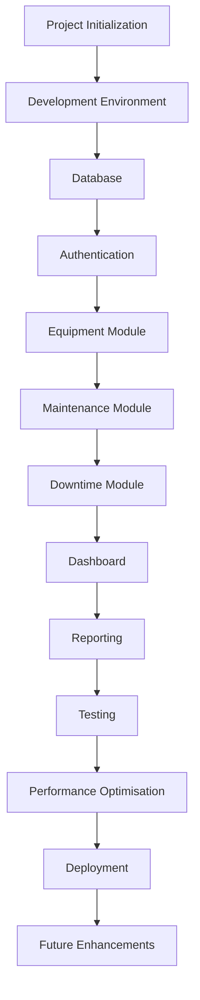
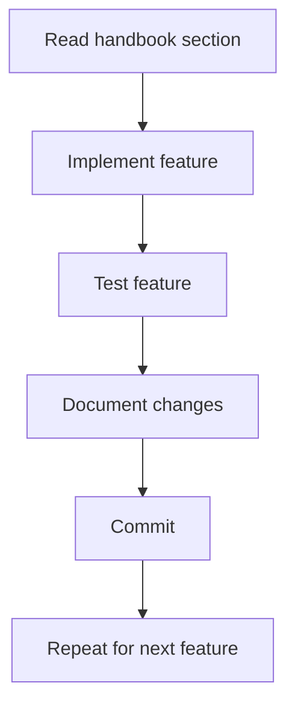

# EMMS Implementation Roadmap

---

## Purpose

The Learning Handbook (Sessions 1–15) teaches the **reasoning** behind the EMMS: the business problem, the domain, the architecture, the database, the workflows, and the production thinking.

This roadmap converts that knowledge into an **actionable implementation plan**. It answers one question:

> "Given everything we have learned, in what order should we build EMMS?"

The Handbook is the "why." This roadmap is the "what's next." Both documents should be consulted throughout development — the Handbook when you need to understand a decision, this roadmap when you need to know what to do next.

> [!IMPORTANT]
> The Handbook explains the reasoning; this roadmap defines the order of work. Use them together. When in doubt about *why* something is built a certain way, return to the Handbook session referenced here.

---

## Before Writing Code

Before any implementation begins, complete this checklist. Each item protects you from building on a wrong foundation.

- [ ] Read the README — understand what the project is and its status
- [ ] Review the PRD — the approved product scope and MVP definition
- [ ] Review the Learning Handbook — Sessions 1–15 cover the full reasoning
- [ ] Understand the business problem — why the EMMS exists (Session 1)
- [ ] Confirm the project architecture — how the pieces fit (Sessions 4 and 5)
- [ ] Confirm the database design — tables and relationships (Sessions 3 and 10)
- [ ] Understand the user roles — who uses the system and what each can do (Sessions 1 and 11)

> [!NOTE]
> Relevant Handbook sessions: Session 1 (business problem), Sessions 3 and 10 (database), Sessions 4 and 5 (architecture), Session 11 (roles).

---

## Overall Development Roadmap

Here is the complete implementation journey, from an empty folder to a deployed, production-ready system.



Each step builds on the one before it — the same dependency thinking used in Sessions 10 and 12.

---

## Implementation Phases

The roadmap is divided into ten phases. Each phase produces a milestone you can commit, review, and verify.

| Phase | Objective | Main Deliverables | Related Handbook Sessions | Suggested Git Milestone |
|---|---|---|---|---|
| Phase 1 – Project Foundation | Create a working project with services connected | Next.js project, configured tooling, working homepage | Session 9 | `foundation-project-setup` |
| Phase 2 – Database | Turn the design into a real schema | Prisma schema, migrations, seed data, verified connections | Sessions 3 and 10 | `database-schema-and-seed` |
| Phase 3 – Authentication | Secure access by role | Login, logout, sessions, roles, protected pages | Session 11 | `authentication-rbac` |
| Phase 4 – Equipment Management | Build the asset registry | Equipment CRUD, search, detail views | Sessions 10 and 12 | `equipment-module` |
| Phase 5 – Maintenance Management | Schedule and complete maintenance | Task scheduling, assignment, completion, history | Sessions 2 and 12 | `maintenance-module` |
| Phase 6 – Downtime Tracking | Capture and resolve downtime | Downtime reporting, resolution, production loss | Sessions 2, 7, and 12 | `downtime-module` |
| Phase 7 – Dashboards & Reporting | Summarize the data | Dashboard metrics, reports, exports | Sessions 7 and 12 | `dashboard-and-reports` |
| Phase 8 – Testing | Verify everything works | Unit, integration, end-to-end, and manual tests | Session 13 | `testing-suite` |
| Phase 9 – Optimisation | Prepare for growth | Performance, caching, indexing, scalability | Session 14 | `performance-optimisation` |
| Phase 10 – Production Deployment | Release to real users | Deployed app on Vercel and Railway, backups | Session 8 | `production-deployment` |

> [!NOTE]
> Each phase has a suggested Git milestone. These are tag or branch names that mark a complete, verifiable point in the project.

---

## Detailed Milestones

### Phase 1 – Project Foundation

- **Purpose:** Stand up the project scaffold and connect the core services before writing any business logic (Session 9).
- **Expected outcome:** A working Next.js project that starts, displays a homepage, and can read from PostgreSQL and Redis.
- **Git commits:**
  - `Initialize project`
  - `Configure tooling`
  - `Connect database`
  - `Connect Redis`
  - `Add working homepage`
- **Definition of Done:**
  - [ ] Application starts successfully
  - [ ] PostgreSQL connected and verified
  - [ ] Redis connected and verified
  - [ ] Authentication foundation in place
  - [ ] Folder structure from Session 6 complete
- **Potential risks:** Missing environment variables; services not installed; secrets hardcoded.
- **Dependencies:** Node.js, Docker, and the development environment from Session 9.

### Phase 2 – Database

- **Purpose:** Implement the database design from Session 3 as a real schema (Session 10).
- **Expected outcome:** All tables exist, relate correctly, and contain realistic seed data.
- **Git commits:**
  - `Create database schema`
  - `Run first migration`
  - `Add seed data`
  - `Verify relationships`
- **Definition of Done:**
  - [ ] All models from Session 10 exist
  - [ ] Relationships use foreign keys correctly
  - [ ] Migrations are tracked in version control
  - [ ] Seed data loads realistic records
  - [ ] Prisma Client is generated and working
- **Potential risks:** Duplicated data; ignored relationships; unsynced schema and migrations.
- **Dependencies:** Phase 1 (working project and database connection).

### Phase 3 – Authentication

- **Purpose:** Secure the system so users sign in and act according to their role (Session 11).
- **Expected outcome:** Users can log in and out, sessions persist, and pages are protected by role.
- **Git commits:**
  - `Implement login`
  - `Implement logout`
  - `Add role-based access`
  - `Protect pages`
- **Definition of Done:**
  - [ ] Login works with valid credentials
  - [ ] Logout ends the session
  - [ ] Sessions persist across pages
  - [ ] Roles are identified and enforced
  - [ ] Protected pages redirect logged-out users
- **Potential risks:** Trusting the client; hardcoded permissions; forgotten authorization checks.
- **Dependencies:** Phase 2 (the User model must exist).

### Phase 4 – Equipment Management

- **Purpose:** Build the asset registry that anchors the whole system (Sessions 10 and 12).
- **Expected outcome:** Equipment can be created, viewed, edited, and searched.
- **Git commits:**
  - `Equipment CRUD`
  - `Equipment search`
  - `Equipment detail view`
- **Definition of Done:**
  - [ ] Equipment can be registered (per role rules)
  - [ ] Equipment can be viewed and edited
  - [ ] Equipment can be searched by name, number, location, and status
  - [ ] Duplicate serial numbers are rejected
- **Potential risks:** Duplicate records; missing validation; search too slow to scale.
- **Dependencies:** Phases 2 and 3.

### Phase 5 – Maintenance Management

- **Purpose:** Let supervisors plan work and technicians complete it (Sessions 2 and 12).
- **Expected outcome:** Tasks can be scheduled, assigned, completed, and recorded in history.
- **Git commits:**
  - `Maintenance scheduling`
  - `Task assignment`
  - `Task completion`
  - `Maintenance history`
- **Definition of Done:**
  - [ ] Tasks can be scheduled with priority and due dates
  - [ ] Tasks can be assigned to technicians
  - [ ] Completing a task updates its status
  - [ ] Completed work creates maintenance history
- **Potential risks:** Invalid dates; incorrect status transitions; missing history.
- **Dependencies:** Phases 2, 3, and 4 (tasks need equipment and users).

### Phase 6 – Downtime Tracking

- **Purpose:** Capture and resolve downtime so the analytics have data (Sessions 2, 7, and 12).
- **Expected outcome:** Operators can report downtime and technicians can resolve it, with production loss calculated.
- **Git commits:**
  - `Downtime reporting`
  - `Downtime resolution`
  - `Production loss calculation`
- **Definition of Done:**
  - [ ] Downtime events can be reported with reason codes
  - [ ] Events can be resolved with end times
  - [ ] Downtime duration and production loss are calculated
- **Potential risks:** Wrong machine recorded; impossible times; reason codes misused.
- **Dependencies:** Phases 2, 3, and 4.

### Phase 7 – Dashboards & Reporting

- **Purpose:** Summarize the data into metrics managers can act on (Sessions 7 and 12).
- **Expected outcome:** A dashboard shows key metrics, and reports can be generated and exported.
- **Git commits:**
  - `Dashboard metrics`
  - `Report generation`
  - `Report exports`
- **Definition of Done:**
  - [ ] Dashboard shows open tasks, equipment status, overdue work, and downtime
  - [ ] Reports summarize maintenance, equipment performance, and downtime
  - [ ] Reports can be filtered and exported
- **Potential risks:** Stale dashboard data; reports counting records incorrectly.
- **Dependencies:** Phases 4, 5, and 6 (data must exist before it is summarized).

### Phase 8 – Testing

- **Purpose:** Verify every workflow behaves correctly before release (Session 13).
- **Expected outcome:** Tests cover the core workflows, and bugs are found and fixed.
- **Git commits:**
  - `Add unit tests`
  - `Add integration tests`
  - `Add end-to-end tests`
  - `Fix discovered bugs`
- **Definition of Done:**
  - [ ] Unit tests pass
  - [ ] Integration tests pass
  - [ ] End-to-end workflows verified
  - [ ] Manual review completed
- **Potential risks:** Skipping tests; untested edge cases; regressions.
- **Dependencies:** Phases 4–7 (features must exist to be tested).

### Phase 9 – Optimisation

- **Purpose:** Make the system fast and ready to grow (Session 14).
- **Expected outcome:** Caching, indexing, pagination, and filtering are in place.
- **Git commits:**
  - `Add caching`
  - `Add database indexes`
  - `Add pagination`
- **Definition of Done:**
  - [ ] Frequently used results are cached
  - [ ] Cache invalidation works
  - [ ] Large lists are paginated
  - [ ] Search and reports stay fast with realistic data
- **Potential risks:** Caching the wrong data; stale caches; over-optimizing prematurely.
- **Dependencies:** Phases 4–7 (realistic data is needed to measure performance).

### Phase 10 – Production Deployment

- **Purpose:** Deploy the finished application to real users (Session 8).
- **Expected outcome:** The app runs on Vercel with PostgreSQL and Redis on Railway, secure and available.
- **Git commits:**
  - `Configure production environment`
  - `Run production migrations`
  - `Deploy to production`
- **Definition of Done:**
  - [ ] Environment variables configured in production
  - [ ] Migrations run against production
  - [ ] HTTPS enabled
  - [ ] Backups configured
  - [ ] The production checklist from Session 8 is complete
- **Potential risks:** Missing variables; connection failures; secrets exposed.
- **Dependencies:** All previous phases.

---

## Suggested Git Commit Strategy

Make **small, meaningful commits** — each one a single, complete piece of work that can be understood on its own.

An example progression:

```
Initialize project
Configure tooling
Connect database
Connect Redis
Add working homepage
Create database schema
Run first migration
Add seed data
Implement authentication
Add role-based access
Equipment CRUD
Equipment search
Maintenance scheduling
Downtime workflow
Dashboard
Reports
Add tests
Fix discovered bugs
Optimize performance
Deploy to production
```

> [!TIP]
> Small commits help in three ways: you can find the change that introduced a bug; you can describe your work clearly; and each commit is a safe checkpoint you can return to.

---

## Suggested Branch Strategy

A simple workflow works well for a solo developer: a stable `main`, a working `develop`, and short-lived feature and bugfix branches.

| Branch | Purpose | When to use |
|---|---|---|
| `main` | The production-ready version | Only completed, tested, released work lives here |
| `develop` | The main working branch | Most work is merged here as phases are completed |
| `feature/*` | One new feature at a time | For example, `feature/equipment-registry` |
| `bugfix/*` | One bug fix at a time | For example, `bugfix/fix-dashboard-stale-cache` |

When a `feature/*` branch is complete and verified, it is merged into `develop`. When `develop` is stable and tested, it is merged into `main` for release.

> [!NOTE]
> A **branch** is a separate line of development. Working on a branch keeps incomplete work from disturbing the main project, and merging brings finished work back in.

---

## Recommended Development Workflow

Follow the same repeatable cycle for every feature:



1. **Read the handbook section** — understand the reasoning before coding.
2. **Implement the feature** — build it according to the roadmap phase.
3. **Test the feature** — verify it works (Session 13).
4. **Document changes** — keep the handbook and docs in sync.
5. **Commit** — make a small, meaningful commit.
6. **Repeat** — move to the next feature.

---

## Quality Checklist Before Moving to the Next Phase

Before advancing to any new phase, confirm every item:

- [ ] **Feature complete** — the phase's features are all implemented
- [ ] **Code reviewed** — a fresh look found no obvious problems
- [ ] **Database verified** — tables, relationships, and data behave correctly
- [ ] **Authentication verified** — roles and permissions are enforced
- [ ] **Tests passing** — the phase's tests pass
- [ ] **Documentation updated** — the handbook and docs reflect the work
- [ ] **Git committed** — the milestone is committed and, where appropriate, tagged

> [!IMPORTANT]
> Do not start a new phase until the current phase passes this checklist. Building on an unverified phase imports its problems into everything that follows.

---

## Risks During Development

Watch for these common pitfalls, and avoid them deliberately.

| Risk | How to avoid it |
|---|---|
| **Skipping documentation** | Update the handbook and docs in the same step as the feature work |
| **Building out of order** | Follow the roadmap phases — data before features, features before dashboards |
| **Ignoring testing** | Test each feature in the phase it is built (Session 13) |
| **Large commits** | Make small, single-purpose commits that are easy to review and revert |
| **Changing architecture without updating documentation** | Any architecture change is a handbook change too — keep them in sync |

> [!TIP]
> Most development problems come from rushing the order, skipping the tests, or letting docs go stale. The roadmap exists to keep you on track.

---

## Success Criteria

A successful first version (MVP) of the EMMS should include:

- **User authentication** with role-based access for the roles from Session 11
- **Equipment management** — register, view, edit, and search assets
- **Maintenance management** — schedule, assign, and complete tasks with history
- **Downtime tracking** — report and resolve downtime events
- **A dashboard** showing key metrics at a glance
- **Reports** that summarize the data
- **Testing** verifying the core workflows
- **Documentation** that explains the system (the Learning Handbook)
- **Deployment** to a production environment

These criteria come from the PRD's MVP scope and the features designed across the handbook.

> [!NOTE]
> Reference the PRD for the full MVP scope, and Sessions 7, 11, and 12 for the features themselves.

---

## After MVP

These enhancements are intentionally postponed until the MVP is complete. They build on the foundation the MVP creates.

| Enhancement | Description | Foundation It Needs |
|---|---|---|
| Mobile app | Field access for technicians | A stable, tested backend |
| Barcode scanning | Instant equipment identification | The Equipment Registry |
| QR codes | Quick access to equipment records | The Equipment Registry |
| Notifications | Alerts for due and overdue work | Maintenance scheduling |
| Predictive maintenance | Forecast failures from history | Downtime and history data |
| IoT integration | Machines report data automatically | Stable data models |
| AI-assisted maintenance planning | Smarter scheduling suggestions | Analytics and history data |
| Offline mode | Keep working without internet | A resilient application core |
| Multi-company support | Serve many organizations | Flexible data architecture |

> [!IMPORTANT]
> Do not build these before the MVP. The MVP proves the core works; these enhancements grow it. Building them early risks an unfinished core.

---

## Final Advice

Software is built **one milestone at a time**.

You will not finish the EMMS in a day, a week, or even a single month. You will finish it the way every software project is finished: phase by phase, commit by commit, verifying each step before moving to the next.

**Consistency beats speed.** A steady, repeatable workflow — read, implement, test, document, commit — produces better software than rushing. Each small, verified milestone is real progress.

Use the Learning Handbook as the **"why"** and this roadmap as the **"what's next."** When you need to understand a decision, open the Handbook. When you need to know what to do next, open this roadmap.

> [!TIP]
> Start with Phase 1, finish the checklist, and move forward. Every phase completed brings the EMMS one step closer to a real, working system that solves a real business problem.
