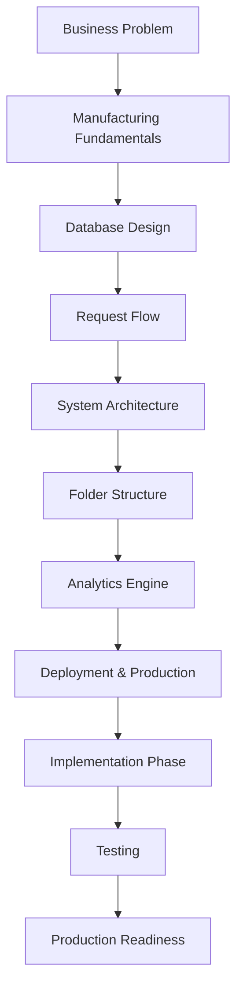
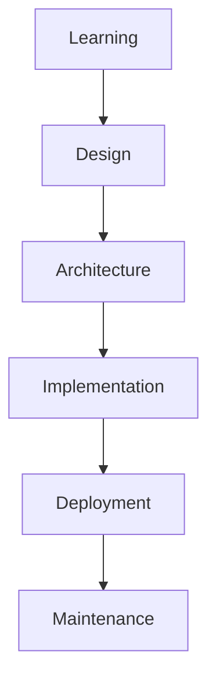

# Equipment Maintenance Management System (EMMS) Learning Handbook

Welcome to the Learning Handbook for the Equipment Maintenance Management System (EMMS).

This handbook is a step-by-step guide that teaches a junior software developer everything they need to understand this project — from the business problem it solves, all the way through to deploying it for real users.

If you have just opened this repository and are wondering where to start, this page is your answer. It explains what the handbook is, why it exists, who it is for, and the order in which you should study the chapters.

> [!NOTE]
> You may notice that earlier chapters sometimes call the application the "Downtime Command Center." That is the same system — the EMMS — described from different angles. As the project grew, the name settled on the Equipment Maintenance Management System.

> [!TIP]
> You do not need to read everything at once. Follow the roadmap, take your time, and use each chapter's Key Takeaways to check your understanding before moving on.

---

## Purpose of the Handbook

This handbook is designed to teach two things at the same time:

1. **The business domain of manufacturing maintenance** — how factories work, why downtime is expensive, and what operators, engineers, and managers actually need.
2. **The software engineering concepts required to build the system** — database design, request flows, system architecture, caching, analytics, and deployment.

These two halves are taught together because they belong together. Every technical decision in this project exists because of a real manufacturing need.

The handbook progresses in a natural order:

- First, you understand **the problem**.
- Then, you **design** the solution.
- Next, you learn how to **build** and **deploy** the application.
- Finally, you prepare to **maintain** and **improve** it over time.

By the end, you will understand both the factory floor and the software that serves it.

> [!NOTE]
> The handbook teaches concepts in plain language before they are used in code. It is a learning resource, not just a reference manual.

---

## Learning Philosophy

Every chapter in this handbook focuses on answering **why** before **how**.

Before we show you how the database is structured, we explain why it is structured that way. Before we show you how a request travels through the system, we explain why the server must be the gatekeeper. Before we show you how the dashboard is built, we explain why analytics exist at all.

This order matters because understanding the reasoning behind architectural and design decisions makes implementation much easier. When you know *why* something works the way it does:

- the code starts to make sense instead of looking like magic
- you can make sensible choices when things do not go exactly as planned
- you can explain your work clearly to other developers and interviewers

Here is a short motivational note: the chapters are written to be read **in order**. Each one builds on the ones before it. Later chapters assume you remember the concepts from earlier ones. If you skip around, you will often meet a term that has not been explained yet.

Take your time, go one chapter at a time, and trust the process. Every session brings you closer to understanding the whole system.

> [!IMPORTANT]
> Read the chapters in order. Later chapters assume knowledge from earlier ones. The "why" of one chapter becomes the foundation of the next.

---

## Learning Roadmap

Here is the full journey of the handbook, from the first chapter to the day the application is ready for production.

Each step in this roadmap answers a question:

- **Business Problem** — Why does this software exist?
- **Manufacturing Fundamentals** — What is the world this software models?
- **Database Design** — How is the data organized?
- **Request Flow** — How does a single action travel through the system?
- **System Architecture** — How do all the pieces fit together?
- **Folder Structure** — Where does everything live in the codebase?
- **Analytics Engine** — How does raw data become useful insight?
- **Deployment & Production** — How does the application reach real users?
- **Implementation Phase** — How is the system actually built?
- **Testing** — How do we make sure it works correctly?
- **Production Readiness** — How do we prepare it for real use?

The first eight steps are complete. The final three are the work ahead.

---

## Table of Contents

The handbook is organized into numbered sessions. This table shows every session, its file, its topic, and its purpose.

### Completed Chapters

| Session | File | Topic | Purpose |
|---|---|---|---|
| 1 | `01-business-problem.md` | Business Problem | Explains why the EMMS exists and the real-world problems it solves |
| 2 | `02-manufacturing-fundamentals.md` | Manufacturing Fundamentals | Introduces production lines, downtime, MTTR, MTBF, reason codes, and maintenance |
| 3 | `03-database-design.md` | Database Design | Explains how the data is organized into tables and relationships |
| 4 | `04-request-flow.md` | Request Flow | Follows one user action from the browser through the backend and back |
| 5 | `05-system-architecture.md` | System Architecture | Shows how all the technologies in the project work together |
| 6 | `06-folder-structure.md` | Folder Structure | Teaches how to navigate the project's codebase |
| 7 | `07-analytics-engine.md` | Analytics Engine | Explains how downtime records become dashboard metrics and decisions |
| 8 | `08-deployment-and-production.md` | Deployment and Production | Covers moving the application from a laptop to real users |

### Planned Chapters

| Session | File | Topic | Purpose |
|---|---|---|---|
| 9 | Planned | Building the EMMS | Project setup and scaffolding |
| 10 | Planned | Database Implementation | Creating the real database schema and seed data |
| 11 | Planned | Authentication and Role-Based Access | Adding sign-in and user permissions |
| 12 | Planned | Building Core Features | Implementing downtime events, machines, and the dashboard |
| 13 | Planned | Testing and Debugging | Verifying the application works correctly |
| 14 | Planned | Production Readiness and Future Improvements | Preparing for real users and planning what comes next |

> [!NOTE]
> Sessions 1 through 8 are complete and ready to study. Sessions 9 through 14 are planned and will be added as the project is built.

---

## Recommended Reading Order

You should complete the chapters **sequentially**, starting at Session 1 and moving forward in order.

Here is why the order matters:

- Each chapter introduces concepts that the next chapter uses.
- Session 1 explains the business problem that Session 2 builds its manufacturing concepts on.
- Session 3 designs the database that Session 4's request flow talks to.
- Sessions 4 and 5 describe the architecture that Session 6 teaches you to navigate.
- Session 7 turns the data you designed into the analytics the dashboard shows.
- Session 8 moves all of that into the real world of production.

Later chapters assume you have learned the material from earlier ones. For example, Session 8 talks about environment variables and caching without re-teaching what a database or a cache is — because you already learned those in Sessions 3, 4, and 7.

Studying in order also helps your confidence. Each chapter ends with Key Takeaways that summarize what you should remember. When you can explain those takeaways in your own words, you are ready for the next session.

> [!TIP]
> After each chapter, try to summarize what you learned out loud, or in a short note. If you can explain it simply, you have truly understood it.

---

## Skills You Will Learn

This handbook teaches a wide range of skills that are useful for real software projects. Here is where each skill is learned:

| Skill | Where It Is Learned |
|---|---|
| Understanding manufacturing systems | Sessions 1 and 2 |
| Database design | Session 3 |
| System architecture | Session 5 |
| Request lifecycle | Session 4 |
| Analytics | Session 7 |
| Caching | Sessions 4, 7, and 8 |
| Deployment | Session 8 |
| Authentication | Session 5 (introduction) and Session 11 (planned) |
| Testing | Session 13 (planned) |
| Project planning | Sessions 9 and 14 (planned) |
| Production thinking | Session 8 and Session 14 (planned) |

Some skills are introduced early and built upon later. For example, authentication first appears in the architecture chapter (Session 5) and is implemented in detail in the planned Session 11.

---

## How This Handbook Connects to the Project

This handbook is not a separate exercise. It mirrors the lifecycle of the EMMS project itself. Each chapter supports a later implementation task.

Here is how each stage maps to the handbook:

- **Learning** — Sessions 1 and 2 build your understanding of the problem and the domain.
- **Design** — Session 3 designs the database that will be implemented later.
- **Architecture** — Sessions 4, 5, and 6 describe and organize the system's structure.
- **Implementation** — Sessions 9 through 12 (planned) build the actual application.
- **Deployment** — Session 8 explains how the finished application reaches users.
- **Maintenance** — Session 14 (planned) covers production readiness and future improvements.

In other words, every chapter you study maps to a real task in the project. The handbook is the plan, and the codebase is the result of following that plan.

> [!IMPORTANT]
> The handbook and the project are two halves of the same whole. The handbook explains the thinking; the project shows the result. Understanding one makes the other far easier.

---

## Project Goals

The EMMS project is designed to achieve several goals. These are the reasons the project exists and the outcomes you should expect by the end:

- **Learn full-stack software engineering** — experience both the frontend and the backend of a real application.
- **Understand manufacturing workflows** — see how software models a real business process.
- **Build a production-style application** — not a toy, but an application designed to be deployed and used.
- **Practice clean architecture** — keep the system organized so it is easy to understand and grow.
- **Develop portfolio-quality documentation** — produce material that is clear enough to share and demonstrate.
- **Gain confidence explaining technical decisions** — be able to explain *why* the system is built the way it is.

Each goal connects to the skills in the handbook. When you finish, you will have a working project, a complete learning record, and the ability to talk about both with confidence.

---

## Contributing to the Handbook

If you add new chapters — for example, the planned Sessions 9 through 14 — follow these guidelines so the handbook stays consistent and beginner-friendly:

- **Remain beginner-friendly** — assume the reader is new to the topic and explain terms before using them.
- **Explain concepts before implementation** — focus on *why* before *how*, following the handbook's learning philosophy.
- **Use practical examples** — anchor every idea in a realistic situation from the EMMS or the factory floor.
- **Include Mermaid diagrams where useful** — a clear diagram often communicates more than a paragraph.
- **Maintain a consistent writing style** — use the same headings, callouts, tables, and Key Takeaways structure as Sessions 1 through 8.

> [!NOTE]
> Consistency is what makes a handbook easy to study. When every chapter follows the same pattern, readers always know what to expect.

---

## Key Takeaways

- The EMMS Learning Handbook is the beginner-friendly guide to the Equipment Maintenance Management System.
- It teaches both the manufacturing domain and the software engineering needed to build the system.
- The handbook progresses from understanding the problem, to designing, building, deploying, and maintaining the application.
- Every chapter answers **why** before **how**, making implementation and explanation easier.
- Sessions 1 through 8 are complete. Sessions 9 through 14 are planned.
- Read the chapters in order — later chapters assume knowledge from earlier ones.
- Each chapter supports a real task in the project, so the handbook and the codebase go hand in hand.
- The project goals are learning, understanding, building, practicing clean architecture, producing quality documentation, and gaining confidence.
- New chapters should stay beginner-friendly, explain concepts before implementation, and keep a consistent style.
- When you are ready, continue with **Session 9 — Building the EMMS (Project Setup & Scaffolding)** to start the implementation phase.
