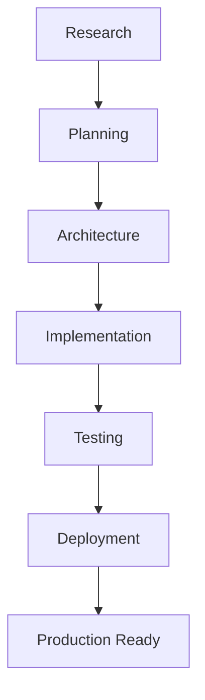

> [!NOTE]
> **Project Status:** 🟡 Planning & Architecture Phase
>
> The business requirements, architecture, database design, and learning handbook are complete. The implementation phase begins next.

# Equipment Maintenance Management System (EMMS)

The Equipment Maintenance Management System (EMMS) is a modern web application designed to help manufacturing organizations manage equipment, maintenance activities, and operational reliability through a centralized digital platform.

Many factories still run on paper logs, shared spreadsheets, and messages scattered across apps. When machines fail, the story of what happened — and why — often lives in a notebook or a whiteboard that gets wiped clean at the end of a shift. EMMS replaces that fragmentation with a single place where equipment, maintenance work, downtime, and history are recorded, organized, and understood.

This repository is the home of that project. It documents not only what EMMS aims to build, but also the reasoning behind every design decision — making it a genuine learning project as much as a software product.

> [!NOTE]
> EMMS is currently in the **planning and design phase**. The application itself has not been implemented yet. This README explains the problem the project solves and the system we are preparing to build.

---

## The Problem

Manufacturing organizations depend on equipment running reliably. Every minute a machine is stopped is production lost — but for many companies, the information needed to prevent and understand those stops is scattered and unreliable.

Common realities in today's factories:

- **Paper maintenance records** — handwritten logs that get lost, damaged, or become unreadable
- **Excel spreadsheets** — multiple versions drifting apart, with no single version anyone trusts
- **Whiteboards** — useful in the moment, but wiped clean with no history left behind
- **WhatsApp communication** — important details buried in group chats and impossible to search
- **Lost maintenance history** — no record of what was done, when, or why
- **Poor visibility into equipment health** — managers cannot see which machines are reliable and which are not
- **Delayed maintenance** — work happens late because nothing reminds anyone it is due
- **Reactive instead of preventive maintenance** — teams fix failures after they happen instead of preventing them

These problems are expensive. When maintenance is unplanned, the costs add up quickly:

- unexpected downtime halts production lines
- emergency repairs cost far more than planned work
- recurring failures go unnoticed because there is no history to spot the pattern
- managers make decisions without reliable data

> [!IMPORTANT]
> The core problem EMMS addresses is not machine failure itself — it is the **fragmentation of information** about those failures. When data is scattered, the people who need it cannot learn from it.

---

## The Solution

EMMS provides one centralized system where an organization can manage the full lifecycle of its equipment and maintenance work.

With EMMS, a company can:

- **register equipment** — keep a reliable inventory of every machine and asset
- **manage maintenance activities** — plan preventive work and track tasks to completion
- **monitor equipment health** — see the current status of machines at a glance
- **track downtime** — record when machines stop and capture what happened
- **organize maintenance history** — build a lasting record of every repair and inspection
- **improve planning** — schedule maintenance before failures happen, not after
- **support better operational decisions** — give managers clear data instead of guesswork

The focus is on **outcomes**, not implementation. The value of EMMS is that a supervisor can open a dashboard and see what needs attention, a technician can record work in minutes, and a manager can look at trends over time — all from the same source of truth.

> [!TIP]
> EMMS turns scattered records into **organizational knowledge**. Individual events become patterns, and patterns become better decisions.

---

## Who Is This Project For?

EMMS is designed for the people who keep a factory running. Each role interacts with the system differently:

| Role | Responsibilities | How EMMS Helps |
|---|---|---|
| **Maintenance Technician** | Performs maintenance work and records what was done | A quick way to see assigned tasks, record completion, and reference past repairs |
| **Maintenance Supervisor** | Plans maintenance and manages the maintenance team | Tools to schedule work, see what is overdue, and keep the team on track |
| **Plant Manager** | Oversees plant performance and reliability | A dashboard view of equipment health, downtime, and where attention is needed |
| **Reliability Engineer** | Analyzes failures and drives long-term improvement | Historical data and analytics that reveal patterns behind repeated failures |
| **Operations Manager** | Manages production and minimizes disruption | Visibility into downtime and its impact on output and planning |

The same system serves different needs: the technician needs speed and clarity, while the manager needs summary and insight.

---

## Project Goals

EMMS is built around a set of clear objectives:

- **Improve maintenance organization** — replace scattered tools with one reliable system
- **Reduce equipment downtime** — catch problems earlier through better planning and history
- **Increase equipment reliability** — understand what breaks, why, and how to prevent it
- **Improve data visibility** — give every level of the organization a clear picture
- **Replace manual processes** — remove paper, spreadsheets, and message-based tracking
- **Support data-driven decision making** — base decisions on evidence, not instinct
- **Demonstrate modern software engineering practices** — a project built with clean architecture and professional documentation

Each goal shapes both the product and how the project itself is developed.

---

## Core Features (Planned)

The following features are planned for EMMS:

| Feature | What It Does |
|---|---|
| **Equipment Registry** | A central inventory of all machines and assets |
| **Maintenance Scheduling** | Planning preventive maintenance and tracking tasks |
| **Downtime Tracking** | Recording when equipment stops and what caused it |
| **Maintenance History** | A lasting record of every repair and inspection per asset |
| **Dashboards** | At-a-glance summaries of equipment and maintenance status |
| **Reports** | Filtered views of downtime, performance, and trends |
| **Role-Based Access** | Different levels of access for different user roles |
| **Notifications** | Alerts for upcoming or overdue maintenance |
| **Analytics** | Insights such as repair times and top problem machines |

> [!NOTE]
> These features are **planned for the build phase** and will be implemented as the project moves from design into development. Nothing here is running yet.

---

## Project Scope

The MVP is intentionally focused. It covers the core workflows a small maintenance team needs, and deliberately leaves advanced capabilities for later.

**Included in the MVP:**

- Equipment management
- Maintenance management
- Downtime tracking
- Dashboards

**Not included in the first release:**

- Predictive AI maintenance
- IoT integrations
- Mobile applications
- ERP integrations

Keeping the first release focused means the core system can be built well, validated, and understood before adding complexity.

---

## Learning Journey

This repository documents more than the software — it captures the **engineering decisions** behind it.

The project includes a dedicated **Learning Handbook** located at:

```
docs/learning/
```

The handbook teaches readers:

- the **business concepts** of manufacturing maintenance
- the **architecture** of the system
- the **design decisions** behind the database and services
- the **implementation journey** from planning to deployment

Written for a junior developer, the handbook explains *why* the system is designed the way it is, one chapter at a time. It turns this repository into both a product and a learning resource.

> [!TIP]
> If you want to understand this project deeply, start with `docs/learning/README.md`. It maps out the entire learning roadmap.

---

## Current Project Status

EMMS is in its planning and design phase. Implementation has not yet begun.

| Status | Item |
|---|---|
| ✅ Complete | Product requirements |
| ✅ Complete | Learning handbook |
| ✅ Complete | Architecture design |
| ✅ Complete | Database design |
| ⏳ Next | Implementation planning |
| ⏳ Pending | Application implementation |
| ⏳ Pending | Testing |
| ⏳ Pending | Deployment |

> [!IMPORTANT]
> This is a design-first project. The planning and documentation are complete; the build phase is the next major step.

---

## Roadmap

The project follows a clear, high-level progression:



The project currently sits at the **Architecture** stage, with **Implementation** as the next milestone.

---

## Repository Structure

The repository currently contains the following major areas:

| Path | Purpose |
|---|---|
| `PRD.md` | The Product Requirements Document defining the MVP scope |
| `docs/learning/` | The Learning Handbook — chapters covering the problem, design, architecture, and roadmap |

As implementation begins, the repository will grow with the application code, database schema, and supporting files.

---

## Future Vision

Beyond the MVP, EMMS could evolve in several directions:

- **Advanced analytics** — deeper insight into reliability and performance
- **Predictive maintenance** — using historical data to forecast failures
- **IoT sensors** — live machine data feeding the system automatically
- **Barcode / QR asset tracking** — scanning equipment to identify and update it
- **Mobile technician application** — field-friendly access for technicians
- **AI-assisted maintenance planning** — intelligent scheduling based on patterns

These are **future possibilities**, not current functionality. The MVP focuses on the solid core: reliable equipment and maintenance management.

---

## Contributing

The project is currently under **active development** and is still in its design phase.

Once implementation begins, contributions, discussions, suggestions, and issue reports will be welcome. The goal is to build something well-thought-out — and the best way to do that is with thoughtful input from others.

---

## License

A license has not yet been selected for this project. It will be decided and added here before the repository is opened for general contribution.

---

## Final Notes

The goal of EMMS is not simply to build another CRUD application. It is to understand real manufacturing workflows and apply modern full-stack software engineering principles to solve meaningful business problems. Every design decision in this repository exists because it answers a real question — and the Learning Handbook exists so that anyone, including a future version of me, can understand those answers.
