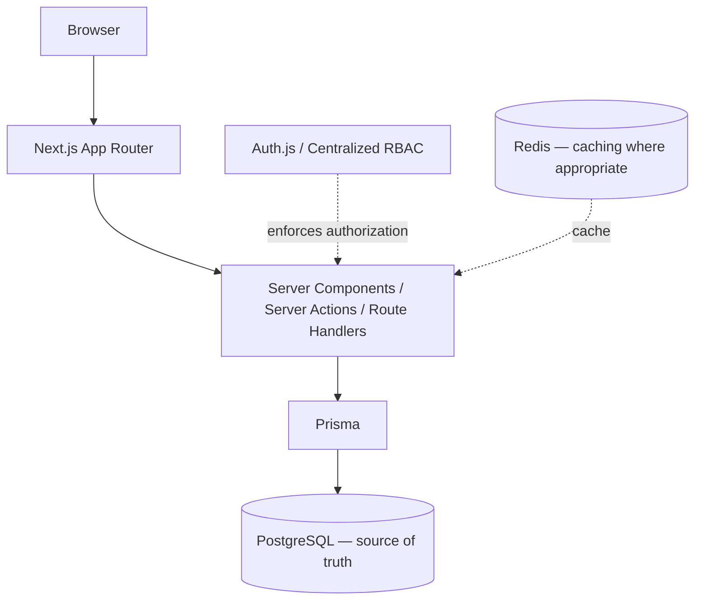

# Equipment Maintenance Management System

## Overview

The Equipment Maintenance Management System (EMMS) is a manufacturing equipment maintenance management platform. It replaces the fragmented, manual ways maintenance work is typically tracked — paper-based records, spreadsheets, and emails scattered across teams — with one centralized system for managing equipment and maintenance workflows.

In many plants, maintenance history lives in binders and desktop files. Equipment records are duplicated or lost, history is hard to trace, and maintenance can be missed or poorly coordinated between shifts and roles. Unplanned equipment failure then turns into operational impact: stopped lines, delayed production, and reactive firefighting.

EMMS addresses that by giving EMMS a single, consistent place to model the plant, its equipment, and the work performed on it. The goal is a system that makes equipment history reliable, maintenance work coordinated, and the people doing the work — from technicians to plant managers — grounded in the same trusted data.

## Who Uses EMMS

EMMS models six distinct roles, each with a different stake in the system:

- **Administrator** — owns the system itself: manages users, manages roles and permissions, and has full access across equipment and maintenance operations.
- **Supervisor** — runs day-to-day maintenance operations: maintains the equipment register, schedules maintenance work, tracks completion, and reviews reports.
- **Technician** — performs maintenance and repair work: views assigned equipment and records completed maintenance directly against it.
- **Operator** — works on the production floor with the equipment and logs operational events, such as downtime, that affect it.
- **Plant Manager** — cares about operational performance: consumes reporting and analytics without doing hands-on maintenance work.
- **Reliability Engineer** — analyzes equipment performance and failure history to reduce breakdowns, relying on the same maintained records and reporting views.

The differences in responsibility are encoded as distinct permissions, so each role sees and does only what its job requires.

## Core Capabilities

Completed and planned work is deliberately separated. Nothing marked **Planned** is claimed to be implemented yet.

### Completed

- **Authentication** — secure sign-in with session management (Auth.js), with passwords hashed on the server.
- **Role-based access control** — a centralized permission model mapping the six roles to granular permissions, enforced on every action.
- **Application shell & navigation** — a consistent, responsive application layout and navigation structure.
- **Equipment Registry**
  - Equipment listing with search and filtering
  - Equipment detail views with full history context
  - Create and edit equipment records
  - Server-side authorization on every view and mutation

### Planned

- Maintenance scheduling
- Maintenance completion and records
- Maintenance history
- Downtime tracking
- Dashboards
- Reports and analytics
- Performance and scalability refinement
- Production deployment

## Architecture

EMMS follows a server-first architecture on the Next.js App Router. The browser interacts with Next.js, which renders server components and exposes data mutations through server actions and route handlers. Server-side logic is the **security boundary** — authorization is enforced where the data is touched, not just in the UI. All reads and writes flow through Prisma to PostgreSQL, the single **source of truth**. Auth.js provides authentication, backed by a centralized role-based permission model. Redis is available as caching infrastructure where appropriate, and Docker provides the local PostgreSQL/Redis development environment.

The separation of concerns is deliberately simple: the framework handles routing and rendering, the server handles business logic and authorization, Prisma handles all database access, and PostgreSQL owns the data.

## Technology Stack

| Technology | Purpose |
| --- | --- |
| Next.js 16 (App Router) | React framework for routing, rendering, and server-side execution |
| React 19 | UI component library |
| TypeScript 5 | Typed language for maintainable, predictable code |
| Tailwind CSS 4 | Utility-first styling |
| shadcn/ui | Accessible, composable UI components |
| React Hook Form | Form state management and validation |
| Zod 4 | Schema validation for forms and data |
| Server Actions | Server-side data mutations |
| Route Handlers | API endpoints (e.g., authentication) |
| Auth.js (NextAuth) | Authentication and session management |
| Prisma 7 | Object-relational mapping / database access |
| PostgreSQL | Relational database — the source of truth |
| Redis | Caching infrastructure where appropriate |
| Docker | Local PostgreSQL/Redis development environment |
| bcryptjs | Password hashing |

## What Makes This More Than a CRUD Application

EMMS is designed around the shape of real manufacturing work rather than generic data entry:

- **Real manufacturing workflows** — the domain spans equipment, maintenance tasks and records, downtime, and operational reporting.
- **Role-based security** — permissions are modeled centrally and differ meaningfully between roles, not bolted on as a single admin toggle.
- **Server-side authorization** — every view and mutation is checked against the permission model on the server; the UI never trusts the client.
- **Relational business data** — the data model (users, factories, equipment, maintenance tasks and records) captures relationships, not flat rows.
- **Maintenance lifecycle management** — the system is oriented around the lifecycle of equipment from registration through planned and completed work.
- **Operational history** — every record is part of a traceable history used for analysis.
- **Reporting and analytics** — planned on top of that same operational data.
- **Documented architectural decisions** — key choices are recorded as ADR-style entries in the architecture documentation.
- **Testing against a real PostgreSQL environment** — work is verified against an actual database, not just by compiling.

## Development Roadmap

The project is built incrementally, milestone by milestone, with each delivered in a reviewable state:

- **Milestones 1–2 — Foundation & Database** (complete): project setup and the initial relational database design.
- **Milestone 3 — Authentication & RBAC** (complete): sign-in, sessions, and the centralized role/permission model.
- **Milestone 4 — Application Shell** (complete): the application layout and navigation structure.
- **Milestone 5 — Equipment Registry** (complete): machinery register with search, detail views, and CRUD behind server-side authorization.
- **Milestone 6+ — Maintenance Management** (next): scheduling, completion, and maintenance records for equipment.
- **Future — Downtime Tracking** (planned)
- **Future — Dashboards & Reports** (planned)
- **Future — Performance & Scalability** (planned)
- **Future — Production Deployment** (planned)

Completed and upcoming work are kept distinct; the roadmap reflects what is delivered versus what remains.

## Engineering Documentation

Alongside the application code, the repository contains the engineering trail behind it:

- [PRD.md](./PRD.md) — product requirements and scope
- [ARCHITECTURE.md](./docs/ARCHITECTURE.md) — architectural principles, decisions, and ADRs
- [IMPLEMENTATION_ROADMAP.md](./IMPLEMENTATION_ROADMAP.md) — the implementation plan
- [BUILD_LOG.md](./docs/BUILD_LOG.md) — implementation history, including environment setup
- [learning/](./docs/learning/) — a 15-session learning handbook documenting the reasoning behind each part of the system

These documents explain not just what was built, but why it was built that way.

## Current Status

EMMS is actively being built incrementally. At the time of writing, **Milestones 1–5 are complete**, including the functional Equipment Registry with search, detail views, and server-side-authorized create and edit. The overall application is **not** complete: maintenance management, downtime tracking, dashboards, reporting, and production deployment remain future work.

## Development Philosophy

- **Server-first development** — logic and rendering live on the server by default.
- **Security enforced on the server** — the server is the enforcement point for every authorization decision.
- **Simple architecture before unnecessary complexity** — solve today's problem directly, and add machinery only when it earns its place.
- **Build functionality before visual polish** — working, verifiable workflows come before decoration.
- **Test real workflows** — verify behavior against a real PostgreSQL environment rather than only compiling.
- **Document important decisions** — significant architectural choices are recorded so the reasoning survives.

## Setup

For local setup and development instructions, see [BUILD_LOG.md](./docs/BUILD_LOG.md) — the environment (PostgreSQL and Redis via Docker, database migration and seeding) is documented there rather than repeated in this overview.