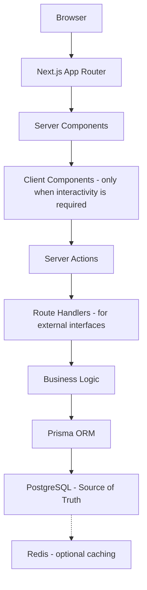

# EMMS Architecture

This document records the final architectural principles that will guide the implementation of the Equipment Maintenance Management System (EMMS) MVP.

It is the **source of truth for all future development**. The Learning Handbook explains the reasoning behind the architecture (Sessions 4 and 5); this document locks in the concrete decisions that will be followed during implementation.

> [!IMPORTANT]
> This architecture is considered **frozen for the MVP** unless a significant business requirement changes. Any change to these principles must be documented and synchronized with the README, BUILD_LOG, and IMPLEMENTATION_ROADMAP (see Principle 11).

---

# Architectural Principles

The following principles guide every implementation decision.

---

## Principle 1 — Simplicity First

Every technology must solve a real business problem.

Avoid unnecessary complexity. Before adding a tool, an abstraction, or a pattern, ask: "Does this serve a real need for the EMMS MVP?" If the answer is no, it is not added.

> [!NOTE]
> Simplicity keeps the project easier to understand, easier to debug, and easier to grow. This is the same thinking behind Principle 12 — clarity over cleverness.

---

## Principle 2 — Server-First Development

Use **Next.js Server Components** by default.

Only use **Client Components** when browser interactivity is required — for example, interactive forms, live state, or components that respond to user input.

This approach:

- improves performance, because most rendering happens on the server
- reduces the amount of JavaScript shipped to the browser
- keeps data-fetching logic close to the server where the data lives
- aligns with the server-first principles taught in Session 4

> [!NOTE]
> A **Server Component** renders on the server and sends the finished HTML to the browser. A **Client Component** runs in the browser and is used when interactivity is required.

---

## Principle 3 — Server Actions for Business Operations

All create/update/delete business operations should use **Server Actions**.

The flow is always:

```
User
    ↓
Server Action
    ↓
Zod Validation
    ↓
Business Logic
    ↓
Prisma
    ↓
PostgreSQL
```

A Server Action runs on the server, validates the incoming data with **Zod**, applies the business rules, and writes to the database through **Prisma**.

This keeps business logic on the server, where it cannot be bypassed or inspected by the browser — the gatekeeper idea taught in Session 4.

> [!IMPORTANT]
> The server must always be the source of truth for business rules. Server Actions enforce that by keeping create/update/delete logic on the server.

---

## Principle 4 — Route Handlers for External Interfaces

**Route Handlers** should be used for external interfaces, such as:

- CSV exports
- PDF generation
- Webhooks
- External integrations
- Download endpoints

Route Handlers are **NOT** the default replacement for Server Actions. The default for business operations is always Server Actions (Principle 3). Route Handlers are reserved for cases where the interface is about serving files or receiving external requests rather than mutating business data.

> [!NOTE]
> A **Route Handler** is a server endpoint that responds to HTTP requests. It is ideal for downloads, webhooks, and integrations — but not a replacement for Server Actions in normal business flows.

---

## Principle 5 — Prisma as the Data Access Layer

All database access goes through **Prisma**.

Avoid raw SQL unless there is a demonstrated performance requirement.

The benefits of Prisma:

- **Type safety** — the database schema is reflected in TypeScript types, catching mistakes early
- **Maintainability** — schema changes are managed through the Prisma schema and migrations
- **Readability** — database work is expressed in clear, application-level code rather than raw SQL

Raw SQL may be considered only when profiling demonstrates that Prisma cannot meet a real performance requirement.

> [!NOTE]
> This matches the role Prisma played in the request flow taught in Session 4 — the translator between application code and the database.

---

## Principle 6 — PostgreSQL is the Source of Truth

Business data always lives inside **PostgreSQL**.

- **Redis** is only a cache — it stores temporary copies, never the authoritative record.
- **React state** is never the permanent source of truth — it manages the UI only (Principle 7).

Any record that matters to the business — equipment, tasks, events, users — must be persisted in PostgreSQL. Everything else is a temporary convenience.

> [!IMPORTANT]
> The database is the single source of truth, as taught in Sessions 5 and 8. If a value exists only in Redis or only in React state, it is not the authoritative record.

---

## Principle 7 — React State is Temporary

React state manages the UI only.

Examples of appropriate use:

- modal visibility
- loading indicators
- selected tabs
- filters

Business records always come from the database. React state is a UI convenience, cleared when the user navigates away or the component unmounts — it must never hold the permanent record of business data.

> [!NOTE]
> This separation keeps the UI honest: what the user sees can change instantly, but the business truth always lives in PostgreSQL.

---

## Principle 8 — Authentication Before Authorization

- **Authentication** answers: "Who are you?"
- **Authorization** answers: "What are you allowed to do?"

The EMMS uses **Auth.js** for authentication and **Role-Based Access Control (RBAC)** for authorization, as designed in Session 11.

Authentication must be in place before any authorization logic is built. Users are identified first; their role then determines what they may access.

> [!NOTE]
> Authentication confirms identity. Authorization enforces permissions. Both are required, and authentication always comes first.

---

## Principle 9 — Feature-Based Development

Development should follow complete business features, not disconnected pages.

A feature is built end to end:

```
Equipment Module
    ↓
Database
    ↓
Validation
    ↓
Server Action
    ↓
UI
    ↓
Testing
    ↓
Documentation
```

Do not build disconnected pages. Each feature should be complete — database support, validation, server logic, UI, tests, and documentation — before moving to the next. This is the feature workflow defined in the IMPLEMENTATION_ROADMAP.

> [!IMPORTANT]
> A feature is not done when its page renders. It is done when its full chain — data, logic, UI, tests, and documentation — is complete and verified.

---

## Principle 10 — MVP Before Advanced Features

The first version intentionally excludes:

- AI recommendations
- QR scanning
- Barcode support
- IoT integration
- Mobile applications
- Offline support
- Notifications

These belong to later versions. The MVP focuses on the core: equipment, maintenance, downtime, dashboards, and reports. Advanced features are planned after the MVP is complete, as listed in the IMPLEMENTATION_ROADMAP's "After MVP" section.

> [!IMPORTANT]
> Building advanced features before the MVP is complete risks an unfinished core. The MVP comes first.

---

## Principle 11 — Documentation Evolves With the Code

Whenever architecture changes significantly, the following documents must remain synchronized:

- README
- BUILD_LOG
- ARCHITECTURE
- IMPLEMENTATION_ROADMAP

If a decision in this document changes, every other document that references the architecture must be updated in the same effort.

> [!NOTE]
> Documentation is part of the deliverable, not an afterthought. Keeping it synchronized is what makes the project maintainable over time.

---

## Principle 12 — Prefer Clarity Over Cleverness

Code should prioritize:

- readability
- descriptive naming
- modularity
- maintainability

Future developers (including a future version of you) should understand the project quickly. Prefer the clear solution over the clever one. A simple solution that everyone understands is better than an impressive one that only one person can follow.

> [!TIP]
> Clarity is a form of respect for the people who will read the code later — including yourself, six months from now.

---

# Architectural Decisions

This section records the key decisions made for the EMMS MVP.

---

## ADR-001 — API Strategy

**Status:** Accepted

**Decision:**

The EMMS MVP will use:

- Server Components
- Server Actions
- Route Handlers

instead of introducing tRPC.

**Reasoning:**

- Simpler architecture
- Fewer abstractions
- Better alignment with Next.js App Router
- Lower maintenance burden
- Easier learning experience
- Sufficient for the requirements of the MVP

> [!NOTE]
> tRPC remains an excellent technology and was studied in Session 4. It may be introduced in future versions if EMMS grows into a larger multi-client platform. It is intentionally not used in the MVP to keep the architecture simple and aligned with the App Router.

---

# Architecture Diagram

The following diagram shows the final architecture for the EMMS MVP.



Key points:

- **PostgreSQL remains the source of truth** — all business data lives there.
- **Redis is optional caching** — it speeds up repeated reads but never stores the authoritative record.
- **Server Components are the default**; Client Components are used only when browser interactivity is required.
- **Server Actions handle business operations**; Route Handlers serve external interfaces.
