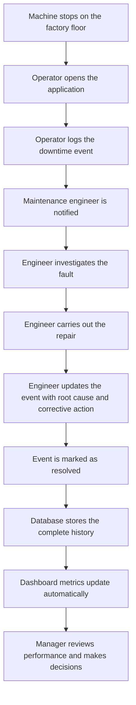

# Business Problem

## Purpose

Before looking at any code, it is worth asking a simple question: why does this software exist?

Every piece of software is built to solve a real-world problem. The technology choices, the database design, the user interface — all of it flows from that original problem. If you understand the problem first, the technical decisions start to make sense on their own.

This chapter has nothing to do with code. It is about the business situation that made this project necessary.

> [!NOTE]
> Software exists to solve business problems, not simply to demonstrate technology. Understanding the problem is the first step to understanding the solution.

---

## Imagine Owning a Factory

Picture a factory that makes a physical product — bottled drinks, car parts, packaged food, or anything else that gets manufactured in large quantities.

Inside that factory there are machines. A machine might be a conveyor belt that moves products along a line, a press that shapes metal, a filling machine that pours liquid into bottles, or a packaging unit that wraps finished goods. Each machine has one job, and it is expected to do that job continuously throughout the working day.

A factory typically runs in shifts. A morning shift might run from 6am to 2pm. An evening shift from 2pm to 10pm. A night shift from 10pm to 6am. During each of those shifts, the machines are expected to be running.

Here is the important part: when a machine is running, the factory is making money. When a machine stops, the factory is not.

A simple example:

| Machine | Products per hour | Revenue per hour |
|---|---|---|
| Filling Machine A | 2,000 bottles | £1,200 |
| Conveyor Line B | 5,000 units | £3,000 |
| Packaging Press C | 800 boxes | £960 |

If Filling Machine A stops for two hours, that is 4,000 bottles that were never filled and £2,400 in lost production. The workers on that line are still being paid. The factory's fixed costs — rent, electricity, insurance — are still running. But nothing is being produced.

That gap between what the factory should have produced and what it actually produced is called production loss. It is one of the most important numbers in manufacturing.

---

## What Happens When a Machine Stops?

Machine failures do not announce themselves politely. They happen suddenly, in the middle of a shift, without warning.

Here is what that typically looks like:

```
Machine is running normally
  ↓
Machine suddenly fails
  ↓
Production stops on that line
  ↓
Workers on that line have nothing to do
  ↓
The operator calls for a maintenance engineer
  ↓
The engineer investigates the fault
  ↓
Repair takes time — minutes, hours, or longer
  ↓
Orders that were due today are now delayed
  ↓
The business loses money
```

This kind of unplanned stop is called downtime. The word "downtime" simply means the period of time when a machine is not running when it should be.

Downtime is not always avoidable. Machines wear out. Parts break. Unexpected faults happen. But the way a factory responds to downtime — how quickly it is detected, reported, investigated, and resolved — makes an enormous difference to how much production is lost.

> [!NOTE]
> Downtime is the period when a machine is not running when it should be. Every minute of downtime has a cost.

---

## How Many Factories Track This Today

You might assume that factories use sophisticated software to track every machine failure. In reality, many factories — including large, well-established ones — still rely on manual methods.

Common approaches include:

| Method | How it works | Common problems |
|---|---|---|
| Paper log books | Operators write incidents by hand in a physical book | Handwriting is hard to read, books get lost, no search function |
| Excel spreadsheets | Someone enters data into a shared file | Multiple versions, no real-time updates, easy to overwrite |
| Whiteboards | Shift information is written on a board in the factory | Wiped clean at the end of each shift, no history |
| Notebooks | Engineers keep personal notes about repairs | Information stays with one person, not shared |
| WhatsApp messages | Teams communicate faults via group chat | Buried in conversation, impossible to analyse |
| Shift handover notes | Outgoing shift writes a summary for the incoming shift | Inconsistent format, often incomplete |

Each of these methods has the same fundamental weakness: the information is recorded somewhere, but it is not organized in a way that makes it easy to find, compare, or learn from.

A paper log book from three months ago might contain exactly the information a manager needs to understand why a machine keeps failing. But finding it, reading it, and connecting it to other incidents is slow and unreliable.

---

## The Business Questions Nobody Can Answer

Here is the frustrating reality for most factory managers who rely on manual tracking.

They know that machines are failing. They know that production is being lost. But when they try to ask specific questions, they cannot get reliable answers.

Questions like:

- Which machine fails the most often?
- Which failures cause the most production loss?
- Which maintenance engineers resolve faults the fastest?
- What is our average time to repair a machine?
- Are there machines that fail repeatedly for the same reason?
- Which machines should we prioritise for preventive maintenance?
- How does this month compare to last month?
- Which production line has the worst downtime record?

The information to answer these questions exists. It is sitting in log books, spreadsheets, notebooks, and WhatsApp threads. But it is scattered across different places, recorded in different formats, and owned by different people.

Scattered information is almost as useless as no information at all. You cannot spot a trend in a pile of paper. You cannot compare this month to last month if last month's records are in a notebook that has been misplaced.

> [!IMPORTANT]
> The data exists. The problem is that it is fragmented, inconsistent, and impossible to analyse at scale.

---

## The Real Problem

It would be easy to assume that the problem is the machine failures themselves. But machine failures are a fact of life in manufacturing. They cannot be eliminated entirely.

The real problem is something different.

The real problem is that valuable operational information is fragmented across too many places, recorded in too many formats, and owned by too many individuals. As a result, the people who need to make decisions — managers, engineers, supervisors — are making those decisions without reliable information.

Poor information leads to poor decisions. For example:

- A manager might invest in replacing a machine that is actually performing well, while ignoring a cheaper machine that is causing most of the downtime.
- An engineer might keep applying the same temporary fix to a recurring fault, not realising that the same fault has happened twelve times in the past year.
- A supervisor might not know which shift has the worst downtime record, so they cannot target training or support where it is most needed.
- A factory director might report to the board that downtime is "under control" because they have no reliable data to suggest otherwise.

These are not failures of intelligence or effort. They are failures of information. When the information is bad, even good people make bad decisions.

---

## The Solution

The Downtime Command Center is a web application that centralizes all downtime information into one system.

Instead of paper logs, spreadsheets, and WhatsApp messages, every downtime event is recorded in the same place, in the same format, by the people who are closest to the problem.

This creates several important benefits.

**One source of truth.** Every downtime event — regardless of which machine, which shift, or which engineer — is stored in the same database. There is no confusion about which version of the data is correct.

**Standardized reporting.** Every event is recorded using the same fields: machine, reason code, start time, end time, parts used, corrective action. This consistency makes it possible to compare events across machines, shifts, and time periods.

**Historical records.** Because every event is stored permanently, the system builds up a history over time. A manager can look back six months and see exactly how many times a particular machine failed, what the reasons were, and how long each repair took.

**Better decision making.** With reliable, organized information, managers can spot patterns, identify problem machines, measure engineer performance, and make investment decisions based on evidence rather than gut feeling.

> [!TIP]
> The goal of the system is not just to record what happened. It is to turn what happened into information that helps the business improve.

---

## Who Uses the System?

Three different types of people use the Downtime Command Center. Each has a different role, different goals, and a different way of interacting with the application.

### Operator

An operator is the person working directly on the factory floor, closest to the machines.

**Responsibilities**

- Monitors machines during their shift
- Notices when a machine stops or behaves abnormally
- Calls for maintenance when a fault occurs

**Goals**

- Report the fault quickly so the repair can begin
- Provide accurate information about what happened and when

**How they use the application**

The operator opens the downtime form, selects the machine that stopped, chooses a reason code from a list, adds any relevant notes, and submits the event. This takes less than a minute. The event is now recorded in the system and visible to the rest of the team.

---

### Maintenance Engineer

A maintenance engineer is the person responsible for diagnosing and repairing faults.

**Responsibilities**

- Responds to downtime events
- Investigates the root cause of the fault
- Carries out the repair
- Records what was done and what parts were used

**Goals**

- Resolve the fault as quickly as possible
- Document the repair accurately so the history is useful
- Identify recurring faults that might need a permanent fix

**How they use the application**

The engineer opens the downtime event that was logged by the operator. They add the root cause — the underlying reason the machine failed. They record the corrective action — what they did to fix it. They log any spare parts that were used. When the repair is complete, they mark the event as resolved.

---

### Manager

A manager is responsible for the overall performance of the factory or production area.

**Responsibilities**

- Monitors production performance across all machines and lines
- Identifies trends and recurring problems
- Makes decisions about maintenance priorities and investment
- Reports upward to senior leadership

**Goals**

- Understand where production loss is coming from
- Identify which machines or lines need attention
- Measure how quickly the maintenance team resolves faults
- Make evidence-based decisions

**How they use the application**

The manager uses the dashboard. The dashboard shows summary metrics: total downtime events today, production loss by machine, average repair time, and the machines with the most incidents. The manager does not need to read individual event records — the system aggregates the information and presents it clearly.

---

## End-to-End Workflow

Here is how a single downtime event moves through the system from start to finish:



Each stage in this workflow has a clear owner and a clear purpose.

- The operator's job is to log the event quickly and accurately.
- The engineer's job is to fix the problem and document what was done.
- The system's job is to store everything reliably and make it easy to find.
- The dashboard's job is to turn the stored history into useful summaries.
- The manager's job is to use those summaries to improve the operation.

When every stage works as intended, the factory builds up a reliable record of its own performance over time.

---

## Why It Is Called a Command Center

The name "Command Center" comes from the idea of a central place where information from many different sources is brought together so that decisions can be made.

In the military, a command center is a room where information from the field — troop positions, enemy movements, supply levels — is gathered and displayed so that commanders can see the full picture and act accordingly.

In this application, the command center is the dashboard. Information from every machine, every production line, every shift, and every engineer flows into one place. A manager sitting at their desk can see what is happening across the entire factory without walking the floor or chasing people for updates.

The word "command" is also intentional. The goal is not just to observe what is happening. It is to give managers the information they need to take action — to command the operation rather than simply react to it.

---

## Why This Project Matters

It is easy to think of software as a technical exercise. But the real value of this project is not in the code. It is in what the code makes possible.

Before a system like this, a factory manager might know that downtime is a problem but have no way to prove it, measure it, or track whether it is getting better or worse. Every decision about maintenance priorities, staffing, and equipment investment is based on instinct and incomplete information.

After a system like this, the same manager can open a dashboard and see exactly which machines are causing the most production loss, how long repairs are taking, whether things are improving or getting worse, and where to focus attention next.

That shift — from instinct to evidence — is what software creates when it is built to solve a real problem.

Individual downtime events are just records. But when hundreds of events are stored consistently over months and years, patterns emerge. Those patterns are where the real value lives. They reveal which machines are unreliable, which faults keep recurring, which engineers are most effective, and which production lines need investment.

Trends are more valuable than isolated records. A single downtime event tells you that something went wrong. A year of downtime events tells you why things keep going wrong and what to do about it.

> [!NOTE]
> The purpose of this system is to turn operational events into organizational knowledge. That knowledge is what allows a factory to improve over time.

---

## Key Takeaways

- Software exists to solve real business problems. Understanding the problem is the first step to understanding the code.
- Factories depend on machines running continuously. Every minute of unplanned downtime has a direct cost.
- Downtime is the period when a machine is not running when it should be. It causes production loss, delayed orders, and wasted labour.
- Most factories track downtime manually using paper logs, spreadsheets, or informal messages. These methods make it impossible to analyse the data at scale.
- The real problem is not machine failures — it is that the information about those failures is fragmented, inconsistent, and impossible to learn from.
- The Downtime Command Center centralizes all downtime information into one system with one format and one source of truth.
- Three types of users interact with the system: operators who log events, engineers who resolve and document them, and managers who use the dashboard to make decisions.
- Individual records are useful. Patterns across hundreds of records are where the real value lies.
- The goal of the system is to turn operational events into organizational knowledge that helps the factory improve over time.
