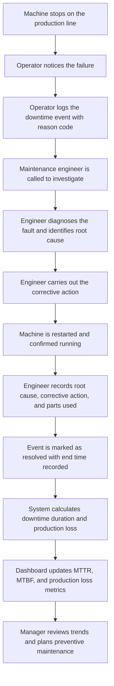

# Manufacturing Fundamentals

## Purpose

The Downtime Command Center is built around manufacturing concepts. The database tables, the dashboard metrics, the user roles, and the event workflow all reflect the way a real factory operates.

Before exploring the database design or the application architecture, it helps to understand the manufacturing world that the software is modelling. This chapter introduces the key concepts — production lines, downtime, metrics, and maintenance — using plain language and practical examples.

You do not need any manufacturing experience to follow along. Every term is explained before it is used.

> [!NOTE]
> Understanding the real-world concepts behind a system makes the technical decisions much easier to follow. The database tables in this project exist because the manufacturing concepts in this chapter exist.

---

## What Is a Production Line?

To understand the software, it helps to first picture the physical environment it is designed for.

### The factory

A factory is a building where physical products are made. It might produce bottled drinks, car parts, packaged food, electronic components, or any other manufactured goods. The factory is the top level of the operation — everything else happens inside it.

### The production line

Inside a factory, work is organized into production lines. A production line is a sequence of machines arranged so that a product moves from one end to the other, with each machine performing one step in the process.

Think of it like an assembly line. A product enters at one end as raw material and exits at the other end as a finished item. Each machine along the way does one specific job.

A simple illustration:

```
Raw Material
    ↓
[ Machine 1: Cutting ]
    ↓
[ Machine 2: Shaping ]
    ↓
[ Machine 3: Filling ]
    ↓
[ Machine 4: Sealing ]
    ↓
[ Machine 5: Packaging ]
    ↓
Finished Product
```

### The machine

A machine is a single piece of equipment on the production line. Each machine has one job. Machine 1 cuts. Machine 3 fills. Machine 5 packages. They work together in sequence to produce the finished product.

### Why one stopped machine matters

Here is the important thing about a production line: it is only as fast as its slowest or most unreliable machine.

If Machine 3 stops, the product cannot move forward. Machines 4 and 5 have nothing to work on. The entire line comes to a halt, even though four out of five machines are perfectly fine.

This is why a single machine failure can stop an entire factory line. The machines are not independent — they are connected in a chain, and a break anywhere in the chain stops everything downstream.

> [!NOTE]
> A production line is a chain of machines. When one machine stops, the whole chain stops. This is why downtime on a single machine can have a large impact on the whole factory.

---

## Understanding Downtime

Downtime is the period of time when a machine is not running when it should be.

The word "down" here means the machine is not operational. It is not producing anything. It is stopped.

Downtime is expensive for a simple reason: the factory's costs do not stop when the machine does. Workers are still being paid. The building still costs money to run. But nothing is being produced. The factory is spending money without making anything.

### The lifecycle of a downtime event

A downtime event has a clear beginning and end:

```
Machine is running normally
  ↓
Something goes wrong — the machine fails
  ↓
Production stops
  ↓
An operator notices and reports the fault
  ↓
A maintenance engineer arrives and investigates
  ↓
The engineer carries out the repair
  ↓
The machine is restarted and tested
  ↓
Machine is running normally again
```

The downtime event starts the moment the machine fails and ends the moment it is running again. Everything in between — the investigation, the repair, the testing — is part of the downtime duration.

### How downtime duration is calculated

Downtime duration is simply the difference between when the machine stopped and when it started running again.

```
Downtime Duration = End Time − Start Time
```

A practical example:

| Event | Time |
|---|---|
| Machine stopped | 09:15 |
| Machine running again | 10:40 |
| Downtime duration | 1 hour 25 minutes |

That 1 hour and 25 minutes is the downtime duration for that event. It is one of the most important numbers the system records, because it feeds directly into the performance metrics that managers use to make decisions.

---

## Production Loss

Downtime duration tells you how long a machine was stopped. Production loss tells you what that stoppage actually cost in terms of output.

Production loss is the number of units that were not produced because the machine was stopped.

### Calculating production loss

Every machine has a normal output rate — the number of units it produces per hour when running correctly. If you know the output rate and the downtime duration, you can calculate the production loss.

```
Production Loss = Output Rate × Downtime Duration
```

A practical example:

| Detail | Value |
|---|---|
| Machine normal output | 1,200 bottles per hour |
| Downtime duration | 1 hour 25 minutes (1.42 hours) |
| Production loss | 1,704 bottles |

Those 1,704 bottles were never produced. They represent the real cost of that downtime event.

### Why factories measure units, not money

You might expect factories to measure production loss in money rather than units. Some do. But many prefer units because units are objective and consistent.

The price of a product can change. Discounts, promotions, and market conditions all affect the monetary value of a unit. But a bottle is always a bottle. A box is always a box. Measuring in units makes it easier to compare performance across different time periods without worrying about price changes.

Units are also easier for operators and engineers to understand. "We lost 1,700 bottles" is more concrete and immediate than "we lost £340 in revenue."

> [!TIP]
> Production loss in units is a consistent, objective measure of downtime impact. It does not change with market conditions, making it reliable for long-term trend analysis.

---

## Open vs Resolved Downtime

Not all downtime events are the same. The system tracks two states for every event: open and resolved.

### Open event

An open event is a downtime event that has been logged but not yet resolved. The machine may still be stopped, or the repair may be in progress. The end time is not yet known.

An open event tells the system: "something is wrong right now."

### Resolved event

A resolved event is a downtime event where the repair has been completed and the machine is running again. The end time has been recorded, and the engineer has documented what was found and what was done.

A resolved event tells the system: "this incident is complete and fully documented."

### What becomes available after resolution

When an event is resolved, several important pieces of information become available that were not available while the event was open:

| Information | Available when open? | Available when resolved? |
|---|---|---|
| Start time | Yes | Yes |
| End time | No | Yes |
| Downtime duration | No | Yes |
| Production loss | No | Yes |
| Root cause | No | Yes |
| Corrective action | No | Yes |
| Parts used | Partially | Yes |

This is why the system distinguishes between open and resolved events. An open event is a live incident. A resolved event is a complete historical record that can be analysed and learned from.

---

## MTTR

MTTR stands for Mean Time To Repair.

Breaking that down into plain English:

- **Mean** means average.
- **Time To Repair** means how long it takes to fix a machine after it fails.

So MTTR is simply the average repair time across multiple downtime events.

### Calculating MTTR

To calculate MTTR, you add up the repair times for all events in a given period and divide by the number of events.

```
MTTR = Total Repair Time ÷ Number of Events
```

A practical example:

| Event | Repair Time |
|---|---|
| Event 1 | 45 minutes |
| Event 2 | 30 minutes |
| Event 3 | 90 minutes |
| Event 4 | 15 minutes |
| **Total** | **180 minutes** |

```
MTTR = 180 minutes ÷ 4 events = 45 minutes
```

The average repair time for this machine is 45 minutes.

### Why managers monitor MTTR

MTTR is one of the most watched metrics in maintenance management because it measures the speed and effectiveness of the maintenance team.

A falling MTTR over time means the team is getting faster at diagnosing and fixing faults. That might be because engineers are becoming more experienced, because spare parts are more readily available, or because recurring faults are being permanently fixed rather than patched.

A rising MTTR is a warning sign. It might mean faults are becoming more complex, that the team is understaffed, or that the same problems keep recurring without a permanent solution.

> [!NOTE]
> MTTR measures how quickly the maintenance team responds to and resolves faults. It is one of the clearest indicators of maintenance team performance.

---

## MTBF

MTBF stands for Mean Time Between Failures.

Breaking that down:

- **Mean** means average.
- **Time Between Failures** means how long a machine runs before it fails again.

So MTBF is the average amount of running time between one failure and the next.

### A simple timeline example

Imagine a machine over a single working week:

```
Monday 06:00 — Machine starts running
Monday 10:30 — Machine fails (ran for 4.5 hours)
Monday 11:15 — Machine repaired and running again
Tuesday 14:00 — Machine fails (ran for 26.75 hours)
Tuesday 15:30 — Machine repaired and running again
Wednesday 09:00 — Machine fails (ran for 17.5 hours)
```

The running times between failures were 4.5 hours, 26.75 hours, and 17.5 hours.

```
MTBF = (4.5 + 26.75 + 17.5) ÷ 3 = 16.25 hours
```

On average, this machine runs for about 16 hours before failing again.

### MTTR vs MTBF

These two metrics work together to give a complete picture of machine reliability and maintenance performance.

| Metric | What it measures | What a good result looks like |
|---|---|---|
| MTTR | How long repairs take | Low — repairs are fast |
| MTBF | How long the machine runs before failing | High — the machine runs for a long time without breaking |

A machine with a low MTBF fails frequently. A machine with a high MTTR takes a long time to fix. Both are problems, but they point to different solutions.

A low MTBF suggests the machine itself needs attention — perhaps a component is wearing out and needs replacing before it fails. A high MTTR suggests the maintenance process needs attention — perhaps spare parts are hard to find, or the fault is difficult to diagnose.

---

## Reason Codes

When a machine fails, the first question is: what kind of failure was it?

A reason code is a standardized category that describes the type of failure. Instead of writing a free-text description every time — which would be different for every operator and impossible to analyse — the system uses a fixed list of categories.

Common reason code categories used in manufacturing:

| Reason Code | What it means |
|---|---|
| Mechanical | A physical component broke, wore out, or jammed |
| Electrical | A wiring fault, sensor failure, or power issue |
| Hydraulic | A problem with fluid-powered systems |
| Pneumatic | A problem with air-powered systems |
| Material | The raw material caused the fault — wrong size, wrong quality, blockage |
| Operator Error | The machine was operated incorrectly |
| Quality | The machine stopped because it was producing defective output |
| Changeover | The machine was being set up for a different product |

### Why standardized categories matter

Without reason codes, every operator describes a fault in their own words. One person writes "belt snapped." Another writes "conveyor stopped." Another writes "mechanical issue on line 2." These all describe the same type of problem, but they look like three different things to anyone trying to analyse the data.

With reason codes, every mechanical failure is recorded as "Mechanical" regardless of who logged it. This makes it possible to ask questions like: "How many of our failures this month were mechanical?" and get a reliable answer.

Standardized categories turn individual records into comparable data. That is what makes analysis possible.

> [!TIP]
> Reason codes are one of the most important design decisions in a downtime tracking system. They are what allow the system to produce meaningful reports rather than just a list of incidents.

---

## Root Cause

A reason code describes the type of failure. A root cause explains why the failure happened.

These are different things, and it is important not to confuse them.

| Concept | Question it answers | Example |
|---|---|---|
| Reason Code | What kind of failure was it? | Mechanical |
| Root Cause | Why did the failure happen? | Bearing worn out due to lack of lubrication |

The reason code is recorded quickly by the operator at the time of the failure. The root cause is recorded by the engineer after they have investigated the fault.

### More examples

| Reason Code | Root Cause |
|---|---|
| Electrical | Sensor cable damaged by repeated contact with moving part |
| Material | Supplier delivered undersized components that jammed the feeder |
| Mechanical | Drive belt had not been replaced on schedule and snapped under load |
| Operator Error | New operator was not trained on the correct startup sequence |

The root cause is the most valuable piece of information in the entire downtime record. It is what allows the factory to learn from failures rather than simply recording them.

If the root cause is "bearing worn out due to lack of lubrication," the factory can add a lubrication check to the regular maintenance schedule and prevent the same failure from happening again. Without the root cause, the failure is just a number in a report.

---

## Corrective Action

A corrective action is what was done to fix the problem.

It is the engineer's record of the repair. It answers the question: "What did you do to get the machine running again?"

### How it differs from root cause

Root cause and corrective action are related but distinct:

| Concept | Question it answers | Example |
|---|---|---|
| Root Cause | Why did the machine fail? | Bearing worn out due to lack of lubrication |
| Corrective Action | What was done to fix it? | Replaced bearing, added lubrication point to maintenance schedule |

The root cause is a diagnosis. The corrective action is the treatment.

### Why corrective action is recorded

Recording the corrective action serves two purposes.

First, it creates a repair history for the machine. If the same fault happens again six months later, the engineer can look back and see exactly what was done last time. This saves investigation time and avoids repeating mistakes.

Second, it provides evidence for improvement. If the corrective action for a recurring fault is always "replaced the same part," that is a signal that the root cause has not been properly addressed. The part keeps failing because the underlying problem — perhaps inadequate lubrication, or a misaligned component — has never been fixed.

> [!NOTE]
> Root cause explains why the machine failed. Corrective action explains what was done about it. Both are needed to build a useful maintenance history.

---

## Critical Machines

Not all machines are equally important. Some machines, if they stop, cause far more disruption than others.

### Critical assets

A critical asset is a machine whose failure has a large impact on the factory's ability to produce. It might be critical because:

- it is the only machine of its type on the line
- it handles a high volume of production
- it is expensive or time-consuming to repair
- it sits at a point in the production line where everything else depends on it

### Bottleneck machines

A bottleneck machine is one that limits the speed of the entire production line. Even if every other machine is running perfectly, the line can only go as fast as the bottleneck allows.

If the bottleneck machine stops, the entire line stops immediately. There is no buffer, no workaround, and no way to keep producing without it.

### Why some machines deserve closer monitoring

Understanding which machines are critical helps the factory prioritise its maintenance effort. It does not make sense to treat every machine the same way. A machine that produces 50 units per hour and has a cheap, readily available spare part is very different from a machine that produces 5,000 units per hour and requires a specialist engineer to repair.

The Downtime Command Center allows managers to see which machines are generating the most downtime events and the most production loss. Over time, this data reveals which machines deserve the most attention — whether that means more frequent inspections, faster spare parts availability, or dedicated maintenance resources.

---

## Preventive Maintenance

There are two fundamentally different approaches to maintaining machines.

### Corrective maintenance

Corrective maintenance means waiting for a machine to fail and then fixing it. This is the reactive approach. The machine breaks, the engineer responds, the machine is repaired.

Corrective maintenance is sometimes unavoidable — some failures cannot be predicted. But relying on it entirely is expensive. Every failure causes downtime, production loss, and emergency repair costs.

### Preventive maintenance

Preventive maintenance means servicing a machine on a regular schedule before it fails. This is the proactive approach. The engineer inspects the machine, replaces worn components, lubricates moving parts, and checks for early signs of problems — all before anything breaks.

A simple comparison:

| Approach | When it happens | Goal | Downtime caused |
|---|---|---|---|
| Corrective maintenance | After a failure | Fix the broken machine | Unplanned, often long |
| Preventive maintenance | On a regular schedule | Prevent failures before they happen | Planned, usually short |

### How analytics help schedule preventive maintenance

This is where the data collected by the Downtime Command Center becomes genuinely valuable.

If the system shows that a particular machine fails with a mechanical fault every six to eight weeks, a manager can schedule a preventive maintenance check every five weeks. The engineer inspects and services the machine before the failure happens. The unplanned downtime is replaced by a short, planned maintenance window.

Without historical data, this kind of scheduling is guesswork. With it, it becomes evidence-based planning.

> [!TIP]
> Preventive maintenance is only possible when you have reliable historical data. The Downtime Command Center builds that data over time, making it possible to move from reactive to proactive maintenance.

---

## Complete Manufacturing Workflow

Here is how all of these concepts connect in a single downtime event, from the moment a machine stops to the moment a manager uses the data to make a decision:



Each step in this workflow maps directly to a concept covered in this chapter:

- The operator logs the event with a reason code — standardized categorization.
- The engineer identifies the root cause — the underlying reason for the failure.
- The engineer records the corrective action — what was done to fix it.
- The system calculates downtime duration and production loss — quantifying the impact.
- The dashboard updates MTTR and MTBF — performance metrics for decision making.
- The manager plans preventive maintenance — using historical data to prevent future failures.

---

## Why These Concepts Matter

Every metric in the Downtime Command Center exists because it helps a business make a better operational decision.

The connection between the manufacturing concepts and the software is direct:

| Manufacturing concept | Why the software tracks it |
|---|---|
| Downtime duration | Quantifies the cost of each failure |
| Production loss | Translates downtime into lost output |
| Reason code | Enables analysis by failure type |
| Root cause | Enables learning and prevention |
| Corrective action | Builds a repair history for each machine |
| MTTR | Measures maintenance team performance |
| MTBF | Measures machine reliability over time |
| Open / resolved status | Separates live incidents from completed history |
| Critical machines | Helps prioritise maintenance resources |
| Preventive maintenance | Reduces unplanned downtime over time |

None of these are arbitrary fields in a database. Each one represents a real question that a real manager needs to answer. The software exists to collect the raw information and turn it into answers.

A downtime event on its own is just a record. But when hundreds of events are stored consistently — with reason codes, root causes, durations, and corrective actions — patterns emerge. Those patterns are what allow a factory to improve.

---

## Key Takeaways

- A factory contains production lines. A production line is a sequence of machines that work together to produce a finished product.
- When one machine on a production line stops, the entire line stops. This is why a single failure can have a large impact.
- Downtime is the period when a machine is not running when it should be. Downtime duration is calculated as the difference between the start time and the end time of the failure.
- Production loss is the number of units that were not produced during the downtime period. It is calculated using the machine's normal output rate.
- An open event is a live incident. A resolved event is a complete historical record with a documented root cause, corrective action, and end time.
- MTTR is the average repair time. A lower MTTR means the maintenance team resolves faults faster.
- MTBF is the average running time between failures. A higher MTBF means the machine is more reliable.
- Reason codes are standardized categories that describe the type of failure. They make it possible to analyse failures at scale.
- Root cause explains why the failure happened. Corrective action explains what was done to fix it. Both are needed to build a useful maintenance history.
- Critical machines are those whose failure has the largest impact on production. They deserve closer monitoring and faster response.
- Preventive maintenance uses historical data to service machines before they fail, replacing unplanned downtime with planned maintenance windows.
- Every metric in the application exists because it helps a manager make a better decision. The software turns operational events into organizational knowledge.
