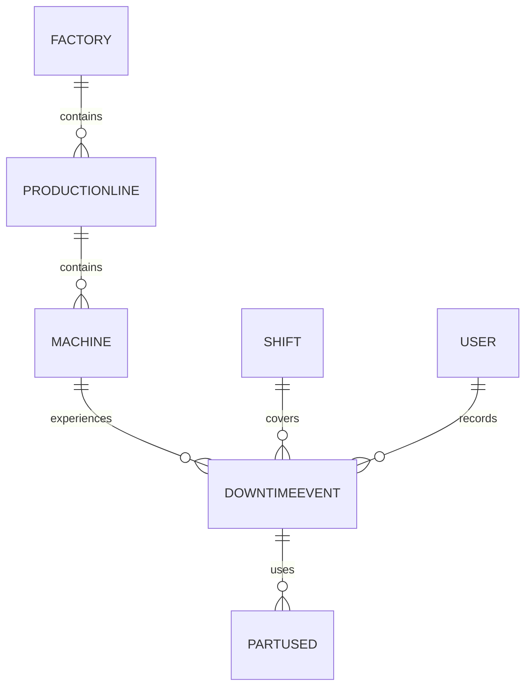

# Database Design

## Purpose

A database is the organized memory of the maintenance system. It stores information about factories, production lines, machines, downtime events, and the people who work with them. In simple terms, the database helps the application answer important business questions such as:

- Which machine had the most downtime this month?
- Which production line is causing the most delays?
- Which part is used most often during repairs?
- What happened during a specific incident?

The goal is not just to save data. The goal is to keep that data in a way that is clear, dependable, and easy to use.

> [!NOTE]
> Think of the database as the system's shared memory. It remembers what happened, where it happened, and who was involved.

## What is a Database?

A database is like a digital filing cabinet. Instead of paper folders, it uses digital storage boxes called tables.

A table is a structured list. Each table holds one kind of information. For example, one table might hold information about machines, while another holds information about downtime events.

Inside a table, data is arranged in rows and columns:

- A row is one record, or one item in the list.
- A column is one type of information.

For example, in a table of machines:

- each row might represent one machine
- each column might hold details such as machine name, model, or status

This structure makes it easier to find, update, and compare information.

## Why Not Store Everything in One Table?

It may seem simple to put all information into one giant table, but that creates problems.

### Duplicated data

If the same information is written many times, the database becomes messy. For example, if every downtime record repeats the full machine information, the machine name and model may appear again and again.

### Difficult updates

If a machine name changes, you would need to update it in many places. That is easy to forget.

### Wasted storage

Repeated information takes up more space than necessary.

### Inconsistent information

If one record says the machine is "Line 2 Press" and another says "Line Two Press," the data becomes confusing.

A simple example:

Imagine a single table containing downtime events and machine details together. The same machine information might appear in every incident record. That is repetitive and makes the data harder to maintain.

## What is Database Normalization?

Database normalization is a simple idea:

"Store each piece of information once, then connect everything together."

Instead of copying the same information into many places, the database keeps it in one logical home and links related records together. This makes the design cleaner and more reliable.

A beginner-friendly way to think about it is this:

- keep machine details in one place
- keep downtime details in another place
- connect them when needed

That way, if a machine is updated, the change does not need to be repeated everywhere.

## Database Overview

The database is designed to reflect the real manufacturing environment. Each table represents a different part of that world.

### User

#### Purpose

Represents the people who use the system, such as operators, engineers, supervisors, or administrators.

#### Example Data

| UserID | Name   | Role       |
| ------ | ------ | ---------- |
| 1      | Amina  | Operator   |
| 2      | Daniel | Engineer   |
| 3      | Sara   | Supervisor |

#### Why It Exists

Users are important because many actions in the system are connected to the person who recorded or reviewed them. Keeping users separate makes it easier to track responsibility.

### Factory

#### Purpose

Represents a physical factory location.

#### Example Data

| FactoryID | FactoryName | City  |
| --------- | ----------- | ----- |
| 1         | North Plant | Lagos |
| 2         | South Plant | Abuja |

#### Why It Exists

Factories are the highest level in the manufacturing structure. Grouping production lines under factories helps organize operations.

### ProductionLine

#### Purpose

Represents a production line inside a factory.

#### Example Data

| ProductionLineID | Name             | FactoryID |
| ---------------- | ---------------- | --------- |
| 1                | Packaging Line A | 1         |
| 2                | Assembly Line B  | 1         |

#### Why It Exists

A production line is a more specific part of the factory. Separating it from the factory allows the system to describe operations at the right level.

### Machine

#### Purpose

Represents a specific machine on a production line.

#### Example Data

| MachineID | MachineName | ProductionLineID |
| --------- | ----------- | ---------------- |
| 10        | Press 01    | 1                |
| 11        | Conveyor 02 | 1                |

#### Why It Exists

Machines are the equipment that actually experiences downtime and maintenance work. Keeping them in their own table allows each machine to be tracked independently.

### DowntimeEvent

#### Purpose

Represents a recorded period when a machine stopped working or underperformed.

#### Example Data

| DowntimeEventID | MachineID | StartTime        | EndTime          | Status   |
| --------------- | --------- | ---------------- | ---------------- | -------- |
| 100             | 10        | 2026-07-20 08:00 | 2026-07-20 08:40 | Resolved |
| 101             | 11        | 2026-07-20 09:10 | 2026-07-20 09:30 | Open     |

#### Why It Exists

This is the main event table. It captures the problem itself, including when it started, when it ended, and whether it is still open.

### PartUsed

#### Purpose

Represents the spare parts or materials used during a downtime event.

#### Example Data

| PartUsedID | DowntimeEventID | PartName | Quantity |
| ---------- | --------------- | -------- | -------- |
| 1          | 100             | Bearing  | 2        |
| 2          | 101             | Sensor   | 1        |

#### Why It Exists

Parts are tied to the repair work, not to the machine alone. Keeping them separate allows the system to record what was used during each incident.

### Shift

#### Purpose

Represents a work period during which the event was handled.

#### Example Data

| ShiftID | ShiftName | StartTime | EndTime |
| ------- | --------- | --------- | ------- |
| 1       | Morning   | 06:00     | 14:00   |
| 2       | Evening   | 14:00     | 22:00   |

#### Why It Exists

Shifts help describe when an incident happened and which team was present. This is useful for reporting and follow-up.

## Relationships Between Tables

The tables are connected in a way that mirrors the real manufacturing environment.

The hierarchy looks like this:

Factory
→ Production Line
→ Machine
→ Downtime Event
→ Parts Used

A factory contains production lines. A production line contains machines. A machine can experience downtime events. Each downtime event may involve parts used during repair.

The same idea also applies to people and shifts. A user may record an event, and a shift may be associated with the time during which the event occurred.

This structure makes the data easier to understand because it follows the real world rather than forcing everything into one flat list.

## Why IDs Are Used

In a database, each important record needs a way to be identified clearly. That is why IDs are used.

Every machine receives a unique ID so the database can refer to it without copying all its information every time.

For example, instead of writing the full machine details again and again in every downtime record, the database simply stores the machine's ID.

A simple example:

| DowntimeEventID | MachineID | Problem      |
| --------------- | --------- | ------------ |
| 100             | 10        | Conveyor jam |

Here, the number 10 points to the machine record for Press 01. The database does not need to repeat the full machine details in the downtime record.

This is helpful because the database can link related information together without duplication.

> [!TIP]
> A good rule is: keep the main information in one place, and use small references to connect related records.

## Example Workflow

Let us walk through a realistic downtime scenario.

1. Operator logs downtime.
   - The system creates a new record in the DowntimeEvent table.
   - The event is linked to the relevant Machine and Shift.

2. DowntimeEvent is created.
   - The event now represents the incident that happened on the shop floor.
   - The record stores the start time, status, and related machine.

3. Engineer records root cause.
   - The engineer adds the reason the machine stopped.
   - This information is connected to the downtime event rather than stored as a separate machine description.

4. Engineer records corrective action.
   - The repair steps or fix plan are linked to the same downtime event.
   - This keeps the incident history in one place.

5. Parts are added.
   - The system records used parts in the PartUsed table.
   - Each part entry is connected to the downtime event that required it.

6. Event is marked resolved.
   - The status of the downtime event changes from open to resolved.
   - The database now shows that the issue was handled.

7. Managers later query this information.
   - A manager can review the event history, see which machine was affected, and understand what was done.
   - The information is easy to find because the tables are connected logically.

This workflow shows why the database design matters. Each step is tied to the real manufacturing process, and the data remains organized.

## Why This Is a Good Database Design

This design is strong because it follows good habits:

- Separation of concerns: each table has a clear purpose.
- Minimal duplication: information is stored once and linked where needed.
- Scalability: the system can grow to handle more factories, lines, machines, and events.
- Maintainability: updates are easier because the same data is not repeated everywhere.
- Easier reporting: managers can ask business questions and get reliable answers.
- Reflection of the real process: the structure matches how manufacturing operations actually work.

In other words, the database does more than store records. It supports the business by making the information useful.

## Key Takeaways

- A database is a structured way to store information, much like a digital filing cabinet.
- Tables hold one kind of information, while rows and columns organize that information clearly.
- Putting everything into one giant table causes duplication, confusion, and maintenance problems.
- Normalization means storing each piece of information once and connecting related records.
- The design in this project mirrors the real manufacturing hierarchy: factory, line, machine, event, and parts.
- IDs help the database connect records without repeating full information over and over.
- A well-designed database makes reporting, maintenance tracking, and future growth much easier.
