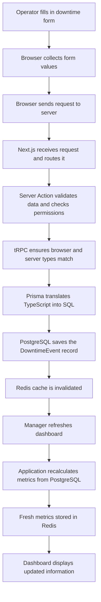

# Request Flow

## Purpose

This chapter follows one user action — clicking a button on a form — all the way through the backend and back to the dashboard. Every step of that journey is explained in plain language.

Understanding request flow is one of the most important skills in backend and full-stack development. Once you can trace what happens when a user does something, you can debug problems faster, design better systems, and explain your work clearly to others.

> [!NOTE]
> You do not need to memorise every detail in this chapter. The goal is to build a mental picture of how the pieces fit together.

---

## High-Level Overview

Before diving into the details, here is the big picture. Every user action in this application follows a similar journey:

```
User
  ↓
Browser
  ↓
Next.js
  ↓
Server Action / tRPC
  ↓
Prisma
  ↓
PostgreSQL
  ↓
Redis
  ↓
Dashboard
```

Each step in that list is a different layer of the application. Each layer has one job. Together, they make the system work reliably and safely.

The rest of this chapter explains each layer using a single, concrete example.

---

## The Example Scenario

An operator is on the factory floor. A machine has just stopped unexpectedly.

They open the application, fill in the downtime form, and click:

**"Log Downtime"**

They enter:

- which machine stopped
- the reason it stopped
- any notes about what they observed

The rest of this document follows that single click from the browser all the way to the database and back to the manager's dashboard.

---

## Step 1 – User Interaction

The operator fills in the form on screen. They type the machine name, select a reason code from a dropdown, and add a short note.

At this point, the form values exist only in the browser. Nothing has been saved anywhere permanent yet. If the operator closed the tab right now, the information would be lost.

A completed form might look like this:

```
┌─────────────────────────────────────────┐
│  Log Downtime Event                     │
├─────────────────────────────────────────┤
│  Machine:      Press 01                 │
│  Reason:       Mechanical Failure       │
│  Notes:        Conveyor belt snapped    │
│                                         │
│              [ Log Downtime ]           │
└─────────────────────────────────────────┘
```

The moment the operator clicks "Log Downtime", the browser takes over.

---

## Step 2 – The Browser

The browser collects the values from the form and packages them into a request. Think of it like putting a letter into an envelope and addressing it to the server.

That request might carry information that looks like this:

```json
{
  "machineId": "machine_10",
  "reasonCode": "MECHANICAL_FAILURE",
  "notes": "Conveyor belt snapped"
}
```

The browser then sends that envelope over the internet to the server.

> [!NOTE]
> The browser is only responsible for collecting and sending information. It does not decide whether the data is valid, whether the user has permission, or how the data should be stored. Those decisions belong to the server.

---

## Why the Browser Cannot Save Directly

You might wonder: why can the browser not just save the data itself? Why does it need to send anything to a server at all?

The short answer is: the browser cannot be trusted on its own.

Here is why.

Anyone with basic technical knowledge can open their browser's developer tools and change the values in a form before submitting it. They could change their machine ID to someone else's, remove a required field, or submit data that should not be allowed.

If the browser were allowed to save directly to the database, there would be no way to stop that.

The server is the gatekeeper. It checks every request before anything is saved. It asks:

- Is this data in the right format?
- Does this user have permission to do this?
- Does this machine actually exist?

Only after those checks pass does the server allow the data to be stored.

> [!IMPORTANT]
> The server must always be the source of truth. The browser is a tool for collecting input, not for making decisions about what gets saved.

---

## Step 3 – Next.js

The request arrives at the server. The first thing it meets is Next.js.

Next.js is the framework that runs the application. Think of it like a receptionist at the front desk of a large office building. When a visitor arrives, the receptionist does not handle every task themselves. Instead, they look at what the visitor needs and direct them to the right person.

Next.js does the same thing. It receives the incoming request, looks at what is being asked for, and routes it to the correct piece of server logic.

In this case, it sees that the operator is trying to log a downtime event and passes the request along to the server action responsible for handling that.

---

## Step 4 – Server Actions and tRPC

This is where the real work begins.

### Server Actions

A server action is a function that runs on the server. It contains the business logic — the rules that decide what should happen.

For the downtime form, the server action might:

- check that all required fields are present
- confirm that the machine ID actually exists in the database
- verify that the logged-in user has permission to log downtime
- prepare the data to be saved

Think of the server action as the kitchen manager in a restaurant. The waiter (the browser) brings in an order, but the kitchen manager checks it before anything goes to the chef. They make sure the order makes sense, that the ingredients are available, and that nothing unusual is being requested.

### tRPC

tRPC is the tool this project uses to connect the browser and the server in a structured way.

To understand why tRPC is useful, it helps to first understand the traditional approach.

In a traditional setup, the browser and server communicate using something called a REST API. The browser sends a request to a URL like `/api/log-downtime`, and the server responds. The problem is that the browser and server have to agree on the shape of the data separately. If the server changes something, the browser might not know until something breaks.

tRPC solves this by sharing the same TypeScript types between the browser and the server. If the server changes the shape of a response, the browser immediately knows about it — the code editor will highlight the problem before the application even runs.

Here is a comparison:

| Feature | REST API | tRPC |
|---|---|---|
| Shared types between browser and server | No — must be maintained manually | Yes — automatic |
| Autocomplete in the code editor | Limited | Full autocomplete |
| Risk of type mismatch bugs | Higher | Much lower |
| Amount of repeated code | More | Less |
| Learning curve | Familiar to most developers | Slightly newer concept |

tRPC was chosen for this project because it reduces the chance of bugs caused by mismatched data shapes, makes the code easier to write with autocomplete, and keeps the browser and server in sync without extra effort.

> [!TIP]
> You do not need to understand every detail of tRPC right now. The key idea is that it keeps the browser and server speaking the same language automatically.

---

## Step 5 – Prisma

Once the server action has validated the request and confirmed everything is correct, it needs to save the data to the database.

But here is the thing: databases speak a language called SQL. TypeScript does not speak SQL natively. Something needs to translate between them.

That translator is Prisma.

Prisma is an Object-Relational Mapper, or ORM. That is a fancy term for a tool that lets you write TypeScript code and automatically converts it into the SQL commands the database understands.

The journey looks like this:

```
Application (TypeScript)
  ↓
Prisma
  ↓
SQL
  ↓
PostgreSQL
```

Here is a simple comparison of what that looks like in practice.

Without Prisma, a developer would write raw SQL:

```sql
INSERT INTO "DowntimeEvent" ("machineId", "reasonCode", "notes", "status")
VALUES ('machine_10', 'MECHANICAL_FAILURE', 'Conveyor belt snapped', 'OPEN');
```

With Prisma, the same operation is written in TypeScript:

```typescript
await prisma.downtimeEvent.create({
  data: {
    machineId: "machine_10",
    reasonCode: "MECHANICAL_FAILURE",
    notes: "Conveyor belt snapped",
    status: "OPEN",
  },
});
```

Both do the same thing. But the Prisma version is easier to read, benefits from autocomplete, and is checked by TypeScript for mistakes before the code even runs.

Prisma improves developer productivity because it removes the need to write and maintain raw SQL for everyday operations, while still giving full access to the database when needed.

---

## Step 6 – PostgreSQL

Prisma sends the translated SQL command to PostgreSQL, the database.

PostgreSQL is the permanent storage layer. It is where the data actually lives. Think of it as the filing cabinet that never forgets.

When the SQL command arrives, PostgreSQL creates a new row in the `DowntimeEvent` table. That row now contains:

- the machine that stopped
- the reason it stopped
- the notes the operator entered
- the time the event was logged
- a status of "Open"

This is persistent storage. That means the data survives even if the server restarts, the browser closes, or the power goes out. The record is now part of the permanent history of the system.

This is why refreshing the page does not lose the data. The information is no longer sitting in the browser — it is safely stored in the database.

> [!NOTE]
> PostgreSQL is the source of truth for all data in this application. Every other layer either reads from it or writes to it.

---

## Step 7 – Redis

After the downtime event is saved to PostgreSQL, there is one more step before the dashboard can show updated information.

That step involves Redis.

Redis is not the main database. It does not store the permanent records. Instead, it stores temporary, fast-access copies of information that is expensive to calculate.

Here is the problem Redis solves.

The manager's dashboard shows metrics like:

- total open downtime events today
- average time to resolve an issue
- which machines have stopped most often this week

Calculating those numbers requires the database to look through potentially thousands of records, add them up, and return a result. If every manager refreshed their dashboard every few seconds, the database would be doing that heavy calculation over and over again.

Redis acts like a whiteboard in the break room. Instead of going back to the filing cabinet every time someone asks "how many open events are there today?", the answer is written on the whiteboard. Anyone who needs it can glance at the whiteboard instead of searching through all the files.

When a new downtime event is saved, the application tells Redis: "the cached dashboard numbers are now out of date — clear them." The next time a manager loads the dashboard, the application recalculates the metrics from PostgreSQL and writes the fresh result back to the whiteboard.

This process is called cache invalidation. It is the system's way of making sure the whiteboard never shows stale information for too long.

> [!TIP]
> Cache invalidation sounds complicated, but the idea is simple: when the real data changes, throw away the old shortcut and let the system create a fresh one.

---

## Step 8 – Dashboard Update

The manager opens the dashboard.

The application checks Redis first. If fresh cached metrics are available, they are returned immediately — the dashboard loads fast.

If the cache was cleared because of the new downtime event, the application goes back to PostgreSQL, recalculates the metrics, stores the result in Redis, and returns the updated numbers to the dashboard.

The manager now sees:

- the new open downtime event for Press 01
- updated production loss figures
- a change in the mean time to repair (MTTR) average
- Press 01 appearing in the top affected machines list

All of this happened because one operator clicked "Log Downtime."

---

## Complete Request Journey

Here is the full journey visualised as a flowchart:



---

## Responsibilities of Each Layer

Each layer in the application has one clear job. Here is a summary:

| Layer | Responsibility |
|---|---|
| Browser | Collects input from the user and sends it to the server |
| Next.js | Receives incoming requests and routes them to the correct server logic |
| Server Actions | Runs business logic, validates data, and enforces application rules |
| tRPC | Keeps the browser and server in sync using shared TypeScript types |
| Prisma | Translates TypeScript code into SQL commands the database understands |
| PostgreSQL | Stores all permanent data and acts as the source of truth |
| Redis | Caches expensive calculations so the dashboard loads quickly |
| Dashboard | Displays metrics and summaries to managers and supervisors |

---

## Restaurant Analogy

A good way to remember how all these layers work together is to think of a restaurant.

```
Customer places an order
  ↓
Waiter takes the order to the kitchen
  ↓
Kitchen Manager checks the order is valid
  ↓
Chef prepares the meal
  ↓
Pantry provides the ingredients
  ↓
Meal is served to the customer
```

Here is how that maps to the application:

| Restaurant | Application |
|---|---|
| Customer | Operator using the browser |
| Waiter | Browser sending the request |
| Kitchen Manager | Server Action checking the request |
| Chef | Prisma preparing the database command |
| Pantry | PostgreSQL storing the permanent data |
| Meal served | Dashboard showing updated results |

Redis would be like a prep station where common ingredients are already chopped and ready. The chef does not need to go back to the pantry for every single dish — the most frequently needed items are already close at hand.

Each person in the restaurant has one job. The waiter does not cook. The chef does not take orders. The kitchen manager does not serve tables. This separation is what makes the restaurant run smoothly, even when it is busy.

The same principle applies to software. When each layer has one clear responsibility, the system is easier to understand, easier to fix, and easier to grow.

---

## Why This Architecture Works Well

This layered approach is not just a convention — it solves real problems.

**Separation of concerns** means each layer only needs to know about its own job. The browser does not need to know how the database works. The database does not need to know what the browser looks like. Changes in one layer rarely break another.

**Maintainability** improves because when something goes wrong, you know exactly where to look. A validation error belongs in the server action. A slow query belongs in Prisma or PostgreSQL. A stale dashboard belongs in Redis.

**Scalability** becomes easier because each layer can be improved independently. If the database becomes slow, you can optimise it without touching the browser code. If the dashboard needs to load faster, you can improve the caching strategy without changing the database schema.

**Security** is stronger because the server always validates and controls what gets saved. The browser is never trusted to make those decisions on its own.

**Readability** improves for the whole team. When a new developer joins the project, they can look at one layer at a time and understand it without needing to understand everything at once.

**Easier debugging** is a natural result of all of the above. When each layer has one job, a bug is much easier to isolate and fix.

---

## Key Takeaways

- Every user action in this application follows the same journey: browser → Next.js → server action → tRPC → Prisma → PostgreSQL → Redis → dashboard.
- The browser collects and sends information. It does not make decisions about what gets saved.
- The server is the gatekeeper. It validates data, checks permissions, and enforces the rules of the application.
- tRPC keeps the browser and server in sync using shared TypeScript types, which reduces bugs and improves the development experience.
- Prisma translates TypeScript into SQL so developers can work with the database without writing raw queries.
- PostgreSQL is the permanent source of truth. Data stored there survives restarts, refreshes, and power outages.
- Redis is a fast, temporary cache. It stores pre-calculated results so the dashboard does not need to recalculate expensive metrics on every page load.
- Cache invalidation is the process of clearing stale cached data when the real data changes.
- Each layer has one responsibility. That separation makes the system easier to build, debug, and grow.
