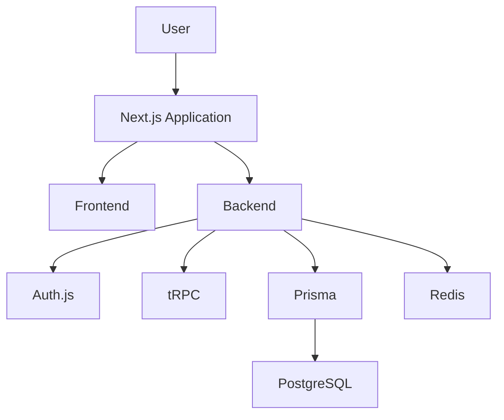
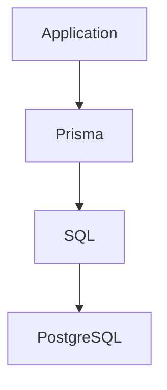
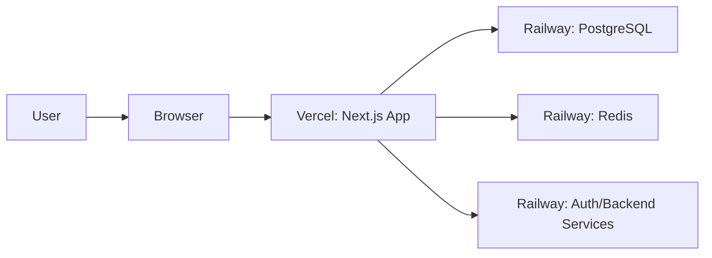
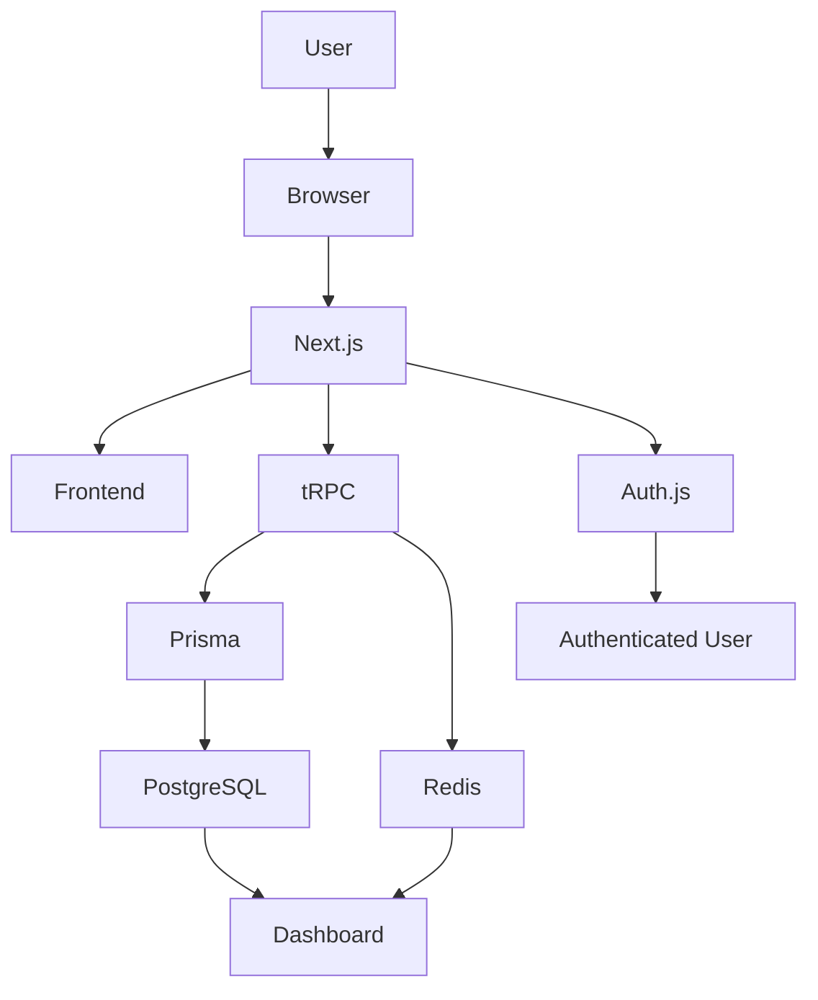

# System Architecture

## Purpose

Architecture is the blueprint of a software system. It is the plan that shows how the different pieces of an application fit together.

When we talk about architecture, we are really answering a simple question:

"How do all of the application's pieces work together?"

For a junior developer, understanding architecture is often more valuable than memorizing a long list of technologies. A system makes more sense when you can see the role of each part and how those parts support one another.

> [!NOTE]
> You do not need to memorize every tool to understand the system. It is more helpful to understand what each tool is responsible for.

## What Is System Architecture?

Think about building a house. You do not put the plumbing, electrical wiring, and walls all in the same place and hope everything works. Each part has a job.

The same is true for software.

A software system is made of many pieces:

- the part users see and interact with
- the part that handles business rules
- the part that stores important data
- the part that protects access and manages sessions

This idea is often called separation of concerns. In simple words, it means each part of the system focuses on one clear job instead of trying to do everything at once.

A good architecture makes the system easier to understand, easier to change, and easier to grow.

## High-Level Architecture

At a high level, the system can be imagined as a flow of work:

Let us understand this flow from top to bottom.

- The user interacts with the application through the browser.
- The Next.js application handles the overall experience.
- The frontend is responsible for what the user sees.
- The backend handles the important rules and decisions.
- Authentication, API communication, database access, and caching each play a specific role.

## Understanding the Frontend

The frontend is the part of the application that users interact with directly. It is the interface they see in the browser.

### React

#### Purpose

React is the tool used to build the interface as a collection of small, reusable pieces.

#### Responsibilities

React helps the page respond to user actions such as clicking buttons, filling forms, and switching views.

#### Why It Was Chosen

React is popular because it makes it easier to build interactive user interfaces in a structured way.

#### Real-world Analogy

Think of React as the builder that assembles the visible parts of a house: walls, doors, windows, and rooms.

### Next.js

#### Purpose

Next.js is the framework that helps organize the web application and manage the overall experience.

#### Responsibilities

It helps with routing, page rendering, and the general structure of the app.

#### Why It Was Chosen

Next.js makes it easier to build modern web applications without starting from scratch.

#### Real-world Analogy

If React is the builder, Next.js is the architect who decides how the rooms connect and how people move through the building.

### Tailwind CSS

#### Purpose

Tailwind CSS is a styling tool that makes it easier to design the user interface.

#### Responsibilities

It provides small styling building blocks so the app can look polished without writing huge amounts of custom CSS.

#### Why It Was Chosen

Tailwind helps the team build consistent, maintainable interfaces quickly.

#### Real-world Analogy

It is like choosing from a well-organized set of paint colors, furniture styles, and layout tools instead of building everything from raw materials.

### shadcn/ui

#### Purpose

shadcn/ui provides ready-made interface components such as buttons, cards, dialogs, and forms.

#### Responsibilities

It helps the team use consistent UI pieces across the application.

#### Why It Was Chosen

It saves time and keeps the interface looking professional.

#### Real-world Analogy

It is like using pre-made furniture pieces instead of building every chair and table by hand.

Together, these technologies create the user interface. React builds the pieces, Next.js arranges the experience, Tailwind styles it, and shadcn/ui supplies polished components.

## Understanding the Backend

The backend is the hidden part of the application that does the important work behind the scenes.

It is responsible for:

- business logic, which means the rules of the application
- validation, which means checking that data is correct
- permissions, which means deciding who is allowed to do what
- communication with the database, which means reading and writing important records

These responsibilities belong on the server rather than inside the browser because the browser is not a trustworthy place to keep critical rules. A user can inspect browser code, so important logic should be protected on the server side.

A simple way to think about it is this:

- the frontend says, "I want to save this downtime event"
- the backend checks the rules, confirms the user has permission, and then stores the right information

## Understanding tRPC

tRPC is a way for the frontend and backend to talk to each other in a safer and simpler way.

### What is tRPC?

It is a tool that lets the frontend call backend functions as if they were normal code inside the application.

### Why do the frontend and backend need to communicate?

The interface needs to ask the server for information and send updates. For example, when a user opens a dashboard, the frontend asks the backend for the latest metrics. When an operator records a downtime event, the frontend sends that request to the backend.

### How does it differ from REST APIs?

A REST API usually uses URLs and HTTP requests such as GET and POST. tRPC uses TypeScript types and function-style calls, which can feel more direct to a developer.

Here is a simple comparison:

| Topic                | REST                    | tRPC                                   |
| -------------------- | ----------------------- | -------------------------------------- |
| Style                | URL-based requests      | Function-style calls                   |
| Communication        | HTTP requests           | Direct TypeScript calls                |
| Type safety          | Often needs extra setup | Strongly connected to TypeScript types |
| Developer experience | More manual             | More convenient and less repetitive    |

### Why it helps

tRPC makes the connection between frontend and backend easier because it supports:

- shared TypeScript types
- autocomplete in the editor
- less duplicated code
- fewer communication bugs

This means developers spend less time guessing how the backend expects data and more time building useful features.

## Understanding TypeScript

TypeScript is a programming language that adds type safety to JavaScript.

A type is a simple way of saying what kind of data something should be. For example, a field might be a text string, a number, or a date.

### Why this matters

Type safety helps catch mistakes before the application runs.

Imagine a kitchen recipe that says, "add two cups of flour" and the cook accidentally pours sugar instead. Type checking is like a smart helper that notices the wrong ingredient before the dish is ruined.

In software, TypeScript helps catch problems early. This reduces bugs and makes the code easier to understand.

### Benefits

- compile-time error detection: problems are found while the code is being written
- shared types: both frontend and backend can agree on the same shape of data
- developer productivity: the editor can suggest the right properties and functions

## Understanding Prisma

Prisma acts like a translator between the application and the database.

Here is the idea:

The application does not need to write raw SQL for every action. Instead, it can use Prisma to talk to the database in a clearer, more developer-friendly way.

### Prisma create() versus SQL INSERT

A simple comparison shows the difference:

| Operation         | Prisma                      | SQL                                  |
| ----------------- | --------------------------- | ------------------------------------ |
| Create a new user | prisma.user.create()        | INSERT INTO users (...) VALUES (...) |
| Find a machine    | prisma.machine.findUnique() | SELECT \* FROM machines WHERE id = ? |

Prisma makes database work feel more like writing normal application code instead of assembling raw SQL statements by hand.

### Why ORMs improve productivity

An ORM, such as Prisma, helps developers:

- write database queries using familiar code
- reduce repetitive SQL syntax
- move faster while building features

It does not remove the need to understand databases, but it makes everyday tasks simpler.

## Understanding PostgreSQL

PostgreSQL is the main database for the project. It is where important, long-term data is stored.

### Persistent storage

Persistent storage means the data stays available even after the application is restarted.

### Source of truth

The database is the source of truth because it is the main place where the system keeps the real records. If a user, machine, or downtime event exists, the database is the place that holds that truth.

The project stores information such as:

- Users
- Factories
- Production Lines
- Machines
- Downtime Events
- Parts
- Shifts

This is why databases are separate from application code. The code is the tool that reads and writes data, but the database is the place where the actual records live.

## Understanding Redis

Redis is a fast in-memory store used for caching.

### What is caching?

Caching means keeping a frequently used result in an easily accessible place so the system does not need to recompute it every single time.

### Why dashboard calculations become expensive

Dashboard pages often need to summarize a lot of information. If the system recalculates the same totals every time a user refreshes the page, that can become slow and expensive.

### How Redis helps

Redis stores some of this information in memory so it can be retrieved quickly.

A useful analogy is a whiteboard in a kitchen:

- the refrigerator is like the main storage area
- sticky notes are like quick reminders
- the whiteboard is like a shortcut for the most important information

Redis is not the primary database. It is a fast helper for data that is often needed again and again.

### Cache invalidation

Cache invalidation simply means making sure the cached result is updated when the real data changes.

For example, if a downtime event is resolved, the dashboard summary should not keep showing the old number. The cache needs to be cleared or refreshed.

That is why caching is helpful, but it also needs careful management.

## Understanding Auth.js

Auth.js is the part of the system that handles authentication and user identity.

### Authentication

Authentication is the process of confirming that a person is who they claim to be.

### Sessions

A session is the period during which the system remembers that a user is logged in.

### User identity

This means the system knows which user is currently active.

### Roles and permissions

Roles and permissions decide what a user is allowed to do. For example, a supervisor may view reports, while a technician may update machine status.

A simple analogy is a reception desk in an office building:

- the receptionist checks a badge
- the system confirms the visitor is allowed inside
- the receptionist then decides which rooms the visitor can enter

Auth.js helps the project manage this secure flow.

## Hosting Architecture

The project is recommended to run on two different platforms:

- Vercel for the web application
- Railway for the database and supporting services

### Why the web application is hosted separately

The frontend and backend need a place to run continuously so users can reach them over the internet. Vercel is a good fit for this part of the system.

### Why PostgreSQL and Redis live on Railway

PostgreSQL and Redis are server-side services that need reliable infrastructure. Railway is a practical home for them.

This separation keeps the system organized:

- Vercel hosts the application experience
- Railway hosts the data and supporting services

## Complete Architecture Diagram

Here is a broader view of how the main pieces connect:

This diagram shows that the user experience, API communication, database access, authentication, and caching all connect around the same central application flow.

## Responsibilities of Every Technology

| Technology   | Primary Responsibility            | Problem It Solves                                         |
| ------------ | --------------------------------- | --------------------------------------------------------- |
| React        | Build interactive user interfaces | Makes the screen respond to user actions                  |
| Next.js      | Organize the web application      | Provides structure for pages and routing                  |
| Tailwind CSS | Style the interface               | Makes UI building faster and more consistent              |
| shadcn/ui    | Provide reusable UI components    | Speeds up interface development                           |
| TypeScript   | Add type safety                   | Helps catch mistakes earlier                              |
| tRPC         | Connect frontend and backend      | Makes API calls cleaner and safer                         |
| Prisma       | Talk to the database in code      | Reduces repetitive SQL work                               |
| PostgreSQL   | Store important data              | Keeps the system's source of truth                        |
| Redis        | Cache repeated results            | Improves speed for expensive calculations                 |
| Auth.js      | Manage identity and permissions   | Keeps the app secure and personalized                     |
| Vercel       | Host the web application          | Makes the app available on the internet                   |
| Railway      | Host data services                | Provides reliable infrastructure for PostgreSQL and Redis |

## What Would Happen If One Technology Were Removed?

| Technology Removed | Impact on the Application                                                    |
| ------------------ | ---------------------------------------------------------------------------- |
| React              | The interface would be much harder to build and update.                      |
| Next.js            | The app would lose its organized web application structure.                  |
| Tailwind CSS       | The interface would become harder to style consistently.                     |
| shadcn/ui          | The UI would need more custom work for common components.                    |
| TypeScript         | More bugs would likely slip through during development.                      |
| tRPC               | Frontend and backend communication would become more manual and error-prone. |
| Prisma             | Database access would require more low-level SQL work.                       |
| PostgreSQL         | The app would lose its main place to store persistent business data.         |
| Redis              | Dashboard performance would likely drop and repeated work would increase.    |
| Auth.js            | Users would not be authenticated properly and access control would break.    |
| Vercel             | The web application would no longer be easily hosted in the recommended way. |
| Railway            | Database and cache services would lose their managed hosting environment.    |

## Why This Architecture Is Good

This architecture is strong because it follows several helpful principles.

### Separation of concerns

Each technology has a clear job. The frontend shows the interface, the backend enforces rules, the database stores truth, and Redis provides speed.

### Single responsibility

Each part solves one main problem well. This makes the system easier to reason about.

### Maintainability

Because responsibilities are separated, the team can change one part without breaking everything else.

### Scalability

As the project grows, the system can handle more traffic, more users, and more data more easily.

### Performance

Caching and efficient communication help the app feel responsive.

### Security

Authentication, permissions, and server-side logic protect important business rules.

### Developer experience

Tools like TypeScript and tRPC help developers move faster and with fewer avoidable mistakes.

## Architecture Principles Learned

### Separation of Concerns

This means different parts of the system handle different jobs. The user interface does not need to know every detail of the database.

### Single Responsibility

A component or service should focus on one main purpose. That makes it easier to understand and fix.

### Source of Truth

The database is the main place where important records live. Other parts of the system rely on it.

### Caching

Caching is a shortcut for information that is used often. It improves speed but must be kept accurate.

### Type Safety

Type safety helps prevent mistakes by making the code clearer and more predictable.

### Defense in Depth

Security is not handled by one single feature alone. The system uses multiple layers of protection, including authentication and permissions.

## Key Takeaways

- Architecture is the blueprint that explains how a system works as a whole.
- A good system divides work into clear responsibilities.
- The frontend is what users see, while the backend enforces rules and protects business logic.
- tRPC makes communication between frontend and backend simpler and safer.
- TypeScript helps catch errors before they become runtime problems.
- Prisma makes database work easier by acting as a translator.
- PostgreSQL is the main place where important data is stored.
- Redis helps speed up repeated work through caching.
- Auth.js manages identity, sessions, and permissions.
- A well-structured architecture makes the system easier to build, maintain, and grow.
