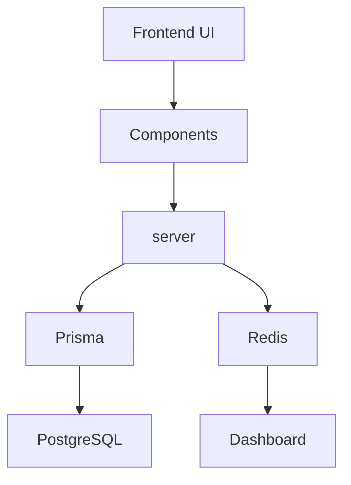

# Understanding the Project Folder Structure

## Purpose

Professional software projects are usually organized around responsibilities rather than around a single technology. A project is not just a random pile of files. It is a carefully arranged workspace where each folder has a purpose.

This chapter teaches you how to navigate the Downtime Command Center project with confidence. When you understand the folder structure, you can find the right place to work faster, debug more easily, and build features without feeling lost.

> [!NOTE]
> The goal is not to memorize every file name. The goal is to understand what each folder is responsible for.

## Why Folder Structure Matters

A well-organized project is easier to work with.

It helps with:

- maintainability: future changes are easier to make
- readability: other developers can understand the project faster
- teamwork: people can find the right place to contribute
- scalability: the project can grow without becoming chaotic
- easier debugging: when something breaks, you can narrow down the problem faster

A good analogy is a workshop. If your tools are scattered everywhere, it takes much longer to fix something. But if each tool has a place, the work becomes smoother.

The same idea applies to software. Every folder should have a clear job.

## The Big Picture

A typical full-stack project might look something like this:

```text
project/
app/
components/
server/
lib/
prisma/
public/
docs/
scripts/
package.json
next.config.ts
tsconfig.json
tailwind.config.ts
.env
```

The exact names may differ slightly from one project to another, but the responsibilities are usually very similar. The important idea is that the project is separated into areas that handle different concerns.

## Understanding the app Folder

The app folder is where the web pages of the application live.

In a Next.js project, this folder is often connected to routing. In simple terms, the folder structure helps decide what URL a page should have.

### Next.js App Router

The App Router is a way of organizing pages and layouts in a project. It helps the framework understand which folders and files should become web pages.

For example:

- app/dashboard/page.tsx becomes /dashboard
- app/machines/page.tsx becomes /machines

This is a very important concept because it means that the folder layout is not just decoration. It shapes the user experience.

### Page files

A file such as page.tsx usually represents a page in the browser.

### Layouts

Layout files define the shared structure around a group of pages. They are like the frame around a room.

### Routes

A route is simply a page address, such as /dashboard or /machines.

### Server components and client components

A server component runs on the server and is often used for data-heavy tasks. A client component runs in the browser and is used for interactive behavior.

This distinction matters because some work belongs on the server and some belongs in the browser.

```mermaid
flowchart LR
    A[app/dashboard/page.tsx] --> B[/dashboard]
    C[app/machines/page.tsx] --> D[/machines]
    E[app/layout.tsx] --> F[Shared layout around pages]
```

## Understanding Components

The components folder contains reusable pieces of the user interface.

These are small building blocks that can be used many times across the app. Examples include:

- Button
- MetricCard
- DashboardCard
- DowntimeForm
- Navbar

A reusable component is like a LEGO brick. Instead of building the same piece again and again, you create it once and reuse it wherever needed.

This helps because:

- the interface is more consistent
- less code is duplicated
- changes are easier to apply across the app

If you want to update the style of a button everywhere, you usually change the button component once rather than editing many pages by hand.

## Understanding the server Folder

The server folder is where server-side logic lives.

This is where you typically find:

- tRPC routers
- business logic
- validation
- database communication

In simple terms, this is the part of the project that handles the important rules of the application.

This is different from the frontend. The frontend is mostly about showing things and collecting input. The server is responsible for deciding what should happen next.

For example, if a user tries to log a downtime event, the server checks whether the request is valid and whether the user is allowed to perform that action.

That is why this logic should not live inside the browser. The browser is not the right place to keep critical rules.

## Understanding the prisma Folder

The prisma folder contains the database model definitions and related scripts.

### schema.prisma

This file describes the database structure. It tells the project what kinds of data exist and how they relate to one another.

This connects directly to the database design chapter. There, you learned about tables such as users, machines, downtime events, and parts. In this folder, those ideas become formal definitions that the application can use.

### seed.ts

A seed file is used to add sample data to the database. This is useful during development because it gives the project a starting point.

### Migrations

Migrations are the step-by-step changes that update the database structure over time.

In simple terms, Prisma helps turn your database design into something the application can actually use.

## Understanding the lib Folder

The lib folder contains shared helper code.

These are small pieces of logic that do not belong to one page or one component but are used in several places.

Examples may include:

- prisma.ts
- redis.ts
- auth.ts
- utils.ts

A helper function might format a date, connect to a service, or create a shared configuration object.

Why is this folder useful?

- code is reused instead of rewritten
- common logic lives in one place
- updates are easier to maintain

If you find yourself asking, "Where should this shared logic go?" the lib folder is often the answer.

## Understanding the public Folder

The public folder stores static assets.

These are files that do not need to be processed by the application code, such as:

- images
- logos
- icons
- other simple files used directly by the browser

These files are different from application code because they are usually just assets that the browser can display.

For example, a company logo belongs in the public folder. A dashboard chart component belongs in the app or components layer instead.

## Understanding the docs Folder

The docs folder is where project knowledge is kept.

This project already contains files such as:

- ARCHITECTURE.md
- BUILD_LOG.md
- DEPLOYMENT.md
- ONE_WEEK_PLAN.md

These files help explain the project from different angles.

The new Learning Handbook lives inside the docs/learning folder. Its purpose is different from traditional technical documentation. Instead of acting like a reference manual, it teaches the reader how the system works in a beginner-friendly way.

This makes the docs folder more than a storage place. It becomes a learning resource for the team.

## Understanding Configuration Files

Configuration files tell the project how to behave.

### package.json

#### Purpose

This file describes the project's scripts and dependencies.

#### Why it exists

It helps developers run common commands and understand which tools the project uses.

#### What would happen if it were missing

The project would not have a clear way to define its runtime tools and scripts.

### next.config.ts

#### Purpose

This file contains general configuration for the Next.js application.

#### Why it exists

It helps the framework behave in the expected way for the project.

#### What would happen if it were missing

The app would still run in many cases, but the project would lose some custom configuration.

### tsconfig.json

#### Purpose

This file configures TypeScript behavior.

#### Why it exists

It helps the project understand how strict the type system should be and how files should be interpreted.

#### What would happen if it were missing

TypeScript would fall back to default behavior, which may not match the project's expectations.

### tailwind.config.ts

#### Purpose

This file configures Tailwind CSS styling behavior.

#### Why it exists

It helps define theme settings and customization options.

#### What would happen if it were missing

The styling system would still work in basic form, but the project would lose special configuration.

### .env

#### Purpose

This file stores environment variables such as secrets and connection settings.

#### Why it exists

It keeps sensitive values out of the source code.

#### What would happen if it were missing

The application would not have the configuration it needs to connect to services like the database.

> [!TIP]
> Configuration files are like the instruction manual for the project. They do not contain the app's business logic, but they tell the app how to behave.

## Following One Feature Through the Project

Let us follow a simple feature: logging downtime.

When a user logs a downtime event, the work usually moves through several parts of the project.



Here is the flow in plain language:

1. The frontend shows the form.
2. The components organize the interface.
3. The server receives the request and applies the rules.
4. Prisma sends the data to the database.
5. PostgreSQL stores the real record.
6. Redis may help speed up related dashboard data.
7. The dashboard can then reflect the latest information.

This is a good example of how a single feature moves through many folders.

## Folder Responsibilities

| Folder/File  | Purpose                                               | Examples                      |
| ------------ | ----------------------------------------------------- | ----------------------------- |
| app          | Holds pages and route-based application structure     | app/dashboard/page.tsx        |
| components   | Stores reusable UI building blocks                    | Button, DashboardCard         |
| server       | Contains server-side logic and business rules         | tRPC routers, validation      |
| lib          | Stores shared helper functions and utilities          | prisma.ts, auth.ts            |
| prisma       | Contains database schema and seed logic               | schema.prisma, seed.ts        |
| public       | Stores static files used by the browser               | images, logos                 |
| docs         | Holds project documentation and learning materials    | ARCHITECTURE.md, BUILD_LOG.md |
| scripts      | Stores helper scripts for development and maintenance | data scripts, automation      |
| package.json | Lists project scripts and dependencies                | npm scripts                   |
| .env         | Stores environment-specific values                    | database URL, secrets         |

## How to Navigate the Project

When you are trying to understand or change something, it helps to ask the right question first.

### "I need to change a page."

Look in the app folder first.

### "I need to modify database tables."

Look in the prisma folder, especially schema.prisma.

### "I need to update business logic."

Look in the server folder.

### "I need to change the dashboard UI."

Look in the components folder and the relevant app page.

### "I need to update authentication."

Look in the auth-related utilities or the server layer where permissions are handled.

The main lesson is simple: start broad, then narrow down. A folder structure helps you move from the big picture to the specific file you need.

## Why This Folder Structure Works Well

This folder layout works well because it reflects the same principles you learned earlier in the handbook.

### Separation of concerns

Each folder has a different responsibility. The UI, the server logic, the database, and the documentation all live in different places.

### Maintainability

Because responsibilities are separated, updates are easier and less risky.

### Reusability

Components and shared utilities can be used across the project instead of being recreated everywhere.

### Scalability

As the product grows, the project can add new pages, services, and features without becoming unmanageable.

### Readability

A clear folder structure helps developers understand the project more quickly.

In other words, the folder structure is not just about neatness. It is one of the main tools that helps the whole system stay understandable.

## Key Takeaways

- A good project folder structure makes a codebase easier to understand and maintain.
- Folders are organized by responsibility, not by random convenience.
- The app folder usually contains pages and routes.
- The components folder holds reusable UI building blocks.
- The server folder contains business logic and backend rules.
- The prisma folder describes the database shape and related setup.
- The lib folder stores shared helper code.
- The public folder holds static files such as images and icons.
- The docs folder keeps project knowledge and learning materials.
- Understanding the folder structure makes debugging and feature work much easier.
