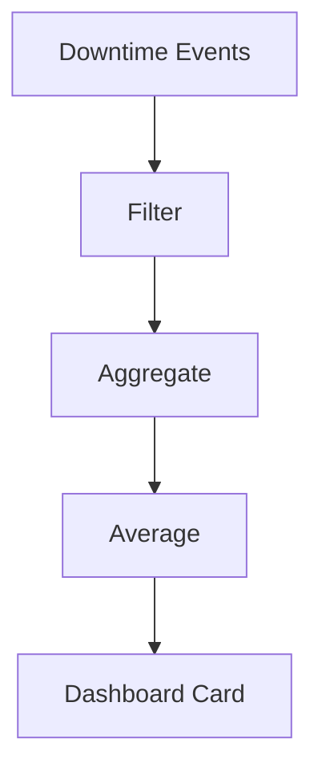
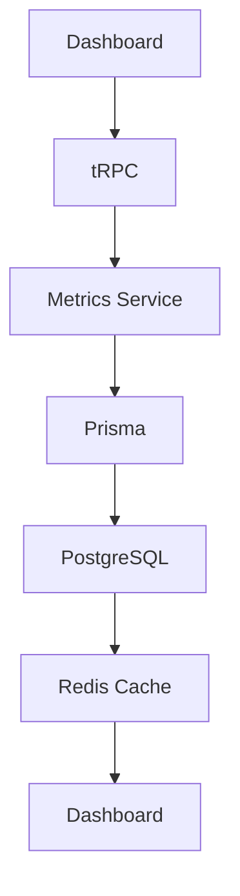
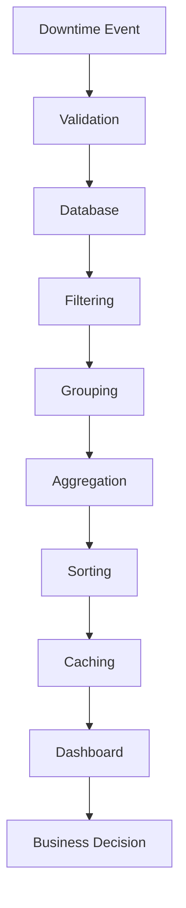

# Understanding the Analytics Engine

## Purpose

Businesses do not collect data just to store it. They collect it to answer questions, spot problems, and make better decisions.

This chapter explains how the Downtime Command Center turns raw downtime records into useful management information. In other words, it shows how a long list of events becomes something a manager can actually use.

> [!NOTE]
> A dashboard is not just a pretty screen. It is a way of turning scattered records into clear guidance.

## From Data to Decisions

Before we talk about dashboards, it helps to understand the path from raw information to action.

The journey looks like this:

Raw Data
↓
Information
↓
Knowledge
↓
Business Decisions

### Raw data

Raw data is the unprocessed material. In this project, that means the individual downtime records: when the event started, when it ended, which machine was involved, what reason code was used, and which parts were consumed.

### Information

Information is when those records are organized into something meaningful. For example, instead of reading many separate event notes, a manager sees that the packaging line had 12 downtime events this week.

### Knowledge

Knowledge comes when a person understands what the information means. If the packaging line had 12 events, the manager may begin to suspect a recurring problem.

### Business decisions

Business decisions are the actions taken because of that understanding. A manager might decide to inspect the machine, train the team, or reorder spare parts.

A simple analogy is grocery receipts. A pile of receipts is raw data. A monthly summary by category is information. Understanding that food costs are rising is knowledge. Deciding to shop at a cheaper store is a business decision.

This is why thousands of raw records are difficult for humans to understand on their own. People need summaries, patterns, and comparisons.

## Why Dashboards Exist

A dashboard exists because people cannot read thousands of records and instantly understand what matters.

Managers need help with:

- information overload: too much raw detail creates confusion
- summaries: a quick overview is easier than scanning every record
- KPIs: important measures that show performance at a glance
- trend detection: seeing whether a problem is getting better or worse
- decision support: helping leaders choose the next action

If you give a supervisor 2,000 downtime records, they will not quickly know what is urgent. But if you show them a dashboard with a few important numbers, the message becomes much clearer.

## What Is a KPI?

A KPI stands for Key Performance Indicator.

A KPI is a simple measure that tells you how well something is going.

In this project, examples of KPIs include:

- open downtime events
- total downtime
- MTTR
- production loss
- top downtime machines
- reason code breakdowns

Businesses use KPIs because they help answer specific questions. For example:

- How many machines are currently down?
- How much production time was lost this week?
- How quickly are repairs being completed?
- Which machines are causing the most trouble?

A KPI is useful because it turns a broad problem into a clear number.

## The Dashboard Metrics

The dashboard is meant to present the most important operational signals in a simple format. In this project, the earlier learning chapters describe the main metrics that matter to maintenance supervisors and managers.

### Open Downtime Events

#### What it measures

This metric shows how many downtime events are still open. An open event means the issue has been logged, but it has not yet been fully resolved.

#### How it is calculated

It is simply the count of downtime events whose status is still open.

#### Why managers care

A manager wants to know whether problems are still unresolved. A rising number of open events can suggest a backlog, slow response times, or recurring issues.

#### Worked example

Suppose there are 5 downtime events in the system:

- 3 are resolved
- 2 are still open

The open downtime metric would be 2.

### Total Downtime

#### What it measures

This metric shows the total amount of downtime recorded over a period of time.

#### How it is calculated

It is the sum of the durations of all relevant downtime events.

#### Why it matters

Total downtime tells managers how much productive time was lost. It is one of the clearest ways to measure the cost of equipment problems.

#### Worked example

If three events lasted:

- 20 minutes
- 35 minutes
- 15 minutes

Then the total downtime is 70 minutes.

### MTTR

#### What it measures

MTTR stands for Mean Time To Repair.

It is the average time required to repair a machine after a downtime event.

#### How it is calculated

You add the repair times for all relevant events and divide by the number of events.

The beginner-friendly formula is:

MTTR = total repair time ÷ number of events

#### Why it matters

A low MTTR usually means the team is resolving issues quickly. A high MTTR can suggest slow diagnosis, a shortage of parts, or more complex failures.

#### Worked example

If four repairs took 30, 45, 25, and 20 minutes:

- total repair time = 120 minutes
- number of events = 4
- MTTR = 30 minutes

This connects directly with the earlier manufacturing chapter, where downtime duration and repair time were explained as important signals of operational performance.

### Production Loss

#### What it measures

This metric estimates how much output was lost because machines were not running.

#### How it is calculated

Production loss is calculated by combining downtime duration with the machine's normal output rate.

In simple terms:

production loss = output rate × downtime duration

#### Why it matters

Managers care about production loss because it shows the real operational impact of downtime. A machine might be down for 30 minutes, but the business impact depends on how much product that machine normally produces in that time.

#### Practical example

If a machine normally produces 120 units per hour and it was down for 1 hour, then the production loss is 120 units.

If the downtime lasted 30 minutes, the production loss would be 60 units.

This is why units are tracked instead of only talking about time. Time tells you how long the machine stopped. Production loss tells you what that stop meant for output.

### Top Downtime Machines

#### What it measures

This metric shows which machines caused the most downtime or the most incidents.

#### How it is calculated

The system groups downtime events by machine, then sorts them by the amount of downtime or number of events.

#### Why it matters

If one machine appears repeatedly, that is a strong clue that something needs attention. It might be a worn-out component, a poor operating condition, or a recurring fault that needs a permanent fix.

### Reason Code Breakdown

#### What it measures

This metric shows how downtime is distributed across categories such as mechanical failure, electrical issue, operator error, or material shortage.

#### How it is calculated

The system groups events by reason code and often shows the results as counts or percentages.

#### Why it matters

Reason codes help managers understand the pattern behind downtime. If many incidents are caused by the same reason, the team can focus on the root issue instead of treating every event as a separate mystery.

> [!TIP]
> Standard reason codes make reporting more reliable. If everyone uses the same labels, the reports become much easier to trust.

## Understanding Aggregation

Aggregation means combining many small pieces of data into one summary.

It is a very important idea in analytics.

Examples of aggregation include:

- sum: adding values together
- average: finding the typical value
- count: finding how many items exist
- maximum: finding the largest value
- minimum: finding the smallest value

In this project, aggregation is how raw downtime events become dashboard metrics.

For example:

- summing durations gives total downtime
- averaging repair times gives MTTR
- counting events gives open downtime count
- grouping by machine and counting them gives top machines

Aggregation is the bridge between detailed records and useful summaries.

## Understanding Filtering

Filtering means narrowing the data to only the records that matter for a particular view.

For example, a manager may only want to see:

- this month
- factory A
- mechanical failures
- only open events

Filtering changes the result because it changes which records are included in the calculation.

If you filter to one factory, you are no longer looking at the whole company. If you filter to only open events, the numbers will reflect active problems rather than all historical incidents.

In other words, filtering helps answer a more specific question.

## Understanding Grouping

Grouping means putting similar records together.

A simple example is grouping downtime events by machine.

Instead of looking at 100 unrelated events, the system can say:

- Machine A had 10 events
- Machine B had 7 events
- Machine C had 14 events

This makes it easier to see which machines are causing the biggest problems.

Grouping is what turns a long list of records into a ranking.

## Understanding Sorting

Sorting means arranging results in a useful order.

For example, you might sort machines from highest downtime to lowest downtime.

This is how the dashboard identifies the top machines.

- ascending order means smallest to largest
- descending order means largest to smallest

If you want the biggest issues first, you usually use descending order.

## Following One Dashboard Metric

Let us follow one metric, MTTR, from start to finish.

### Step 1: Downtime events

The process begins with the individual downtime records stored in the database.

### Step 2: Filter

The system may filter the data to a particular time range, factory, or machine group.

### Step 3: Aggregate

The system collects the repair times from the selected events.

### Step 4: Average

The system adds those times and divides by the number of events to create the MTTR value.

### Step 5: Dashboard card

That result is shown to the user as a readable metric.

This is the basic pattern behind many analytics features.

## Where Analytics Live

In this project, analytics are not just a visual feature. They are part of the application flow.

The general path looks like this:

### Why analytics belong on the server

Analytics should usually happen on the server rather than inside the browser because the server can:

- access the database securely
- apply business rules consistently
- combine data in a controlled way
- protect sensitive information

The browser is good at displaying the results. The server is better at calculating them.

This connects closely with the earlier chapter on request flow and the chapter on system architecture. The user interface asks for the data, the server prepares it, and the dashboard shows the result.

## Why Metrics Are Calculated Instead of Stored

The database stores the raw downtime events. It does not need to store every possible dashboard metric in advance.

This is a very important design idea.

### Why not store every metric directly?

Because metrics are often derived from other data. A dashboard number is usually created from many records at the moment it is needed.

### Advantages of calculating metrics

- flexibility: new reports can be created from the same source data
- accuracy: the latest data can be included each time
- recalculation: the metric can be recomputed when filters or date ranges change
- future scalability: new charts and summaries can be built without changing the original records

A simple example is a monthly total. If you store the monthly total as a fixed number, and new downtime events are added later, that number can become outdated. If you calculate it from the event records each time, the result stays accurate.

## Analytics Pipeline

The analytics flow can be thought of as a pipeline. Each stage adds value to the raw event.

### Stage by stage

1. Downtime Event
   The process begins when a real event is recorded.

2. Validation
   The system checks that the event is complete and acceptable.

3. Database
   The event is stored as a permanent record.

4. Filtering
   The system narrows the data to the right time range or category.

5. Grouping
   Similar events are grouped together.

6. Aggregation
   The system combines the grouped values into a summary.

7. Sorting
   The results are ordered from most important to least important.

8. Caching
   The result may be stored temporarily to make future requests faster.

9. Dashboard
   The summary appears to the user.

10. Business Decision
    A manager uses the insight to take action.

## How This Project Goes Beyond CRUD

A simple application often supports CRUD operations.

CRUD means:

- Create
- Read
- Update
- Delete

That is enough for managing records, but it is not enough for business intelligence.

| Type of Application     | Main Focus                              | Example Outcome                            |
| ----------------------- | --------------------------------------- | ------------------------------------------ |
| Simple CRUD application | Manage individual records               | Add, edit, or delete a downtime event      |
| Analytics application   | Understand patterns across many records | See which machines cause the most downtime |

This project goes beyond simple record management. It helps users understand what the records mean together.

That is one reason the dashboard is so important. It turns ordinary records into useful operational insight.

## Responsibilities of the Analytics Engine

| Responsibility | Example                          | Business Value                      |
| -------------- | -------------------------------- | ----------------------------------- |
| Counting       | Count open events                | Shows workload and backlog          |
| Summing        | Sum downtime minutes             | Shows total lost time               |
| Averaging      | Calculate MTTR                   | Shows repair efficiency             |
| Grouping       | Group downtime by machine        | Identifies repeat problem areas     |
| Sorting        | Rank machines by downtime        | Highlights priority issues          |
| Filtering      | Show only this month             | Gives a current view of performance |
| Caching        | Store calculated results briefly | Improves dashboard speed            |
| Reporting      | Present dashboard cards          | Supports quick decisions            |

## Why This Design Works Well

This design works well because it follows the same principles introduced in the earlier chapters.

### Single source of truth

The database remains the main place where event records live. Dashboard metrics are built from that source rather than from separate copies that might drift out of sync.

### Server-side analytics

The calculations happen in a controlled place, which makes the logic easier to manage and more reliable.

### Maintainability

Because the logic is organized into steps, it is easier to change later. If the team wants a new metric, they can build on the same pattern.

### Performance

Caching improves speed, especially for dashboard views that are requested often.

### Scalability

As the number of events grows, the system can still summarize them in a structured way.

### Future reporting

Once the analytics pipeline is in place, it becomes easier to add new reports, charts, and decision tools.

This is why analytics is not just a feature added at the end. It is part of the product's value.

## Key Takeaways

- Raw downtime records become useful when they are turned into summaries and comparisons.
- Dashboards help people understand large amounts of data quickly.
- A KPI is a simple business measure that answers an important question.
- Metrics such as open downtime, total downtime, MTTR, production loss, top machines, and reason codes are all built from the same event data.
- Aggregation, filtering, grouping, and sorting are the main tools used to build analytics.
- The analytics flow moves from recorded events to dashboard insight and then to business action.
- In this project, the analytics engine helps turn maintenance data into better operational decisions.
