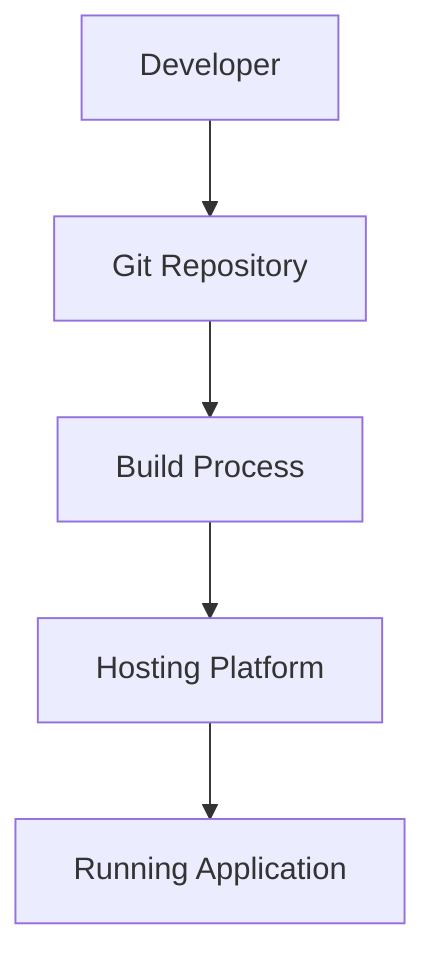
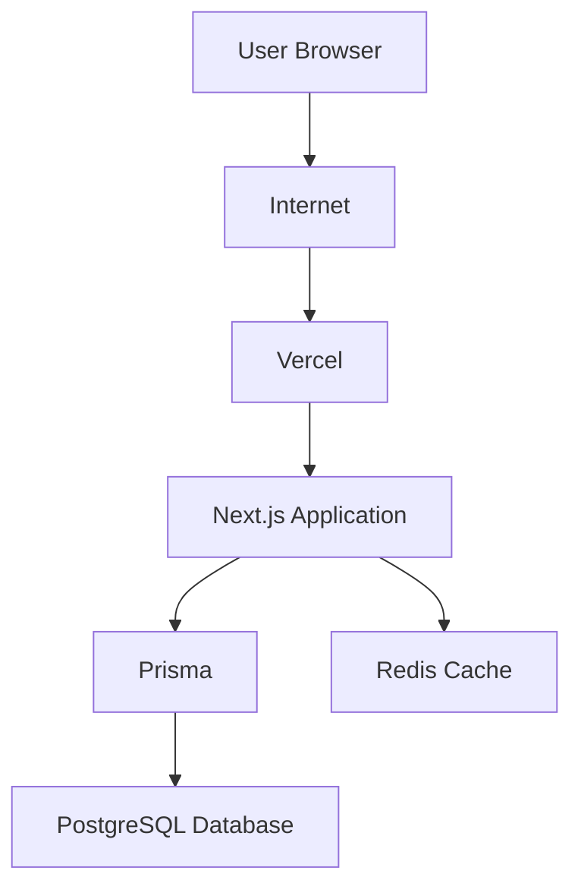
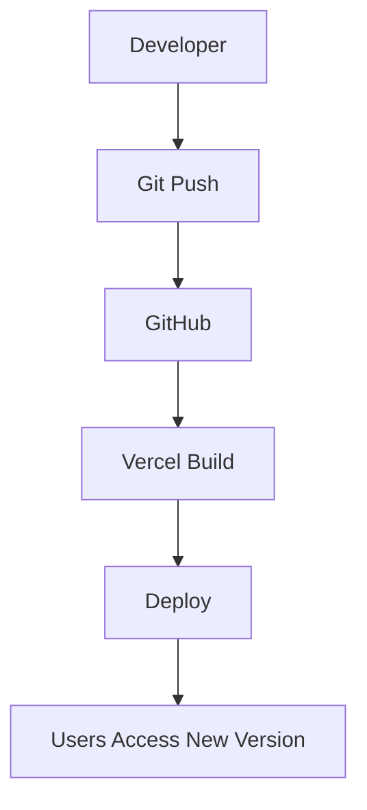
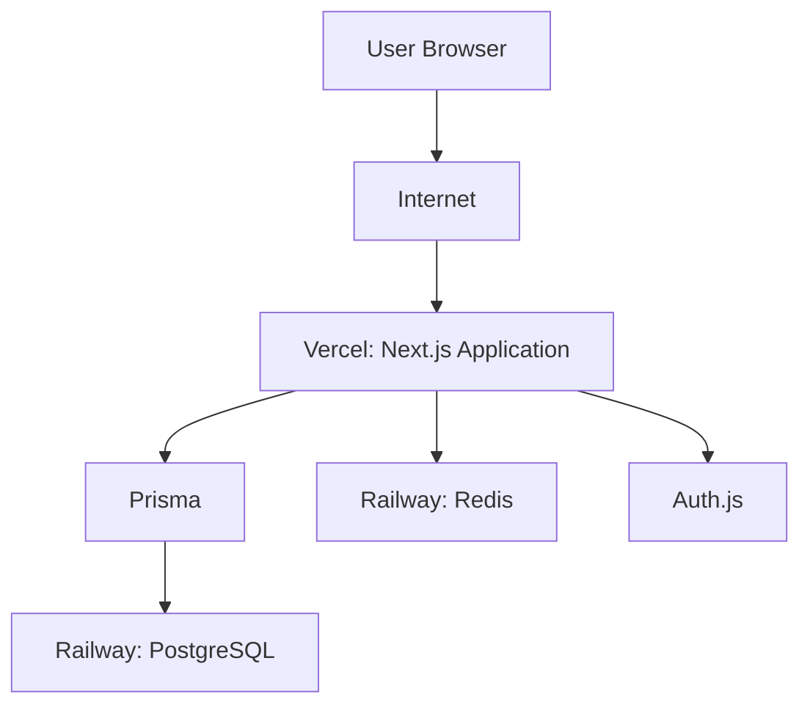

# Deployment and Production

## Purpose

So far in this handbook, you have learned how the application works: how downtime events flow from the browser to the database, how the database is designed, how the dashboard turns raw records into useful metrics, and how all the pieces fit together.

But there is one important gap. Everything we have talked about so far happens on a **developer's computer**. The developer writes code, runs the application locally, and tests it on their own screen. That is great for learning, but it is not enough for real users.

**Deployment** is the process of moving your application from your own computer to a machine that runs on the internet, so that anyone can use it at any time.

Deployment is the final step in taking software from an idea to something real people can rely on.

> [!NOTE]
> A developer's computer is for building and testing. A deployed application is for real users. These are different worlds, and this chapter explains how to move between them.

---

## Why a Developer's Laptop Is Not Enough

Imagine this: you finish building the EMMS and it works perfectly. You can log in, record a downtime event, and watch the dashboard update. You are proud of what you built.

But there is a problem. Your application is running on your laptop, and your laptop is only running when you are using it.

Here is what happens in the real world:

- You close the laptop at night, and the application disappears.
- Your laptop is at your desk, not in the factory. Nobody else can reach it.
- If your laptop breaks or the Wi-Fi drops, the application stops working.
- Other people cannot access `localhost` — that address only ever points to your own machine.

Real users need an application that is:

- **Always on** — available at any time of day or night
- **Always reachable** — accessible from anywhere with an internet connection
- **Reliable** — it does not stop working because one person turned off a computer

A developer's laptop can be none of those things reliably. That is why real applications are moved to a **hosting platform** — a company that runs your application on powerful computers in data centers, connected to the internet, powered and cooled around the clock.

> [!TIP]
> Think of deployment like moving out of your parents' house into a permanent home. Your laptop is the bedroom where you built the thing. The hosting platform is the home where it lives and is always open to visitors.

---

## Development, Staging, and Production

In the software world, an application usually lives in three different "worlds" as it moves toward real users. Each one has a different purpose.

| Environment | Who uses it | Purpose | Example |
|---|---|---|---|
| **Development** | The developers | Building and testing new features safely | Running the app on your laptop while you write code |
| **Staging** | The whole team, before launch | Testing the app in an environment that looks like the real one | A test deployment where you check everything works before going live |
| **Production** | Real users | The live application people actually use | The deployed EMMS that the factory uses every day |

### Development

Development is where you spend most of your time as a developer. You write code, run the app, break things, fix them, and try again. Mistakes here are completely fine — you are the only person using the app.

### Staging

Staging is a practice run. It is a copy of the application that behaves like the real one but is not seen by real users. You use staging to test things like: does the new code work with the real database? Do the environment variables point to the right places? Is everything ready for launch?

Staging catches problems before real users ever see them.

### Production

Production is the real thing. This is the version that real users — operators, engineers, and managers — actually use every day. Changes here are serious, because if something breaks, real work stops.

> [!IMPORTANT]
> Code that works on your laptop is not guaranteed to work in production. The environments are different — different machines, different settings, different data. Staging exists to reduce the surprise.

---

## From Source Code to a Running Application

When you deploy, your code goes on a journey. It starts as text files on your computer and ends as a running application that anyone can reach.

Let us look at each stage.

### Stage 1: Developer

Everything begins with you. You write the code — pages, components, server logic, and database models. This is the work you have been doing in the earlier chapters of this handbook.

### Stage 2: Git Repository

A **Git repository** is a special folder that records every change you make to your code over time. Think of it as a time machine for your project: you can always go back to an earlier version.

When you deploy, you push (send) your code to a **remote** repository — a copy of your repository stored on a service like GitHub. This is important because the hosting platform reads your code from there, and GitHub keeps a safe, shared copy that the whole team can access.

> [!NOTE]
> A **git repository** is a tool for tracking changes to code. GitHub is a website that stores copies of git repositories in the cloud. We met the general idea of folders in Session 6; git adds a layer of version history on top.

### Stage 3: Build Process

A **build** is the step that turns your readable source code into something the application can actually run. In the earlier chapters, you learned that tools like TypeScript and Prisma make development easier. At build time, the application compiles the code, checks for errors, and prepares the production-ready version.

The build process does things like:

- converting TypeScript to JavaScript
- optimizing and bundling the frontend code
- checking that the project is free of errors
- preparing the server-side application

If the build fails, the deployment stops. That is a good thing — it is better to catch a problem before users are affected.

### Stage 4: Hosting Platform

The **hosting platform** is the company that runs your application on their computers. In Session 5 you learned about Vercel and Railway. The hosting platform receives the built application and runs it on servers connected to the internet.

### Stage 5: Running Application

The result is a live application. Real users can now open their browsers, go to your web address, and use the EMMS. The application is always on, always reachable, and ready to serve users.

> [!TIP]
> You can think of the build process like cooking. Your source code is the list of ingredients and the recipe. The build turns it into a finished meal. The hosting platform is the restaurant that serves the meal to customers. Users never see the recipe — they only see the finished dish.

---

## Overall Deployment Architecture

Now let us look at the whole system as it runs in production. This is the same layered architecture you met in Sessions 4 and 5, but now seen from the deployment side.

Let us explain the responsibility of every component.

### User Browser

The browser is what the user sees and interacts with. It sends requests when the user clicks buttons, fills in forms, or opens pages. The browser never makes decisions about what gets saved — that is the server's job, as you learned in Session 4.

### Internet

The internet is the network that carries information between the user's browser and the application. Every request and response travels across it. HTTPS (the secure version of the web protocol) keeps those messages private.

> [!NOTE]
> **HTTPS** is the secure way for browsers and servers to communicate. It keeps data safe from being read by others while it travels over the internet.

### Vercel

Vercel is the hosting platform that runs the Next.js application. It is the front door of the system — it receives requests from the internet and hands them to the application. Session 5 introduced Vercel as the home of the web application.

### Next.js Application

The application contains both the frontend (the interface users see) and the backend (the rules and logic). It handles routing, server actions, and preparing data to be shown to the user.

### Prisma

Prisma is the translator between the application and the database, as you learned in Session 4. The application writes TypeScript, Prisma turns it into SQL, and the database understands it.

### PostgreSQL Database

PostgreSQL is the permanent storage layer. It is the source of truth for all business data — users, machines, downtime events, and parts. In Session 3 you learned how these records are organized into tables.

### Redis Cache

Redis is the fast in-memory store that holds temporary copies of expensive calculations. In Session 7 you learned how dashboard metrics are cached so the dashboard loads quickly. Redis lives beside the application so it can answer fast, repeated requests.

> [!TIP]
> A good mental picture: the user asks a question (the browser). The application answers using permanent facts (PostgreSQL) and quick notes it already prepared (Redis). Vercel is the building where all of this lives, and Prisma is the messenger between the application and its records.

---

## Why We Separate Services

You might wonder: why not put everything on one machine? Why separate the application, the database, and the cache?

It would certainly be simpler. But putting all your eggs in one basket causes serious problems. Let us look at four reasons the services are separated.

### Reliability

If the application, database, and cache all run on the same machine, one failure takes down everything. If the machine crashes, users lose the app, the data, and the caching all at once.

By separating them, a problem in one place does not destroy everything. If the web server needs to restart, the database keeps your data safe.

> [!NOTE]
> **Reliability** means the system keeps working even when something goes wrong. Separation means one failure does not take the whole system down.

### Scalability

**Scalability** means the ability to handle more users or more data over time.

Different services grow at different rates. If a lot of users start using the dashboard, you may need more power for the application, but the database might be fine. If you separate the services, you can grow each one independently. On one combined machine, you would be stuck upgrading everything together.

### Maintenance

Software needs updates. Databases need upgrades. Caches need reconfiguring. Application code needs new versions.

If everything is on one machine, updating one thing risks breaking everything else, and you must take the whole system down to work on it. When services are separate, you can update or restart one part without touching the others.

### Security

The database contains the most sensitive data in the system — user accounts, business records. The application is the part exposed to the internet.

By keeping the database separate, you can protect it more strictly. The database can be configured so that only the application can reach it, not the whole internet. This is part of the "defense in depth" idea you learned about in Session 5.

> [!IMPORTANT]
> Separation protects you. If the application is attacked or crashes, the database — the source of truth — stays safe. This is why we do not put everything on one machine.

### An Analogy: A Hospital

Imagine a hospital. It has an emergency room, an operating theater, a pharmacy, and a records office. Each part has a specialist job.

Could you run the whole hospital in one room? Technically, maybe. But if the lights go out in that one room, surgery stops, medicines are lost, and patient records are damaged all at once.

Real hospitals separate these departments so each one can run well on its own, be maintained independently, and be protected appropriately. A software system works the same way.

---

## Hosting the Frontend

The **frontend** is the part of the application users see and interact with. In this project, the frontend is built with Next.js, React, Tailwind CSS, and shadcn/ui — all of which you learned about in Session 5.

### What Is Vercel?

Vercel is a hosting platform built by the same team that created Next.js. It is a service that runs web applications on servers connected to the internet, so anyone can reach them.

### Why Is It Suitable for Next.js?

Vercel and Next.js are made for each other. Because the same team builds both, Vercel understands Next.js deeply:

- It knows how to build and run Next.js applications correctly.
- It handles both the frontend and the server-side parts of Next.js.
- It is fast at deploying new versions.
- It is designed to be beginner-friendly — you can often connect your repository and be running in minutes.

> [!NOTE]
> A **hosting platform** is a company that runs your application on their computers so users can reach it over the internet. Vercel is the hosting platform used for the Next.js application in this project.

### Automatic Deployments

**Automatic deployment** means that when you push new code to your Git repository, Vercel notices and deploys the new version for you. You do not need to run commands or copy files manually.

The workflow becomes: write code → push to GitHub → Vercel builds and deploys automatically. You just made an update available to real users without touching anything by hand.

### Preview Deployments

**Preview deployments** are temporary versions of the application for testing. Every time you push changes, Vercel creates a special web address where you (or your team) can try the new version before it goes live.

This connects directly to the staging idea from earlier in this chapter. Preview deployments are a built-in staging environment. You can test the new features safely, and only when everything looks good does the real deployment happen.

> [!TIP]
> Automatic and preview deployments are like having a team of assistants. You hand them your code, and they instantly prepare a test room (preview) and a public room (production) for you — without you doing any heavy lifting.

---

## Hosting the Database

The **database** (PostgreSQL) stores all of the application's permanent data. As you learned in Session 3, that includes users, factories, production lines, machines, downtime events, and parts.

### Why Databases Need Persistent Storage

**Persistent storage** means data that survives even when a machine restarts, crashes, or is turned off.

Databases are different from running application code. An application can be stopped and restarted safely — it has no important memory. But a database holds the records your business depends on. If a downtime event is lost, a manager cannot see it in the dashboard, and the history is gone forever.

> [!NOTE]
> **Persistent storage** is storage that keeps data safe even when power is lost or the machine restarts. A database needs this because the data it stores is irreplaceable.

### Why Deleting an Application Server Should Not Delete Business Data

Imagine the application server needs to be replaced. Maybe it is getting old, or it is misbehaving, or a new version needs a fresh machine.

If the database lived on that same server, deleting the server would delete the business data with it. Every machine record, every downtime event, every part used — gone.

By hosting the database separately, you can delete, replace, or restart the application server as often as you like. The database stays in its own location, and the new server simply reconnects to it. Your data outlives any single server.

> [!IMPORTANT]
> The database is the source of truth, as you learned in Session 5. The application server is replaceable. The data is not. This is why the database must have its own permanent home.

### An Analogy: A Bank Vault

Think of the database as a bank vault and the application server as a bank teller's desk.

You can replace the desk whenever you want — paint it, move it, get a new one. The vault stays where it is, and the new desk connects to the same vault. The valuables are never stored on the desk; they are stored safely in the vault.

---

## Hosting Redis

**Redis** is the fast in-memory store used for caching, which you learned about in Session 7. Let us recall why it exists: dashboard metrics like open events, total downtime, and MTTR require expensive calculations. If the dashboard recalculated everything on every page load, it would be slow.

Redis holds temporary, ready-made copies of those results so the dashboard can answer quickly.

### Why Redis Is Hosted Separately

Redis is a different kind of service from PostgreSQL. It is:

- **Fast** — it keeps data in memory (RAM) rather than on slow disks, so it answers in fractions of a second.
- **Temporary** — it holds copies of information that can be rebuilt from the database at any time. If Redis is emptied, nothing is permanently lost.
- **Specialized** — it is optimized for quick reads and writes, not for long-term storage.

Because it has a different job and a different lifespan, Redis lives in its own location. It sits close to the application so the dashboard can reach it quickly, but it is not mixed in with the permanent database.

> [!NOTE]
> **In-memory** means data is kept in a computer's fast memory (RAM) instead of on a slower disk. This is why Redis is so fast — but it is also why Redis is temporary storage, not the source of truth.

### Reference to Session 7

In Session 7, you learned how the analytics engine works: raw events are filtered, grouped, aggregated, and sorted, and the results may be cached to make the dashboard faster. Redis is the cache in that process.

When a new downtime event is saved, the application tells Redis the old cached numbers are out of date — this is cache invalidation, which you met in Session 4. The next time a manager opens the dashboard, the numbers are recalculated and stored fresh.

> [!TIP]
> PostgreSQL remembers everything forever. Redis remembers helpful things for a short time. Each one does what it does best, in its own place.

---

## Environment Variables

An **environment variable** is a named piece of configuration that lives outside your source code. It is like a setting on the server that the application reads when it runs.

For example, to connect to the database, the application needs to know where the database lives and how to sign in. That information is not the same on every machine — your laptop uses a different database than production does.

Environment variables allow the same code to work in development, staging, and production by giving each environment its own settings.

### Why Secrets Should Never Be Stored in Source Code

Some environment variables are **secrets** — values that must be kept private, like passwords or keys.

If you write a secret directly into your code, then:

- anyone who can see your repository can read the secret
- if your repository is public, the whole world can read it
- even if it is private, every person with access can see it

This is dangerous. A leaked database password or authentication secret lets attackers break in.

> [!IMPORTANT]
> Secrets belong in environment variables, never in source code. Your code should contain no passwords, no secret keys, and no private URLs. This is why the `.env` file exists — you met it in Session 6 as the place environment-specific values are stored.

> [!NOTE]
> A **secret** is a piece of sensitive information — like a password, a database connection string, or an authentication key — that must be kept private to protect the system.

### Common Environment Variables in This Project

Here are examples of environment variables the EMMS needs, and what each one does:

| Variable | What it does | Why it is sensitive |
|---|---|---|
| `DATABASE_URL` | Tells the application where the PostgreSQL database is and how to connect to it | Contains the database address and credentials |
| `REDIS_URL` | Tells the application where the Redis cache is and how to connect | Contains the cache address and credentials |
| `AUTH_SECRET` | The secret used to create and verify user sessions and tokens | If leaked, attackers could impersonate users |

> [!TIP]
> A good habit is to keep an `.env.example` file in your repository — a sample showing which variables are needed, with empty or fake values — so other developers know what to set up, without ever sharing real secrets.

---

## Build vs Runtime

There are two very different moments in an application's life: **building** and **running**.

### Building an Application

The **build** happens once, before the application can run. It takes your source code and turns it into a production-ready version.

During the build, the application:

- checks for errors in your code
- converts TypeScript to JavaScript
- bundles the frontend so it loads efficiently
- prepares everything needed to run

Think of building like baking a cake. You gather ingredients (source code), follow the recipe, and produce the finished cake. The baking happens once, in the oven.

### Running an Application

The **runtime** is when the built application is actually doing its job — receiving requests, reading the database, and showing pages to users.

Running happens continuously. Every time a user opens the EMMS, the running application responds. It is like the cake sitting on a serving table, being served to customers all day.

### A Practical Example

Your database password is needed when the application **runs**, because that is when it connects to the database. So it is stored as an environment variable that the running application can read.

But your source code is read at **build** time. This is why secrets should not be in the source code — they would be baked into the build itself, and copied into the deployment. Environment variables keep secrets available at runtime without putting them in the built code.

| Stage | When it happens | What it does | Example |
|---|---|---|---|
| Build | Once, before running | Turns source code into a runnable version | TypeScript compiled to JavaScript, errors checked |
| Runtime | Continuously, while running | The application serves real users | User logs in, records downtime, views the dashboard |

> [!NOTE]
> Build time is when the code is prepared. Runtime is when the application actually serves users. Environment variables are read at runtime, which is one reason secrets do not belong in the source code itself.

---

## Deployment Pipeline

A **pipeline** is the sequence of steps that automatically takes your code from the developer's hands to the live application. This is the deployment journey in full.

### Stage 1: Developer

The developer finishes a change — maybe a new dashboard metric, a fix for a bug, or a new form. The code is committed (saved) in the local git repository.

### Stage 2: Git Push

The developer **pushes** the code — sends it from their computer to the shared repository on GitHub. A push is the act of uploading your local changes to the remote repository.

### Stage 3: GitHub

GitHub receives the pushed code and stores the new version. It is the shared source of truth for the code, and it triggers the next step.

### Stage 4: Vercel Build

Vercel notices the new code and runs the build process. It compiles the code, checks for errors, and prepares the production version. It may also run the preview/staging environment first so the changes can be tested.

### Stage 5: Deploy

If the build succeeds, Vercel deploys the application — it makes the new version live and accessible at the web address. If something fails during the build, deployment stops and the old version stays running. That protects users.

### Stage 6: Users Access New Version

Real users now see the new version when they open the EMMS. The whole pipeline happened without anyone copying files by hand.

> [!TIP]
> The pipeline is like a conveyor belt in a factory. You put your code on one end, and a fresh, tested version of the application comes out the other end — automatically. If something is wrong on the belt, it stops rather than sending out a broken product.

---

## Production Checklist

Before you declare an application "live," it is smart to go through a checklist. This is a beginner-friendly version that you can follow for the EMMS.

| # | Check | Why it matters | How to verify |
|---|---|---|---|
| 1 | Environment variables configured | The app cannot connect to anything without them | Confirm `DATABASE_URL`, `REDIS_URL`, and `AUTH_SECRET` are set in the production environment |
| 2 | Database migrations run | The database must have the correct tables and structure | Run the migrations and confirm the tables from Session 3 exist |
| 3 | Seed data loaded (if needed) | Gives you starting data to test with | Run the seed script and check for sample records |
| 4 | Authentication working | Users must be able to sign in and be protected | Sign up, sign in, sign out, and visit a protected page |
| 5 | Database connected | The application must reach the source of truth | Open a page that reads data and confirm records appear |
| 6 | Redis connected | The dashboard must load quickly using the cache | Open the dashboard and confirm it loads with cached metrics |
| 7 | HTTPS enabled | Communication must be secure | Check that the web address starts with `https://` |
| 8 | Error handling verified | Problems should fail gracefully, not crash the app | Trigger an error and confirm the user sees a friendly message |

> [!IMPORTANT]
> This checklist is not optional decoration. Each item protects something real: your data, your users' security, and the reliability of the system. A deployment is not complete until every box is checked.

---

## Common Deployment Problems

Even experienced developers run into deployment problems. Here are the most common beginner mistakes, what they look like, and how to fix them.

### Missing Environment Variables

**What happens:** The application starts but cannot connect to the database, the cache, or authentication. It may show an error like "connection refused" or "missing variable."

**Why:** The environment variable was set on your laptop but not in the production environment.

**How to fix:** Check the production environment's settings and make sure every variable from your checklist is present. Use an `.env.example` file to keep track of what is needed.

### Database Connection Failures

**What happens:** The application cannot reach PostgreSQL. Users see errors when pages try to load data.

**Why:** The `DATABASE_URL` is wrong, the database is not running, or the database is blocking connections from the application.

**How to fix:** Check that the URL is correct, that the database service is up, and that the application is allowed to connect (for example, the right permissions or network settings).

### Incorrect URLs

**What happens:** Requests go to the wrong place. For example, the application tries to connect to `localhost` instead of the real database, or links in the app point to the wrong address.

**Why:** A URL that was correct in development is not correct in production.

**How to fix:** Review every URL in your environment variables and configuration. `localhost` almost always needs to be replaced with the real production addresses.

### Prisma Migration Issues

**What happens:** The database does not have the tables or columns the application expects, so queries fail.

**Why:** The migrations (the step-by-step database structure changes you learned about in Session 6) were not run in the production environment.

**How to fix:** Run the database migrations against the production database. Make sure migrations are part of your deployment pipeline so they are never forgotten.

### Redis Connection Failures

**What happens:** The dashboard is slow, or the application errors when trying to read or write cached data.

**Why:** The `REDIS_URL` is wrong, Redis is not running, or the application cannot reach it.

**How to fix:** Verify the Redis service is up, check the URL, and confirm the network allows the connection.

> [!NOTE]
> When something goes wrong, do not panic. Start with the most common cause — usually an environment variable or a service that is not running. Check each item in the order it appears in the checklist, and you will usually find the problem quickly.

---

## How EMMS Will Be Deployed

Now let us put it all together for THIS project. Based on everything we have learned in Sessions 1 through 7, here is how the EMMS is expected to reach production.

### The Next.js Application

The Next.js application — the frontend and backend together — will be hosted on **Vercel**, as introduced in Session 5. Vercel builds the application, runs automatic deployments whenever code is pushed, and provides preview deployments for testing.

### The PostgreSQL Database

PostgreSQL will be hosted separately on **Railway**, as described in Session 5. It stores all permanent business data — the users, factories, production lines, machines, downtime events, and parts you learned about in Session 3. Because it is hosted separately, deleting or replacing the application server will not touch the data.

### Redis

Redis will also be hosted on Railway, beside the database. It will cache the expensive dashboard calculations from Session 7 — open events, total downtime, MTTR, production loss, top machines, and reason-code breakdowns — so the dashboard stays fast. The application invalidates the cache whenever new data is saved, just as Session 4 described.

### Authentication

Authentication is handled with **Auth.js**, introduced in Session 5. The `AUTH_SECRET` environment variable protects sessions and tokens. In production, authentication must work over HTTPS so that sign-in information travels securely.

### Static Assets

**Static assets** are files that are served as-is, without processing — images, logos, and icons. In this project they live in the `public` folder, as you learned in Session 6. Vercel serves these files efficiently alongside the application, so users can load logos and images quickly.

### The Full Picture

Putting it all together: users reach the Next.js application on Vercel over the internet. The application talks to PostgreSQL and Redis on Railway through Prisma, and handles authentication with Auth.js — all using secure environment variables and HTTPS. This matches the architecture you learned in Session 5, now ready for real users.

> [!TIP]
> Everything in this chapter is consistent with the earlier sessions: the same database from Session 3, the same request flow from Session 4, the same architecture from Session 5, the same folder structure from Session 6, and the same analytics from Session 7. Deployment simply moves that whole design into the real world.

---

## Key Takeaways

- Deployment is the process of moving an application from a developer's computer to a machine on the internet so real users can reach it.
- A developer's laptop is not enough: it is not always on, not always reachable, and not reliable for real users.
- Applications move through three environments: development (building), staging (testing), and production (real users).
- Source code travels through a journey: developer, git repository, build process, hosting platform, and finally a running application.
- The production system is made of separate parts: the browser, the internet, Vercel, the Next.js application, Prisma, PostgreSQL, and Redis.
- Separating services improves reliability, scalability, maintenance, and security. One failure should not take down everything.
- Vercel hosts the Next.js application, with automatic deployments and preview deployments for testing.
- PostgreSQL is hosted separately because it needs persistent storage. Business data must survive any changes to the application server.
- Redis is hosted separately because it is fast, temporary, in-memory caching — perfect for the dashboard, as explained in Session 7.
- Environment variables store configuration outside the code. Secrets like `DATABASE_URL`, `REDIS_URL`, and `AUTH_SECRET` must never be written into source code.
- Building prepares the code; running serves the users. Secrets are read at runtime, not built into the code.
- The deployment pipeline moves code from developer to git push to GitHub to Vercel build to deploy, and finally to users.
- A production checklist protects your deployment: environment variables, migrations, seed data, authentication, database, Redis, HTTPS, and error handling.
- Most deployment problems come from simple causes: missing environment variables, wrong URLs, or services that are not running. Work through the checklist in order and you will find them.
- The EMMS will be deployed with the Next.js application on Vercel, PostgreSQL and Redis on Railway, Auth.js for authentication, and static assets served from the public folder.
- Deployment is the final step that turns everything you built in Sessions 1 through 7 into a system real users can rely on.
