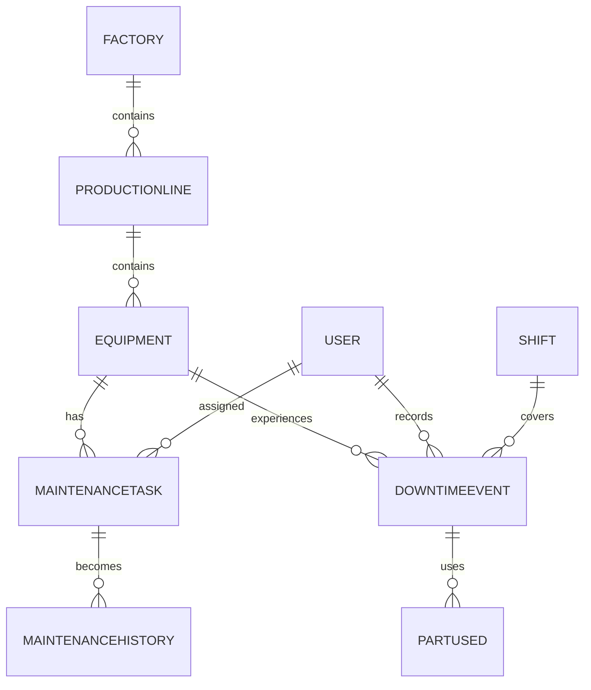
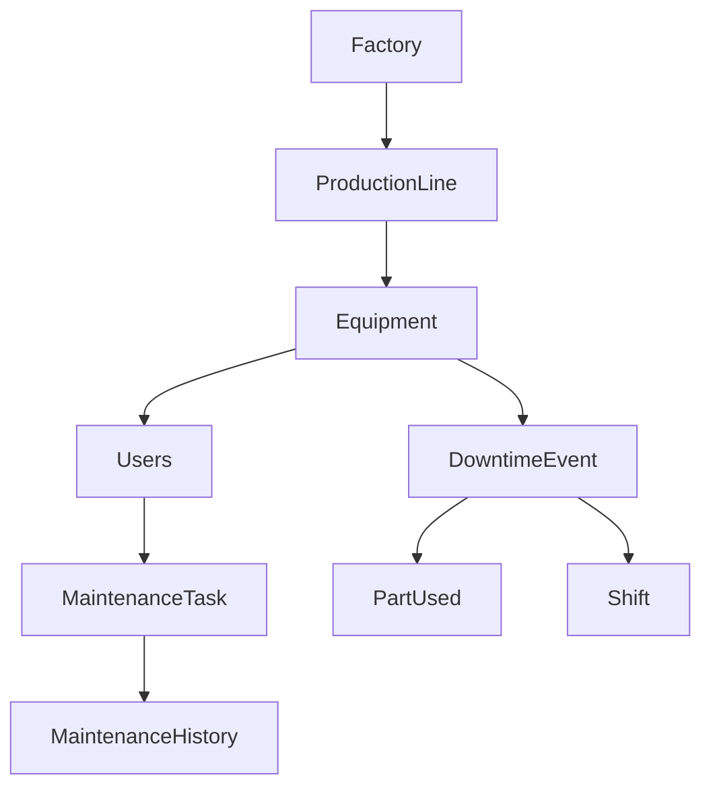

# Implementing the Database

## Purpose

The database is the **foundation** of the EMMS application. Almost every feature — logging a downtime event, registering equipment, assigning a maintenance task, or loading the dashboard — depends on the database being correct.

Think about it: what does a dashboard show? Data. What does a maintenance history show? Data. What does a supervisor review before scheduling work? Data. In this application, nearly everything you can click, view, or save is backed by a record in the database.

If the database is designed well, features become straightforward. If it is designed poorly, every feature fights against it. That is why the database comes first, and why we get it right before building the application logic around it.

In Session 3, you designed this database on paper. You learned about tables, relationships, IDs, and why information should be stored once and connected — not duplicated. This chapter takes that blueprint and turns it into a real, working database inside the EMMS project you set up in Session 9.

> [!NOTE]
> Session 3 gave us the blueprint. This chapter builds the house. Every table we design now was already planned there — our job is to turn the design into reality.

---

## From Business Objects to Database Models

Every table in the database represents a **real-world object** — something that exists in the factory and matters to the business. A **database model** is simply how that real-world object is described in the database.

Here is the map from the business world to the database:

| Business Object | Database Model | Purpose |
|---|---|---|
| A physical factory location | `Factory` | Identifies where the operation takes place |
| A line of machines inside a factory | `ProductionLine` | Groups machines that work together on one process |
| A single machine or asset | `Equipment` | Tracks a specific piece of equipment and its details |
| A piece of planned maintenance work | `MaintenanceTask` | Represents work scheduled for an equipment item |
| A person who uses the system | `User` | Represents a technician, supervisor, engineer, or manager |
| The record of completed work | `MaintenanceHistory` | Stores what maintenance was done, when, and by whom |
| A period when a machine stopped | `DowntimeEvent` | Captures when equipment failed and what happened |
| A spare part used during a repair | `PartUsed` | Records which parts were consumed during an event |
| A work period in the factory | `Shift` | Identifies which team was present when work happened |

Each of these models exists because the business needs it. None of them are there to make the code "interesting" — they mirror the real manufacturing world you studied in Session 2.

> [!NOTE]
> A **database model** is the formal description of one kind of thing the system needs to remember. In this project, models like `Factory` and `DowntimeEvent` are the database's way of saying "we track factories" and "we track downtime events."

---

## Overall Database Relationships

The models are not isolated boxes. They connect to each other the same way the real world connects — a factory contains production lines, a production line contains equipment, and equipment experiences downtime events.



Let us walk through each relationship in plain language:

- **Factory → ProductionLine**: A factory contains many production lines. One factory, many lines.
- **ProductionLine → Equipment**: A production line contains many equipment items. One line, many machines.
- **Equipment → MaintenanceTask**: A piece of equipment can have many maintenance tasks scheduled. One machine, many tasks.
- **MaintenanceTask → MaintenanceHistory**: A completed maintenance task produces a record in the maintenance history.
- **Equipment → DowntimeEvent**: A piece of equipment experiences downtime events over its life. One machine, many events.
- **DowntimeEvent → PartUsed**: A downtime event can involve many spare parts. One event, many parts.
- **User → MaintenanceTask**: A user can be assigned to many maintenance tasks.
- **User → DowntimeEvent**: A user (usually an operator or engineer) records downtime events.
- **Shift → DowntimeEvent**: A shift covers the period during which downtime events occur.

> [!IMPORTANT]
> Relationships are not a technical detail — they are how the system answers real business questions. "Which machine had the most downtime?" is a question about the relationship between `Equipment` and `DowntimeEvent`. "Who fixed this machine last time?" is a question about `User` and `MaintenanceHistory`. The relationships make these questions answerable.

---

## Why We Build the Models in This Order

The models are not built in random order. They are built in an order determined by **dependencies** — the fact that some models only make sense once others exist.

Think of it like building a building: you pour the foundation before you raise the walls, and you raise the walls before you install the roof. Each step depends on the one before it.



Here is the reasoning:

1. **Factory** comes first because it is the top of the hierarchy — nothing else can exist without a place to belong.
2. **ProductionLine** comes next because it belongs to a factory.
3. **Equipment** follows because every machine lives on a production line.
4. **Users** come next — the people who will use the system. Users do not depend on the equipment hierarchy, but the maintenance models depend on users.
5. **MaintenanceTask** comes after Equipment and Users exist, because a task needs a piece of equipment and (usually) a user to be assigned.
6. **MaintenanceHistory** comes after tasks, because history is created when maintenance work is completed.
7. **DowntimeEvent** is built after Equipment, because an event needs a machine.
8. **PartUsed** follows DowntimeEvent, because parts are recorded against a specific event.
9. **Shift** is built alongside DowntimeEvent, because a shift describes when an event happened.

> [!NOTE]
> A **dependency** exists when one thing requires another to exist first. In the database, `ProductionLine` depends on `Factory`, and `DowntimeEvent` depends on `Equipment`. Building in dependency order means we never try to create something that needs a model that does not exist yet.

> [!TIP]
> Whenever you add a new model, ask: "What does this depend on? And what will depend on it?" That single question tells you where it belongs in the build order.

---

## Implementing Each Model

Now we look at each model in detail. For every model, we will answer the same set of questions:

- **Purpose** — why does this model exist?
- **Business meaning** — what real-world thing is this?
- **Important fields** — what information does it store?
- **Relationships** — how does it connect to other models?
- **Example record** — what would one real record look like?
- **Future features** — what will this model support as the EMMS grows?

This is the same structure you will use in your own head every time you design a new table. Understand the *why* first, and the *how* becomes easy.

### Factory

**Purpose:** The `Factory` model represents a physical factory location.

**Business meaning:** A factory is the top level of the operation, as you learned in Session 2. Everything else — lines, machines, events — happens inside a factory.

**Important fields:** A name (to identify it), a location or city (to know where it is), and a unique identifier.

**Relationships:** A factory contains many production lines.

**Example record:** "North Plant, Lagos."

**Future features:** Multiple factories support future expansion. The MVP targets a single organization, but as the system grows, organizing data by factory becomes valuable for comparisons — which factory has the worst downtime?

### ProductionLine

**Purpose:** The `ProductionLine` model represents a line of machines inside a factory.

**Business meaning:** A production line is a sequence of machines that work together to produce a product, as you learned in Session 2. When one machine stops, the whole line is affected.

**Important fields:** A name (like "Packaging Line A"), and a reference to its factory.

**Relationships:** A production line belongs to a factory and contains many equipment items.

**Example record:** "Packaging Line A" in North Plant.

**Future features:** The analytics engine from Session 7 can group downtime by production line, showing which lines have the worst records.

### Equipment

**Purpose:** The `Equipment` model represents a single machine or asset.

**Business meaning:** Equipment is what actually runs, breaks, and gets maintained. In Session 3, this was called a "Machine"; in the EMMS, we call it Equipment to cover any tracked asset.

**Important fields:** A name, a model or type, a serial number (to identify the exact asset), a status (such as operational, down, or under maintenance), and a reference to its production line.

**Relationships:** Equipment belongs to a production line, has maintenance tasks, has maintenance history, and experiences downtime events.

**Example record:** "Press 01," serial number 3401-7789, on Packaging Line A.

**Future features:** Equipment is the heart of the system. Equipment registration, search, and detail pages all read from this model. The dashboard's "top problem machines" (Session 7) counts its downtime events.

### User

**Purpose:** The `User` model represents a person who uses the system.

**Business meaning:** Users are the operators, engineers, supervisors, and managers you met in Session 1. The system needs to know who recorded an event, who completed a task, and who is allowed to do what.

**Important fields:** A name, an email address (to identify them), a role (technician, supervisor, engineer, manager), and authentication details.

**Relationships:** Users are assigned to maintenance tasks and record downtime events.

**Example record:** "Marcus, marcus@emms.example, Technician."

**Future features:** Role-based access control (planned for Session 11) uses the role field to decide who can see and do what. Reports can also measure technician performance using the user's connection to completed work.

### MaintenanceTask

**Purpose:** The `MaintenanceTask` model represents a piece of planned maintenance work.

**Business meaning:** A maintenance task is the scheduling concept from Session 2 — the work a supervisor plans, such as "inspect the drive belt on Press 01" or "lubricate the conveyor bearings."

**Important fields:** A description of the work, a due date, a status (scheduled, in progress, completed, overdue), a reference to the equipment it is for, and a reference to the assigned user.

**Relationships:** A maintenance task belongs to equipment and can be assigned to a user. When completed, it produces a maintenance history record.

**Example record:** "Replace drive belt on Press 01," due 2026-08-15, assigned to Marcus.

**Future features:** Maintenance scheduling and the overdue task views depend entirely on this model.

### MaintenanceHistory

**Purpose:** The `MaintenanceHistory` model records what maintenance was actually done.

**Business meaning:** This is the lasting record of work performed — the "historical records" concept from Session 1. It answers questions like "What was done to this machine last time it failed?"

**Important fields:** The date the work was done, a description of what was done, a reference to the equipment, and a reference to the user who did it. It may connect back to the task that produced it.

**Relationships:** A maintenance history record belongs to equipment and connects to a completed maintenance task.

**Example record:** "Replaced bearing on Press 01 on 2026-08-10 by Marcus."

**Future features:** The equipment detail page shows this history. Reliability engineers use it to spot recurring problems (Session 2's root cause analysis).

### DowntimeEvent

**Purpose:** The `DowntimeEvent` model represents a period when equipment stopped working.

**Business meaning:** This is the central event record from Sessions 1, 2, and 3 — when a machine stops, what happened, and how it was resolved. It feeds every dashboard metric from Session 7.

**Important fields:** Start time, end time, status (open or resolved), reason code (the standardized category from Session 2), a description, and references to the equipment, the user who recorded it, and the shift.

**Relationships:** A downtime event belongs to equipment, is recorded by a user, happens during a shift, and can use many parts.

**Example record:** Press 01 stopped at 09:15, reason "Mechanical," resolved at 10:40 by Daniel.

**Future features:** Total downtime, MTTR, production loss, and top-machine analytics all calculate from this model (Session 7).

### PartUsed

**Purpose:** The `PartUsed` model records spare parts consumed during a repair.

**Business meaning:** When an engineer fixes a machine, they often use parts. Recording them connects the cost and availability of parts to specific events (Session 2).

**Important fields:** The part name, the quantity used, and a reference to the downtime event it belongs to.

**Relationships:** A part record belongs to a downtime event.

**Example record:** "Bearing, quantity 2," used during the Press 01 event.

**Future features:** Parts analysis can reveal which parts fail most often, supporting better inventory planning.

### Shift

**Purpose:** The `Shift` model represents a work period in the factory.

**Business meaning:** Factories run in shifts, as you learned in Session 2. Knowing which shift handled an event helps reporting — "which shift has the worst downtime record?"

**Important fields:** A shift name (morning, evening, night) and its start and end times.

**Relationships:** A shift covers many downtime events.

**Example record:** "Morning shift, 06:00 to 14:00."

**Future features:** Shift-level reporting and the ability to compare performance across shifts.

> [!IMPORTANT]
> Every model answers a business question. If a model does not answer one, it probably does not belong in the system. This is the discipline of building the database from the business outward.

---

## Primary Keys

A **primary key** is the unique identifier for a record in a table. It is the field that guarantees no two records are the same.

### Why every record needs one

Imagine two machines both named "Press 01." Without a unique identifier, the database cannot tell them apart. When an operator logs a downtime event, how would the database know which Press 01 stopped?

The primary key solves this. Every record gets a unique ID that never repeats, so the database can always point to exactly one specific record — the way a serial number uniquely identifies one machine.

### Why UUIDs are commonly used

There are different ways to create unique IDs. A common modern choice is a **UUID** (Universally Unique Identifier) — a long, random string that is practically impossible to repeat.

A UUID looks something like this:

```
3f8a1c2b-7d41-4e9b-8a12-9c0b5d6e7f01
```

Why use a UUID instead of a simple number like 1, 2, 3? Because the database, the application, and the browser can each generate UUIDs without colliding, and you never worry about running out of numbers or about two systems creating the same ID at the same time.

> [!NOTE]
> A **UUID** is a long random identifier used as a primary key. It is unique in practice, works across many machines, and never needs a central counter. It is like a combination lock code that is different for every record.

### A simple analogy

Think of primary keys like passport numbers. Two people can share the same name, but no two people share the same passport number. When you travel, the passport number identifies you precisely. In the database, the primary key identifies a record precisely — even when everything else about two records looks the same.

> [!TIP]
> Primary keys may seem like a boring technical detail, but they are the glue of the whole system. Every relationship you will read about next relies on them.

---

## Foreign Keys

A **foreign key** is a field in one table that points to the primary key of another table. It is how relationships are actually stored.

### Why relationships matter

Earlier we said the database must answer questions like "Which machine had the most downtime?" For that, the database needs to know which downtime events belong to which machine. The foreign key makes that connection real.

### How foreign keys connect parts of the system

In practice, a `DowntimeEvent` record contains a field that stores the primary key of the `Equipment` it belongs to. That field is a foreign key. When the system asks "which events belong to Press 01?", it looks for all downtime events whose equipment foreign key matches Press 01's primary key.

### Practical EMMS examples

| Table | Foreign Key Field | Points To |
|---|---|---|
| `ProductionLine` | `factoryId` | `Factory` |
| `Equipment` | `productionLineId` | `ProductionLine` |
| `MaintenanceTask` | `equipmentId` | `Equipment` |
| `MaintenanceTask` | `assignedUserId` | `User` |
| `DowntimeEvent` | `equipmentId` | `Equipment` |
| `DowntimeEvent` | `recordedByUserId` | `User` |
| `PartUsed` | `downtimeEventId` | `DowntimeEvent` |

> [!NOTE]
> A **foreign key** is a reference from one table to another table's primary key. It is how the database stores the fact that "this event belongs to that machine."

> [!IMPORTANT]
> Foreign keys are what make the database relational. Without them, tables are just isolated lists with no way to connect information — and none of the business questions we care about can be answered.

---

## One-to-One, One-to-Many, and Many-to-Many Relationships

Relationships come in a few types. Let us explain each one using equipment and maintenance examples.

### One-to-One

A **one-to-one** relationship means each record in one table is linked to at most one record in another.

In the EMMS, a one-to-one relationship might connect a `User` to their detailed profile settings — each user has one profile, and each profile belongs to one user. One thing, one match.

### One-to-Many

A **one-to-many** relationship is the most common in this system. It means one record in the first table can be linked to many records in the second.

Examples in the EMMS:

- One `Equipment` item can have many `DowntimeEvent` records.
- One `Factory` can contain many `ProductionLine` records.
- One `DowntimeEvent` can use many `PartUsed` records.

The "one" side holds no extra data. The "many" side stores the foreign key pointing back to the "one" side.

Think of a parent with children: one parent, many children. Each child points back to their parent.

### Many-to-Many

A **many-to-many** relationship means records on both sides can connect to many records on the other side.

In the EMMS, a good example is `User` and `MaintenanceTask` in a shared sense: a supervisor could oversee many tasks, and a task could be checked by several people. When both sides can link to many records, the connection usually needs a middle table that stores the pairings.

Think of a classroom: many students, many teachers. Each teacher teaches many students, and each student has many teachers. A schedule table records who teaches whom.

> [!NOTE]
> **One-to-one** is a single link. **One-to-many** is one record with many children. **Many-to-many** is many records connecting to many records. Most of the EMMS uses one-to-many relationships, because that is how the real factory hierarchy works.

> [!TIP]
> When designing relationships, ask: "For one of these, how many of the other can exist?" The answer tells you the relationship type.

---

## Normalization

**Normalization** is the practice of storing each piece of information once and connecting related records — the idea you learned in Session 3.

### Why information should not be duplicated

If the same information appears in many places, the database becomes fragile. Consider what happens if we repeated the full equipment details (name, model, serial number) inside every downtime event.

### The problems duplication creates

- **Duplicated data:** The same machine information would be written over and over in every event record.
- **Difficult updates:** If the machine's name changed, it would need updating in every record that repeats it.
- **Wasted storage:** Repeating information takes up space for no benefit.
- **Inconsistent information:** One record might say "Press 01" while another says "Press One," making the data confusing to analyze.

### A maintenance example

Imagine every maintenance history record repeated the full equipment details. Now a machine is renamed. Someone must find and update every historical record that mentions it — and if they miss one, the history now disagrees with itself.

Instead, we store the equipment once in the `Equipment` model, and each history record simply points to it with a foreign key. Renaming the machine updates one record, and every history record automatically reflects the change.

> [!IMPORTANT]
> Store each piece of information once, in its logical home, and connect everything else to it. This is the core of normalization, and it is what keeps the database clean and trustworthy as it grows.

---

## Creating the Schema

The **`schema.prisma`** file is where the database design becomes real. It is the formal description of every model, field, and relationship we just discussed.

You learned in Session 6 that `prisma/` is the folder containing the database schema. The `schema.prisma` file is the centerpiece — it tells the database what tables to create and how they relate.

### How the designed models become schema definitions

Everything we planned in this chapter maps directly into the schema:

- Each business object becomes a **model** in the schema.
- Each important field becomes a **field** on that model.
- Each relationship becomes a **relation** connecting two models.
- Each primary key is declared so every record has a unique identifier.
- Each foreign key is declared so relationships are stored correctly.

> [!NOTE]
> A **schema** is the formal description of a database's structure — its tables, fields, and relationships. `schema.prisma` is the file that holds this description for Prisma.

### Why we focus on concepts, not syntax

When you first write a schema, the exact syntax (how the code is typed) matters, but it is easy to look up. What is hard — and what this chapter teaches — is knowing *what* to write and *why*.

Before touching the schema, you should be able to answer: "What are the models? What fields does each need? How do they relate?" That understanding is the real work. The typing is just recording the answers.

> [!TIP]
> If you can draw the database on a whiteboard — models, fields, and relationships — then writing the schema is straightforward. The whiteboard is the design; the schema is the translation.

---

## Running the First Migration

A **migration** is a step-by-step change to the database structure. When you create your schema and run the first migration, Prisma generates the actual SQL commands needed to create the tables, and runs them against the database.

### Why migrations exist

Databases change over time. You add a field, rename a table, or connect two models. Each of those changes is a migration — a recorded, ordered step that takes the database from one version of the schema to the next.

You learned about migrations in Sessions 6 and 8. Now they become real: the first migration creates the initial set of tables.

### How migrations create tables

When you run the migration, Prisma:

1. reads your schema
2. works out what the database should look like
3. generates the SQL to create or change the tables
4. applies that SQL to the actual database
5. records the migration so future changes build on it

### Why migrations should be tracked in version control

Migrations are like the revision history of the building you are constructing. They should be committed to Git (your version control system, from Session 8) so that:

- every developer applies the same changes in the same order
- the production database (Session 8) can be updated identically
- nobody has a database that drifted out of sync with everyone else's

### A simple analogy

Think of migrations like the chapters of a novel. Each migration is one chapter, and the chapters must be read in order. If you skip a chapter, the story stops making sense. If every copy of the book has the same chapters in the same order, everyone ends up at the same place.

> [!NOTE]
> A **migration** is a recorded, ordered change to the database structure. Version control is where these changes are saved so every environment — development, staging, production — evolves identically.

> [!IMPORTANT]
> Never change the schema and forget the migration. If you do, the code expects one structure while the database has another — and the two drift apart until queries start failing.

---

## Generating the Prisma Client

The **Prisma Client** is the tool your application uses to talk to the database. You learned in Session 4 how Prisma translates TypeScript into SQL so developers do not write raw queries by hand. The Prisma Client is that translator, ready to be used.

### What the Prisma Client is

After you define the schema and run migrations, you **generate** the Prisma Client. This produces a library of TypeScript functions that match your exact models — one function for creating a factory, another for finding equipment, and so on.

Because the client is generated from your schema, it always knows the correct fields and relationships. Autocomplete works, and mistakes are caught early.

### Why applications should not manually write SQL for every operation

Writing raw SQL by hand for every operation is possible, but it is slow and error-prone:

- you must remember the exact table names and fields
- a typo breaks the query
- the database structure changes and every hand-written query may break

The Prisma Client removes this burden. You write TypeScript — the same language as the rest of the application — and Prisma handles the SQL.

> [!NOTE]
> The **Prisma Client** is a generated library that gives your application type-safe functions for reading and writing the database. It exists so developers work in TypeScript, not raw SQL.

> [!TIP]
> Remember the restaurant analogy from Session 4? The Prisma Client is the chef's assistant — the application orders, and Prisma prepares the SQL dish. The chef never leaves the kitchen to write out SQL by hand.

---

## Seeding the Database

**Seed data** is sample data added to the database to give the application a realistic starting point. You met the idea of a seed file in Session 6.

### Why seed data is useful

A brand-new database is empty. Empty databases are hard to develop against, because every feature needs data to test with. Seed data solves this by filling the database with realistic records the moment you set up the project.

### Examples of realistic EMMS data

- **Factories:** North Plant, South Plant.
- **Production Lines:** Packaging Line A, Assembly Line B.
- **Equipment:** Press 01, Conveyor 02, Filling Machine C.
- **Users:** a technician (Marcus), a supervisor (Sarah), an engineer (Daniel), a manager.
- **Maintenance Tasks:** scheduled inspections and part replacements on the equipment.
- **Downtime Events:** a few past events with reason codes, resolved and open.

### Why seed data improves development

With seed data, you can:

- see real pages instead of blank screens
- test the dashboard against meaningful records
- try the relationships — open Press 01's history and see its events
- demo the application to someone without starting from nothing

Seed data turns "I hope this works" into "let me try it with real-looking data."

> [!NOTE]
> **Seed data** is sample data created automatically so the application starts with realistic content. It is not production data — it is a development tool that makes building and testing far easier.

> [!TIP]
> Make the seed data realistic, not random. "Press 01 failed three times this month with a mechanical fault" is far more useful for testing than "equipment 3" with an empty history. Realistic data exercises the real logic.

---

## Verifying the Database

Once the schema, migration, and seed data are in place, we verify everything works before building features.

### What developers confirm

- **Tables exist** — the migration created the tables described in the schema.
- **Relationships work** — connecting records (like a downtime event to its equipment) succeeds.
- **Data can be inserted** — we can create new records.
- **Queries return expected results** — asking "which events belong to Press 01?" returns the right records.

### Why verification is important before building features

If the database is broken, every feature built on it will be broken — and you will not know whether the bug is in the new feature or in the database. Verifying the database first gives you a "known-good" foundation (the idea you met in Session 9), so that problems found later are clearly in the new code.

> [!IMPORTANT]
> Verify before you build on top. A database you have confirmed working is a foundation you can trust. A database you have not tested is a mystery that will blame your future code for its own problems.

---

## Common Beginner Mistakes

Here are the most common mistakes when implementing a database, and how to avoid each one.

### Duplicating information

**The mistake:** Repeating equipment details inside event and history records.

**How to avoid it:** Normalize. Store each fact once and reference it with foreign keys. If you notice the same information in two places, stop and ask which model should own it.

### Poor naming

**The mistake:** Names that are unclear, inconsistent, or do not describe what they hold — like `data`, `info`, or `field1`.

**How to avoid it:** Use names that clearly describe the thing: `Equipment`, `MaintenanceTask`, `productionLineId`. Good names make the schema readable and prevent confusion later.

### Ignoring relationships

**The mistake:** Adding foreign keys casually or skipping them entirely, so models cannot connect.

**How to avoid it:** Design relationships on paper first (like this chapter did), then implement them. If a model exists, ask how it connects to the others.

### Skipping migrations

**The mistake:** Changing the schema and assuming the database updates itself.

**How to avoid it:** Every schema change goes through a migration, and migrations are committed to version control. The database never changes without a recorded migration.

### Changing schemas without updating migrations

**The mistake:** Editing the schema but forgetting to create or apply the matching migration.

**How to avoid it:** Treat the schema and migrations as a pair. When you finish editing the schema, create the migration immediately, then apply it and verify.

### Not using realistic seed data

**The mistake:** Leaving the database empty, or seeding random, meaningless records.

**How to avoid it:** Seed realistic factories, lines, equipment, users, tasks, and events — the way this chapter described. Realistic data makes development and demos genuinely useful.

> [!TIP]
> Almost every database problem traces back to one of these six habits. If something behaves strangely, ask yourself which of them you slipped into — the fix is usually quick.

---

## First Major Milestone

After this chapter, the project should have its first major milestone complete. Here is what "done" looks like:

| # | Milestone item | What "done" looks like |
|---|---|---|
| 1 | A working database | PostgreSQL is connected and accepting records |
| 2 | A complete schema | All nine models exist as defined in the schema |
| 3 | Relationships | Models are connected with the correct foreign keys |
| 4 | Seed data | Realistic sample records load into the database |
| 5 | Prisma Client | The generated client is available to the application |
| 6 | Ready for application logic | Everything above is verified and working |

When every box is checked, the database is no longer a design on paper — it is a real, working part of the EMMS, ready to support the application logic that comes next.

> [!NOTE]
> A **milestone** is a point where a complete, meaningful piece of work is finished. This database milestone is the foundation for everything the EMMS will do.

> [!IMPORTANT]
> Do not move to application features until this milestone is verified. The entire purpose of building the database first is so the features have a solid, tested place to live.

---

## What's Next?

The database now exists, with its models, relationships, seed data, and Prisma Client. But a database alone does not make an application — users need a secure way to access it.

**Session 11 — Authentication and Role-Based Access Control** introduces how users sign in and how the system decides who can do what. You learned the concepts in Session 5: authentication confirms who a user is, and authorization decides what they are allowed to do.

Once authentication is in place, the application can protect its pages and data — letting technicians log downtime, supervisors plan maintenance, and managers view dashboards, each according to their role. The database we just built will keep track of the users, and the next chapter will protect and manage that access.

> [!NOTE]
> **Role-Based Access Control (RBAC)** is the approach where each user role is given specific permissions. It was introduced in Session 5 and will be implemented in Session 11.

---

## Key Takeaways

- The database is the foundation of the EMMS — almost every feature depends on it being correct.
- Every table represents a real-world business object, from factories down to spare parts.
- The models connect through relationships: a factory contains lines, lines contain equipment, and equipment experiences tasks and downtime events.
- Models are built in dependency order — you cannot build equipment before its production line exists.
- Each model exists to answer a business question, and every field and relationship supports that purpose.
- A primary key uniquely identifies every record, and UUIDs make identifiers unique and collision-free.
- Foreign keys are how relationships are stored — they connect records across tables.
- Relationships come in types: one-to-one, one-to-many, and many-to-many, and most of the EMMS uses one-to-many.
- Normalization means storing each fact once and referencing it, avoiding duplication, wasted storage, and inconsistency.
- `schema.prisma` turns the design into reality, and migrations apply that design to the actual database.
- Migrations are recorded, ordered, and tracked in version control so every environment stays in sync.
- The Prisma Client lets the application work with the database in TypeScript instead of raw SQL.
- Seed data fills the database with realistic records so development and demos are useful.
- Verify tables, relationships, inserts, and queries before building features on top.
- Avoid the six common mistakes: duplication, poor naming, ignored relationships, skipped migrations, unsynced schema changes, and unrealistic seed data.
- With the database complete, the next step is Session 11: securing access with authentication and role-based access control.
