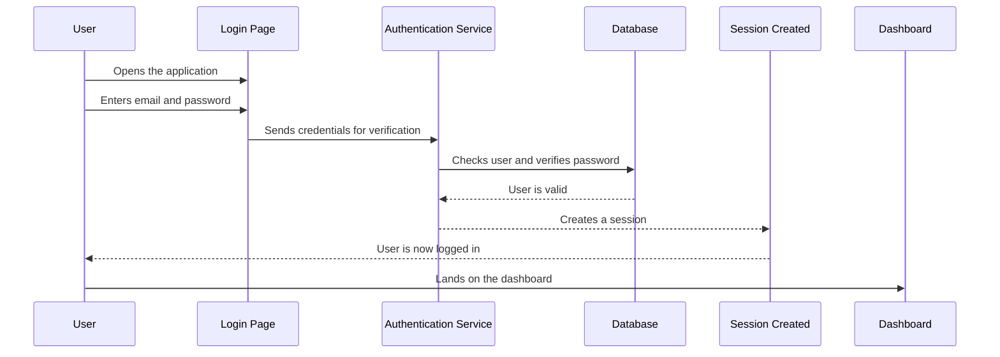
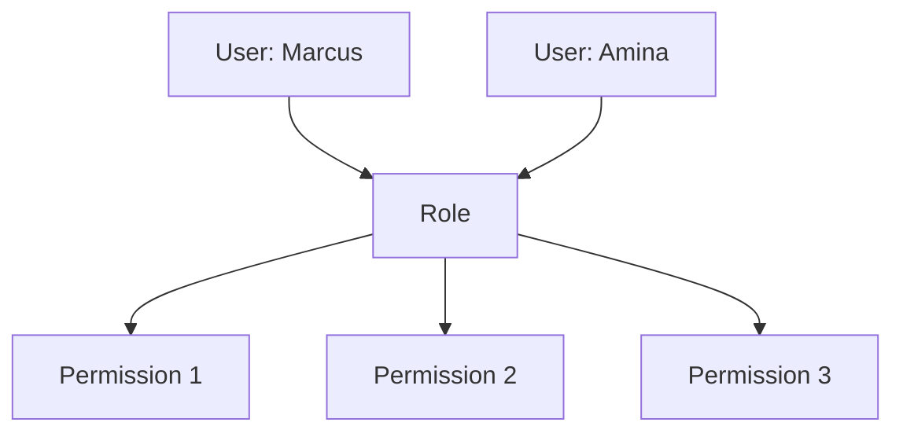

# Authentication & Role-Based Access Control

## Purpose

So far, we have built the database (Session 10) and set up the project scaffold (Session 9). The database now holds users, equipment, maintenance tasks, and downtime events. But there is a critical problem: **anyone could access it**.

Think about what the EMMS stores. Maintenance records, downtime events, repair history, equipment details — all of it is important operational information. Now imagine that *anyone* could open the application and edit that data. A random visitor could delete a maintenance record. A competitor could view downtime reports. An employee who only fixes machines could change who has permission to do what.

That would be chaos — and in a factory, chaos is dangerous and expensive.

This is why applications need **authentication**. Authentication is the process of confirming that a person is who they say they are. When you sign in with an email and password, the application is authenticating you — checking your identity before letting you in.

> [!IMPORTANT]
> Manufacturing software cannot allow anonymous users to edit maintenance information. A maintenance record is a safety-critical document. It must be protected so that only known, trusted people can create or change it.

In Session 5, you learned about Auth.js and how it manages identity, sessions, and permissions. In this chapter, we bring that to life: how users securely access the EMMS, and why different users need different permissions.

---

## Authentication vs Authorization

Before we go further, we must be clear about two words that are often confused: **authentication** and **authorization**.

| | Authentication | Authorization |
|---|---|---|
| **What it answers** | Who are you? | What are you allowed to do? |
| **When it happens** | First — before anything else | Second — after you are identified |
| **What it does** | Confirms your identity | Decides your access |
| **Failure result** | You cannot get in at all | You get in, but cannot do certain things |
| **EMMS example** | Logging in with your email and password | A technician can record work, but cannot delete equipment |

Authentication is the front door. Authorization is what happens after you walk through it.

> [!NOTE]
> **Authentication** confirms *who* you are. **Authorization** decides *what* you may do. The EMMS needs both: the first to let known users in, the second to keep each user within their responsibilities.

### A factory analogy

Imagine a factory with a secure main entrance.

- **Authentication** is the security guard at the gate who checks your ID badge. They confirm you are really who you claim to be. Without a valid badge, you do not get past the gate at all.
- **Authorization** is what happens once you are inside. The guard knows your job, so they direct you to the right areas. A technician can enter the maintenance workshop. A manager can enter the planning office. Neither can wander into the other's area.

The gate checks *who you are*. The building rules decide *where you can go*. That is exactly the relationship between authentication and authorization in the EMMS.

---

## Users of the EMMS

The EMMS serves several kinds of users, each with different responsibilities and permissions. In Session 1, you met the people of the factory. Here is how their roles translate into the system.

| Role | Responsibilities | Permissions |
|---|---|---|
| **Administrator** | Manages the system, user accounts, and configuration | Full access: manage users, view everything, configure the system |
| **Maintenance Supervisor** | Plans maintenance and manages the maintenance team | Schedule tasks, assign work, view equipment and reports |
| **Maintenance Technician** | Performs maintenance work and records completion | View assigned tasks, complete them, record what was done |
| **Operator** | Works on the factory floor, closest to the machines | Log downtime events and report faults as they happen |
| **Plant Manager** | Oversees plant performance and reliability | View dashboards, reports, and analytics across the plant |
| **Reliability Engineer** | Analyzes failures and drives long-term improvement | View history and analytics to spot recurring problems |

Each role interacts with the system differently:

- An **Administrator** keeps the system healthy — adding users, resetting accounts, and managing access.
- A **Supervisor** plans the work — scheduling maintenance and assigning it to the team.
- A **Technician** does the work — seeing assigned tasks, completing them, and recording the outcome.
- An **Operator** reports the problems — logging downtime the moment a machine stops.
- A **Plant Manager** watches the big picture — reading dashboards and reports without editing day-to-day records.
- A **Reliability Engineer** studies the patterns — using history and analytics to prevent repeated failures.

> [!NOTE]
> Each role exists because the business needs it. Roles are not just about restricting people — they are about giving every person the tools they need for their job, and nothing they do not.

> [!TIP]
> Notice how the roles from Session 1 (operators, engineers, managers) appear here, alongside the EMMS-specific roles of supervisor, administrator, and reliability engineer. The user roles are the business model, made real in the system.

---

## Login Flow

When a user signs in, a sequence of steps happens. Here is the flow, step by step.

Let us explain every step.

### Step 1: The user opens the application

The user visits the EMMS. Because most pages are protected, they are directed to the login page.

### Step 2: The user enters their credentials

**Credentials** are the pieces of proof a user provides — in the EMMS, an email address and a password. The user types them into the login form.

### Step 3: The application sends the credentials for verification

The login page passes the credentials to the **authentication service** — the part of the system that checks identities. In this project, that service is Auth.js, as you learned in Session 5.

### Step 4: The service checks the database

The authentication service looks up the user in the database (the `User` model from Session 10) and verifies that the password is correct.

> [!IMPORTANT]
> The application never trusts the browser with the password check. As you learned in Session 4, the server is the gatekeeper. The verification happens on the server, against the database, never in the browser where a user could inspect it.

### Step 5: The session is created

If the credentials are correct, the system creates a **session** — a record that this user is logged in. The user is now authenticated.

### Step 6: The user reaches the dashboard

The logged-in user is taken to the dashboard, where they can use the application according to their role.

> [!NOTE]
> **Credentials** are the evidence of identity — in the EMMS, the email and password a user provides. The **authentication service** is the part of the system that verifies credentials and manages logins.

---

## Why Sessions Exist

A **session** is the period during which the system remembers that a user is logged in. You learned the concept in Session 5; now let us see why it matters so much.

### Why users stay logged in

Imagine if the application forgot who you were after every single click. Every time you opened a new page, you would have to type your email and password again. That would make the EMMS unusable — a technician would spend more time logging in than recording maintenance.

A session solves this. When you log in once, the system creates a session that lasts for a while. As you move between pages, the system remembers you are logged in, and you do not need to keep proving your identity.

### How sessions improve usability

Sessions make the application practical:

- you log in once and move freely through the pages you are allowed to see
- the system knows who you are on every page, so it can show you the right information
- you only need to log in again when the session ends

> [!NOTE]
> A **session** is the system's memory that a particular user is logged in. It is created at login and lasts until it expires or the user logs out.

### A practical analogy

Think of a session like a day pass at a theme park.

When you arrive, you show your ticket and receive a wristband. For the rest of the day, you do not show your ticket again — the wristband proves you are a paying visitor, so you can move between rides freely.

At the end of the day, the wristband is no longer valid, and you would need a new one to return. That is exactly how a session works: one login, lasting access, and a natural end.

> [!TIP]
> Sessions exist to make the application usable. Without them, security would be so tedious that nobody would want to use the system — and an unused system protects nothing.

---

## Role-Based Access Control (RBAC)

**Role-Based Access Control (RBAC)** is a way of managing permissions by attaching them to roles instead of to individual users.

### How RBAC works

Instead of asking "what can Marcus do?" for every single person, the system asks "what can a Technician do?" Marcus is a Technician, so he inherits the Technician permissions.

In this diagram, Marcus and Amina both belong to the same role. The role carries the permissions. When either user acts, the system checks what their role allows.

### Why permissions should attach to roles, not individual users

Attaching permissions to roles is far easier to manage than attaching them to each person:

- **Consistency:** every Technician automatically has the same permissions — no gaps or surprises.
- **Simple changes:** to change what all technicians can do, you change the role once, not each person.
- **Easy onboarding:** a new technician is given the role and immediately has the correct access.
- **Clarity:** you can see at a glance what each role can do, which makes the system predictable and safe.

If you gave permissions to individuals instead, you would end up with a mess: some technicians able to do things others cannot, new employees missing permissions, and no clear way to know who can do what.

> [!IMPORTANT]
> Permissions belong to roles, and users belong to roles. This keeps access consistent, predictable, and easy to manage as the team grows and changes.

> [!NOTE]
> **Role-Based Access Control (RBAC)** is the approach where permissions are grouped into roles, and users are assigned to roles. Users inherit the permissions of their role.

---

## Example Permission Matrix

Here is how permissions might be distributed across the EMMS roles. This is an example — the exact matrix will be finalized during implementation — but it shows the reasoning.

| Feature | Administrator | Supervisor | Technician | Operator | Manager |
|---|---|---|---|---|---|
| View Equipment | ✅ | ✅ | ✅ | ✅ | ✅ |
| Create Equipment | ✅ | ✅ | ❌ | ❌ | ❌ |
| Edit Equipment | ✅ | ✅ | ❌ | ❌ | ❌ |
| Schedule Maintenance | ✅ | ✅ | ❌ | ❌ | ❌ |
| Complete Maintenance | ✅ | ✅ | ✅ | ❌ | ❌ |
| View Reports | ✅ | ✅ | ❌ | ❌ | ✅ |
| Manage Users | ✅ | ❌ | ❌ | ❌ | ❌ |
| View Dashboard | ✅ | ✅ | ✅ | ✅ | ✅ |

Let us explain the reasoning behind each permission.

### View Equipment

Everyone can view equipment. Knowing what machines exist is part of almost every job in the factory — operators work on them, technicians maintain them, and managers oversee them.

### Create Equipment

Only the Administrator and Supervisor can create equipment. Adding a machine to the system is a significant act that changes the inventory. It is not something an operator or technician should do casually.

### Edit Equipment

The same reasoning applies. Changing equipment details affects records across the system, so only the Administrator and Supervisor may do it.

### Schedule Maintenance

Scheduling maintenance is the supervisor's core responsibility (Session 2). Only the Administrator and Supervisor can plan work and assign it.

### Complete Maintenance

Completing maintenance is the technician's core job. The Technician, Supervisor, and Administrator can mark work as done — but an Operator and Manager cannot, because they do not perform the work.

### View Reports

Reports and analytics are management tools (Session 7). Administrators, Supervisors, and Managers can view them. Technicians and Operators work day to day and do not need the management overview.

### Manage Users

Managing user accounts is the Administrator's exclusive job. This is the most sensitive permission — whoever controls user accounts controls access to the whole system.

### View Dashboard

Everyone views the dashboard. The dashboard is the entry point for each role (Session 7), and each role needs at least a basic view of what is happening.

> [!TIP]
> The pattern is simple: people can see what they need for their job, and they can change only what they are responsible for. When you design permissions, ask "what does this role genuinely need to do?" — and grant no more than that.

---

## Authentication in EMMS

The EMMS uses **Auth.js** for authentication. You were introduced to Auth.js in Session 5; here is why it is the right choice for this project.

### Why the project uses Auth.js

Building authentication from scratch is risky. Getting passwords, sessions, and login flows wrong can leave the whole system vulnerable. Auth.js is a well-tested library that handles the hard, security-critical work for us, so we can focus on the EMMS itself.

### Login

Users sign in with their email and password. Auth.js verifies the credentials against the user database and creates a session. Login works the way the flow diagram earlier described.

### Logout

When a user logs out, the session ends. The user is returned to the login screen, and the application no longer treats them as logged in.

### Session management

Auth.js manages sessions for us — creating them at login, remembering the user across pages, and ending them at logout or expiry. This is the "day pass" idea from earlier, handled safely.

### Protected pages

With authentication in place, pages can be protected. A protected page requires a valid session; if a user is not logged in, they are redirected to the login page. The dashboard and every feature page in the EMMS should be protected.

### Future integration with company identity providers

A **company identity provider** is a central service a company uses to manage employee accounts — the kind of service employees already use to log in to their work tools. In the future, the EMMS could let users sign in with their company account instead of a separate EMMS account. Auth.js supports this kind of integration, which is another reason it was chosen.

> [!NOTE]
> An **identity provider** is a central service that verifies who a user is for many applications at once. Auth.js is designed to work with them, so the EMMS can grow from its own logins to company-wide sign-in later.

> [!IMPORTANT]
> Authentication in the EMMS is about protecting real operational data. The goal is not just "users can log in" — it is "only the right users can reach the maintenance information they are responsible for."

---

## Protecting Application Features

Authentication alone is not enough. Once a user is logged in, the system must also enforce what that user is allowed to do. This is where authentication and authorization work together.

The EMMS protects access at several levels:

### Pages

A **page** is what the user sees in the browser. Protecting a page means only signed-in users with the right role can open it. For example, only a Supervisor should be able to open the page for scheduling maintenance.

### API routes

An **API route** is an address the application uses to send and receive data behind the scenes (you met this idea in Session 4). Even if someone bypasses the user interface, the API route must still check whether the caller is allowed to perform the action.

### Server actions

A **server action** is a function that runs on the server to handle a user's request (Session 4). Server actions must check permissions themselves — they cannot assume the page did the checking.

### Database operations

**Database operations** are the actual reads and writes to the database (Session 10). As the final layer, the application's database layer should also respect the user's permissions, so that even a mistake in the layers above cannot expose data.

### Simple examples

- A Technician opens the equipment page: allowed — they need to see what they maintain.
- A Technician tries to open the user management page: blocked — only Administrators manage users.
- An Operator tries to schedule maintenance through an API call: blocked — the server action checks the role and refuses.
- A logged-out visitor tries to load the dashboard: redirected to the login page.

> [!NOTE]
> An **API route** is a server address the application uses to exchange data. A **server action** is server-side logic that handles a request. Both must check permissions independently — you cannot rely on the user interface to enforce security.

> [!IMPORTANT]
> Security is layered. Session 5 introduced "defense in depth" — the idea that protection comes from multiple layers, not one. In the EMMS, pages, API routes, server actions, and database operations each enforce access, so a failure in one layer is caught by the next.

---

## Common Authentication Mistakes

Beginners often make the same authentication mistakes. Here is how to recognize and avoid each one.

### Trusting the client

**The mistake:** Believing the browser when it says "this user is a Supervisor," or hiding sensitive buttons in the interface and assuming that is enough.

**Why it is dangerous:** The browser can be inspected and changed by anyone (Session 4). Hiding a button in the interface does not protect the data behind it.

**How to avoid it:** Always verify identity and permissions on the server. The interface is for convenience; the server is the source of truth.

### Hardcoding permissions

**The mistake:** Writing permission checks as fixed rules scattered through the code, like "only user ID 5 can do this."

**Why it is dangerous:** Hardcoded rules are impossible to manage. When a user changes role or a new employee joins, you must edit code.

**How to avoid it:** Use RBAC. Attach permissions to roles, and check the user's role — not individual users.

### Storing passwords incorrectly

**The mistake:** Saving passwords as plain text, or storing them in a way that can be read back.

**Why it is dangerous:** If the database is ever exposed, every password is readable — and people reuse passwords, so the damage spreads.

**How to avoid it:** Never store readable passwords. Store a **hash** — a one-way scrambled version that cannot be reversed — and let Auth.js handle this correctly.

> [!NOTE]
> A **hash** is a scrambled version of a value that cannot be turned back into the original. When a user sets a password, the system stores a hash, not the password itself. At login, it scrambles the entered password and compares the hashes — without ever storing the real password.

### Forgetting authorization checks

**The mistake:** Implementing login successfully, then assuming every logged-in user can do everything.

**Why it is dangerous:** Authentication without authorization means any user can access anything — a technician could manage users, an operator could delete equipment.

**How to avoid it:** After authentication, add authorization. Protect pages, API routes, server actions, and database operations according to role.

### Giving everyone admin access

**The mistake:** Giving every user Administrator access "so they can do everything," to avoid the work of setting up roles.

**Why it is dangerous:** One careless mistake by any user becomes a catastrophic change to the whole system. Admins should be rare.

**How to avoid it:** Grant the least privilege — the minimum access each role genuinely needs. Only the Administrator role manages users and configuration.

> [!NOTE]
> **Least privilege** is the principle of giving users only the access they need for their job, and nothing more. It is the safest approach because it limits what any one mistake can do.

> [!TIP]
> Almost every authentication problem traces back to these five mistakes. When something feels insecure, ask yourself which one you have made — the fix is usually clear.

---

## First Secure Milestone

After this chapter, the application should reach its first secure milestone. Here is what "done" looks like:

| # | Milestone item | What "done" looks like |
|---|---|---|
| 1 | User login | A known user can sign in with valid credentials |
| 2 | User logout | A signed-in user can end their session and return to login |
| 3 | Session persistence | The user stays logged in across pages until the session ends |
| 4 | Role identification | The system knows which role the logged-in user has |
| 5 | Protected pages | Pages require a valid session and redirect logged-out users to login |
| 6 | Basic RBAC foundation | Permissions are attached to roles, and the roles from this chapter exist |

When every box is checked, the EMMS is no longer open to anyone. It is a protected system where known users sign in, sessions are managed safely, and roles control what each person can do.

> [!IMPORTANT]
> Do not move to building core features until this milestone is verified. Every feature you build next will depend on knowing who the user is — so the authentication foundation must be solid first.

---

## What's Next?

The database is built (Session 10), and now users have a secure way to access it. The next step is to put that foundation to work.

**Session 12 — Building Core Features** introduces the main business features of the EMMS. Now that authenticated users can log in and are identified by role, they can begin interacting with the application's real work:

- operators logging downtime events
- technicians viewing and completing their assigned maintenance
- supervisors scheduling maintenance
- everyone viewing the dashboard with the right level of access

The features built in Session 12 will use the database models from Session 10, protected by the authentication and roles from this chapter. The EMMS begins to become a working application.

> [!NOTE]
> Each feature in Session 12 will combine three things you have already built: the data models from Session 10, the secure access from this chapter, and the business understanding from Sessions 1 through 8.

---

## Key Takeaways

- Authentication confirms who a user is; authorization decides what they may do. The EMMS needs both.
- Manufacturing software cannot allow anonymous editing of maintenance information — records must be protected.
- The factory analogy captures the idea: the guard checks who you are at the gate, and the building rules decide where you can go.
- The EMMS has six roles: Administrator, Supervisor, Technician, Operator, Plant Manager, and Reliability Engineer, each with their own responsibilities and permissions.
- The login flow moves from the login page, to the authentication service, to the database, to a created session, and finally to the dashboard.
- Sessions let users stay logged in across pages, making the application usable instead of tedious.
- RBAC attaches permissions to roles, and users belong to roles — keeping access consistent and easy to manage.
- Permissions should be granted as the least each role needs, following the permission matrix reasoning.
- The EMMS uses Auth.js because it handles the security-critical work of login, logout, sessions, and protected pages reliably.
- Authentication alone is not enough — pages, API routes, server actions, and database operations must all enforce access.
- Avoid the five common mistakes: trusting the client, hardcoding permissions, storing passwords incorrectly, forgetting authorization checks, and giving everyone admin access.
- The first secure milestone is a system where users log in and out, sessions persist, roles are identified, pages are protected, and the RBAC foundation exists.
- Next comes Session 12, where authenticated users begin using the core business features built on the database and secured by this chapter.
