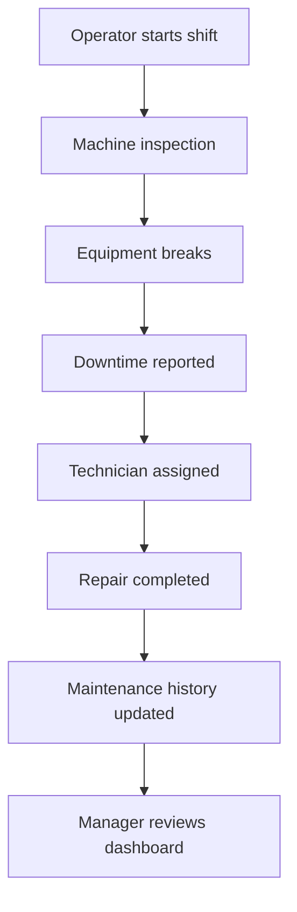
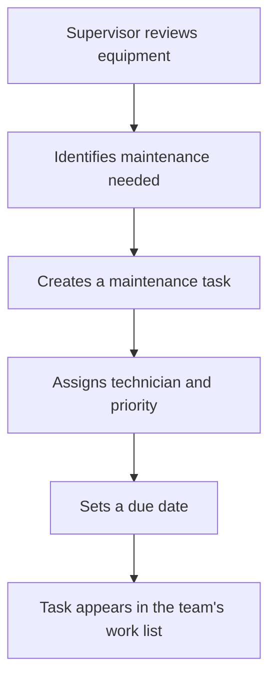
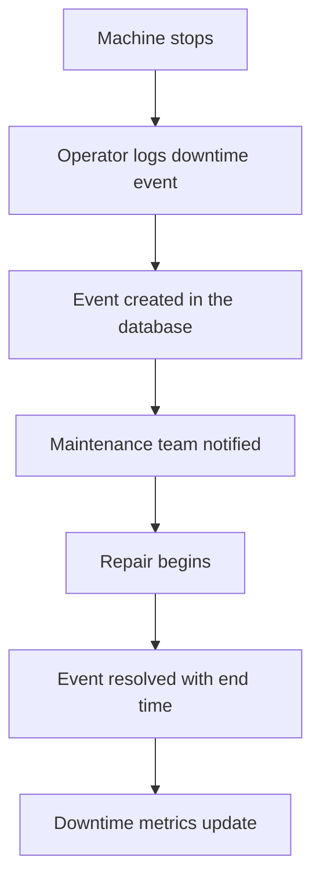
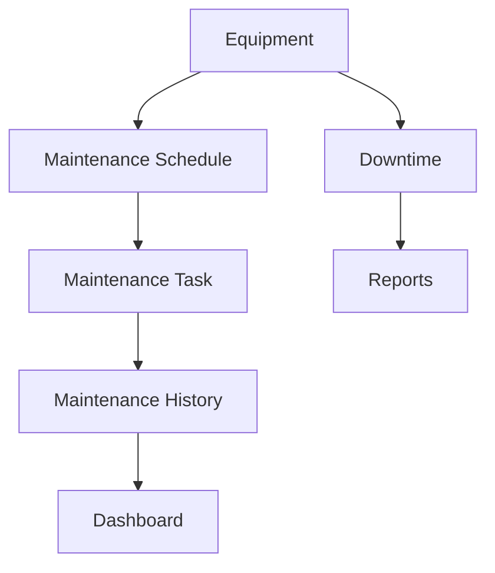
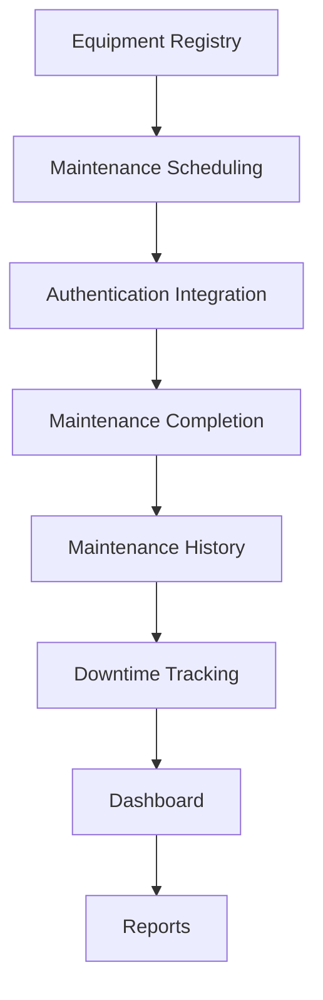

# Building the Core Features

## Purpose

The infrastructure is complete. In the previous sessions, we built the foundation piece by piece:

- the **business problem** we are solving (Session 1)
- the **manufacturing fundamentals** the system models (Session 2)
- the **database** that stores the data (Sessions 3 and 10)
- the **architecture** the system is built on (Sessions 4 and 5)
- the **project setup** that made the codebase real (Session 9)
- the **authentication** that keeps the system secure (Sessions 11)

Now the application is ready to do what it was built for: **solve real business problems**.

This chapter is not a coding tutorial. It will not walk through specific functions or files. Instead, it explains how each **business workflow** — a real task a person performs in the factory — becomes a **software feature** the EMMS provides.

The focus is always the same journey:

```
Business Workflow
    ↓
Software Feature
    ↓
Application Components
    ↓
Database
    ↓
Business Value
```

Every feature in the EMMS starts with a person trying to get work done. We follow that need all the way down to the database that stores the result — and back up to the value it creates.

> [!NOTE]
> A **business workflow** is a real task a person performs as part of their job — like logging a machine breakdown. A **software feature** is the part of the application that supports that task. This chapter connects the two.

---

## The Daily Life of an EMMS User

Before we examine features one by one, let us watch a typical workday. This is the story the EMMS is built to support.



Here is how that day unfolds:

- The morning shift begins. An **Operator** (Session 1) starts their shift and walks through the machines.
- During the **machine inspection**, the operator notices a machine behaving abnormally, then it stops entirely.
- The operator **reports the downtime** through the EMMS — the downtime event is recorded immediately.
- A **Technician is assigned** to investigate and fix the problem.
- The technician completes the **repair** and records what was done.
- The **maintenance history** for that machine is updated, building a permanent record.
- Later, a **Manager reviews the dashboard** (Session 7) and sees the day's summary at a glance.

Every step in this story maps to a feature in the EMMS. The rest of this chapter looks at each one.

> [!TIP]
> Keep this story in your mind as you read. Every feature you are about to learn serves one of these people at one of these moments.

---

## Core Business Workflows

Here are the main workflows the EMMS supports, who uses them, their business goal, and the database models behind them (from Session 10).

| Workflow | Primary User | Business Goal | Main Database Models |
|---|---|---|---|
| Register Equipment | Supervisor, Administrator | Keep an accurate inventory of assets | `Equipment`, `ProductionLine` |
| Schedule Maintenance | Supervisor | Plan preventive work before failures | `MaintenanceTask` |
| View Assigned Work | Technician | Know what work needs to be done | `MaintenanceTask`, `User` |
| Complete Maintenance | Technician | Record that work is done correctly | `MaintenanceTask`, `MaintenanceHistory` |
| Report Downtime | Operator | Capture a breakdown the moment it happens | `DowntimeEvent`, `Shift` |
| View Maintenance History | Technician, Reliability Engineer | Understand what was done to a machine | `MaintenanceHistory`, `Equipment` |
| Search Equipment | Anyone | Find a specific asset quickly | `Equipment` |
| Generate Reports | Supervisor, Manager, Reliability Engineer | Summarize performance and trends | Many models |
| View Dashboard | Manager, Supervisor | See status at a glance | Many models |

Each workflow answers a simple question: *who needs to do what, and why does it matter to the business?* When you understand that, the feature design follows naturally.

> [!NOTE]
> A **workflow** here is the same idea as the request flow from Session 4 — a real action that starts with a user and ends with data in the database. The difference is that this chapter focuses on *which* workflows exist, not just how a single request travels.

---

# Feature 1 — Equipment Registry

The **Equipment Registry** is the digital inventory of every machine and asset in the organization. It is the foundation of the whole system.

### Why equipment must exist before maintenance

Think about it: you cannot schedule maintenance on a machine that is not in the system. You cannot log downtime for equipment that does not exist. Everything else — scheduling, history, downtime, dashboards — points back to equipment records.

That is why the Equipment Registry comes first. It is the anchor that all other features connect to, the way the `Equipment` model connects to `MaintenanceTask` and `DowntimeEvent` in the database (Session 10).

### Business purpose

The registry gives the organization a single source of truth for its assets. Instead of a spreadsheet that nobody trusts, supervisors and administrators have a reliable, searchable record of what exists.

### Typical information stored

Each equipment record stores the details needed to identify and manage the asset:

- a name, such as "Press 01"
- a model or type
- a unique asset or serial number
- the production line it belongs to
- its current status, such as operational, down, or under maintenance

### Who can create equipment

As we decided in the permission matrix in Session 11, creating equipment is restricted to Supervisors and Administrators. Adding an asset changes the inventory, so it is not something every user should do.

### How this feature connects to the database

The registry is the `Equipment` model from Session 10. Creating an equipment record inserts a new row into that table. Viewing the registry reads from it. Everything else the EMMS does references these records.

### Future enhancements

Later, the registry could grow to include equipment photos, documents, and scanning via QR codes or barcodes — ideas from the future vision in the project README.

> [!NOTE]
> The Equipment Registry is the digital version of the factory floor inventory. Every machine the EMMS talks about — its tasks, its history, its downtime — is first registered here.

---

# Feature 2 — Maintenance Scheduling

**Maintenance Scheduling** lets supervisors plan maintenance work before failures happen. This is the heart of the move from reactive to preventive maintenance you learned about in Session 2.

### Preventive vs corrective maintenance

Recall from Session 2 the two approaches:

- **Corrective maintenance** — waiting for a machine to fail, then fixing it. Expensive and unplanned.
- **Preventive maintenance** — servicing a machine on a regular schedule before it fails. Planned and cheaper.

The scheduling feature supports preventive maintenance by letting supervisors plan work in advance, so breakdowns are avoided rather than repaired.

### Assigning technicians

When a supervisor schedules a task, they can assign it to a specific technician. This connects the `MaintenanceTask` model to the `User` model (Session 10) — the task knows both what equipment it is for and who will do it.

### Priority and due dates

Not all tasks are equally urgent. A critical machine (Session 2) needs faster attention than a minor one. Each task carries a **priority** and a **due date**, so the team knows what to do first and by when.

### Status

Every task has a **status** — scheduled, in progress, completed, or overdue. Status is how the system answers "what still needs doing?" at any moment.

### How scheduling reduces downtime

Scheduling maintenance before failure prevents the unplanned downtime that stops production lines (Session 2). A short, planned maintenance window replaces a long, emergency stop.



> [!NOTE]
> **Preventive maintenance** is servicing equipment on a schedule before it fails. **Corrective maintenance** is fixing equipment after it breaks. Scheduling supports the preventive approach, which saves time and money.

> [!IMPORTANT]
> The goal of scheduling is not to create more work — it is to prevent more breakdowns. Every task planned in advance is an unplanned stop that never happens.

---

# Feature 3 — Completing Maintenance

**Completing Maintenance** is how a technician records that work has been done. This feature turns a scheduled task into a completed record.

### The workflow

1. The **technician receives the assignment** — the task appears in their work list (Feature 2).
2. The technician **performs the maintenance** on the equipment.
3. The technician **records notes** — what they found, what they did, and any parts used.
4. The technician **updates the status** of the task to completed.
5. A **maintenance history record is created**, capturing the work permanently.

### Why history is valuable

The history created here is not just a formality. It is the record that future planning depends on (Session 2). When a machine fails again six months later, the technician can look back and see exactly what was done last time — saving investigation time and revealing recurring problems.

### Connecting to the database

This feature connects two models from Session 10: the `MaintenanceTask` (which changes status) and the `MaintenanceHistory` (which stores the completed work). One action — completing a task — updates both.

> [!NOTE]
> Completing maintenance is where scheduled work becomes organizational knowledge. The task is finished, but the history it creates keeps paying value for years.

---

# Feature 4 — Downtime Reporting

**Downtime Reporting** captures the moment a machine stops working. It is the first step in the daily-life story we told earlier.

### The workflow

1. An **Operator reports the breakdown** — selecting the equipment, a reason code (Session 2), and a description.
2. A **downtime event is created** in the `DowntimeEvent` model (Session 10).
3. The **maintenance team is notified** that a machine is down.
4. The **repair begins** — a technician investigates and fixes the problem.
5. The **downtime is resolved** — the event is closed with an end time and details of the repair.

### Production loss

Every minute of downtime has a cost (Session 1). The system records start and end times so it can calculate downtime duration and production loss — metrics you met in Sessions 2 and 7.



> [!NOTE]
> **Production loss** is the output that was not produced because a machine was stopped. Downtime reporting captures the data that makes this number knowable.

> [!TIP]
> Reporting downtime is the moment the EMMS earns its keep. A stop that is logged in seconds becomes a permanent, analysable record — instead of a memory that fades by the end of the shift.

---

# Feature 5 — Maintenance History

**Maintenance History** is the permanent record of every maintenance action performed on each piece of equipment. It is what turns scattered work into a story you can learn from.

### Why organizations keep historical records

In Session 1, we saw how scattered information makes it impossible to learn from the past. The Maintenance History feature is the opposite of that: it centralizes every repair, inspection, and action into one reliable record per asset.

### Examples of business questions history can answer

With a complete history, managers and engineers can answer questions that were impossible with paper logs:

- What has been done to this machine over the past year?
- Does this machine fail with the same problem repeatedly?
- Which machines consume the most parts?
- Was the last repair a permanent fix or a temporary patch?

### How this improves future maintenance planning

History feeds planning. When a supervisor sees that a machine has a recurring fault every six to eight weeks, they can schedule preventive maintenance before the next failure (Session 2). History turns reactive guessing into evidence-based planning.

> [!IMPORTANT]
> Maintenance history is the difference between a system that records work and a system that learns from it. The records you build today are the insights you plan with tomorrow.

---

# Feature 6 — Equipment Search

**Equipment Search** helps users find a specific asset quickly. In a factory with hundreds or thousands of machines, scrolling through a long list is not an option.

### Why search becomes necessary

As the Equipment Registry grows, finding one machine becomes harder. A supervisor needs to check "Press 01," a technician needs the machine they were assigned, a manager needs to look up a machine causing trouble. Search makes that instant.

### Searching by

The EMMS allows users to find equipment by the details that matter:

- **Asset Number** — the unique identifier, exact and unambiguous
- **Equipment Name** — "Press 01" or "Conveyor 02"
- **Location** — which factory or production line it is on
- **Status** — find everything currently "down" or "under maintenance"
- **Department** — if equipment is grouped by department, find all of that department's assets

### The business value

Search saves time and reduces errors. Instead of hunting through a list or asking a colleague, a user finds the exact asset in seconds — and the time saved is time spent on maintenance instead of searching.

> [!NOTE]
> **Search** is the feature that lets users filter and find records without browsing everything. It becomes essential as the registry grows — the same way a search box is essential on a large website.

> [!TIP]
> Search is not a luxury — it is how a large inventory stays usable. A registry nobody can navigate is a registry nobody uses.

---

# Feature 7 — Dashboards

**Dashboards** summarize the state of the EMMS at a glance. This feature brings Session 7 to life — the analytics engine that turns raw records into useful metrics.

### How dashboards summarize information

Managers do not need to read thousands of records to understand what is happening (Session 7). The dashboard presents the key numbers in one view, so a manager can see the situation in seconds.

### What the dashboard shows

The EMMS dashboard summarizes the most important operational signals:

- **Open maintenance tasks** — what still needs to be done
- **Equipment status** — how many machines are operational, down, or under maintenance
- **Overdue work** — tasks that have passed their due date and need priority
- **Downtime** — how much downtime has occurred, and where
- **Upcoming maintenance** — what is scheduled, so nothing is forgotten
- **Reliability metrics** — figures like MTTR from Sessions 2 and 7

### Why managers need summaries rather than raw records

In Session 7 we learned that people cannot read thousands of records and instantly understand what matters. A dashboard condenses that information into the few numbers that drive decisions. It is the "command center" idea from Session 1 — the one place a manager can look to see the whole picture.

> [!NOTE]
> A **dashboard** is a page that shows summary metrics at a glance. It is the visible result of the analytics engine from Session 7.

> [!IMPORTANT]
> The dashboard is only as good as the data behind it. That is why dashboards are built after the features that create records — a dashboard showing empty numbers would be useless.

---

# Feature 8 — Reports

**Reports** are organized, detailed summaries of the EMMS data. If the dashboard is the quick glance, reports are the deeper look.

### Types of reports

The EMMS can provide reports over different time periods and on different subjects:

- **Daily reports** — what happened today
- **Weekly reports** — the week's activities and performance
- **Monthly reports** — trends over a longer period
- **Maintenance summaries** — what work was done, and by whom
- **Equipment performance** — how reliable each asset has been
- **Downtime reports** — where downtime happened, its causes, and its impact

### Exporting information

Reports often need to leave the system — to be shared with leadership, filed for compliance, or reviewed offline. This is called **exporting**: converting the report into a common format, like a PDF or spreadsheet, that can be saved or sent.

> [!NOTE]
> **Exporting** means saving information in a format that can be shared outside the application, such as a PDF or spreadsheet file. It turns the EMMS's data into documents other tools and people can use.

> [!TIP]
> The dashboard answers "what is the situation right now?" Reports answer "what has been happening over time?" Both are built on the same analytics ideas from Session 7.

---

## How All Features Work Together

The features are not separate islands. They form one connected system, exactly like the models in the database (Session 10).



Here is how the relationships work:

- **Equipment** anchors everything — every task, every event, every history record points to a piece of equipment.
- **Maintenance Schedule** creates tasks for equipment, turning planned work into an organized list.
- **Maintenance Task** becomes a **Maintenance History** record when completed, preserving the work.
- **Maintenance History** feeds the **Dashboard**, which summarizes past and current state.
- **Equipment** also experiences **Downtime**, recorded as downtime events.
- **Downtime** feeds **Reports**, giving managers the deeper analysis they need.

> [!NOTE]
> The features mirror the database relationships from Session 10. Each feature reads and writes the same models, so they naturally connect — a task, a history record, and a downtime event all point back to the same equipment.

> [!IMPORTANT]
> Building features that connect to the same data is what makes the system coherent. The Equipment Registry feeds scheduling, scheduling feeds completion, completion feeds history, and history feeds dashboards and reports — one chain of value.

---

## Feature Development Order

Just as the database models were built in dependency order (Session 10), the features are built in a specific order. Each feature provides a foundation for the next.



Here is the reasoning behind the order:

1. **Equipment Registry** comes first because every other feature needs equipment to exist.
2. **Maintenance Scheduling** follows, because tasks need equipment to be assigned to.
3. **Authentication Integration** ties the features to users and roles (Session 11), so each person sees their own work.
4. **Maintenance Completion** builds on scheduling, letting technicians finish assigned tasks.
5. **Maintenance History** comes after completion, because history is created when work is done.
6. **Downtime Tracking** follows, capturing the failures that scheduling tries to prevent.
7. **Dashboard** is built after the features that create data exist — otherwise it would show empty numbers.
8. **Reports** come last, because they summarize the data all previous features have collected.

> [!TIP]
> The rule is simple: build what creates data before what reads it. The registry creates equipment; scheduling creates tasks; completion creates history; and the dashboard and reports read it all. Data first, summaries later.

> [!IMPORTANT]
> Building in this order means every feature is testable as soon as it is built — because the data it needs already exists. This is the same dependency thinking you used when building the database models in Session 10.

---

## Common Beginner Mistakes

Here are the most common mistakes when building core features, and how to avoid each one.

### Building dashboards before data exists

**The mistake:** Building the dashboard first, while the features that create data do not exist yet.

**Why it is wrong:** A dashboard with no data shows empty numbers, and you cannot tell if it works.

**How to avoid it:** Build the features that create data first, then the dashboard that summarizes it — as the development order above describes.

### Skipping maintenance history

**The mistake:** Building scheduling and completion, but forgetting to record the history of completed work.

**Why it is wrong:** Without history, the system cannot learn from the past, and the value we described in Feature 5 is lost.

**How to avoid it:** Make history a natural part of completion — whenever a task is finished, a history record is created.

### Mixing business rules into the UI

**The mistake:** Putting business logic (like "only supervisors can schedule") directly inside the interface code.

**Why it is wrong:** The UI can be bypassed (Session 4). Business rules belong on the server, where they are enforced.

**How to avoid it:** Keep the interface focused on display and input. Put the rules in the server layer, as the architecture from Sessions 4 and 5 describes.

### Duplicating feature logic

**The mistake:** Copying the same logic into several places — for example, duplicating the "find equipment" code in every feature that needs it.

**Why it is wrong:** Duplicated logic drifts apart over time, and fixing one copy leaves the others broken.

**How to avoid it:** Reuse shared logic. If several features need the same thing, put it in one shared place — the same normalization idea you learned for the database in Session 10.

### Ignoring user workflows

**The mistake:** Building features that make sense to the developer but do not match how users actually work.

**Why it is wrong:** If a feature does not fit the user's real workflow, they will not use it — and an unused feature protects nothing.

**How to avoid it:** Start from the daily-life story at the top of this chapter. Ask "who does this, when, and why?" before building anything.

> [!TIP]
> Every mistake on this list is a version of the same lesson: build from the business outward, keep logic in one place, and let the data and workflows drive the features.

---

## Major Milestone

After this chapter, the EMMS is capable of real work. Here is what "done" looks like:

| # | Milestone item | What "done" looks like |
|---|---|---|
| 1 | Equipment Registry | Equipment can be created, viewed, and searched |
| 2 | Maintenance Scheduling | Tasks can be scheduled, assigned, and prioritized |
| 3 | Authentication integration | Features respect the user's role from Session 11 |
| 4 | Maintenance Completion | Technicians can complete tasks and record work |
| 5 | Maintenance History | Completed work is recorded and viewable per asset |
| 6 | Downtime Tracking | Downtime events can be reported and resolved |
| 7 | Dashboard | Summary metrics reflect the data being created |
| 8 | Reports | The data can be summarized and exported |

When every box is checked, the EMMS is no longer just infrastructure — it is a working application that supports the daily life of the factory.

> [!NOTE]
> A **milestone** is a point where a complete, meaningful piece of work is finished. This is the first milestone where the EMMS genuinely solves the business problem from Session 1.

> [!IMPORTANT]
> Features are complete when they work for the user, not when they exist. Verify each one by acting it out: create equipment, schedule a task, complete it, and watch the dashboard reflect the change.

---

## What's Next?

The features are built. The EMMS can register equipment, schedule and complete maintenance, track downtime, and summarize everything on dashboards and reports.

But building features is only half the job. Before this can be trusted with real factory data, we must be sure it **works correctly** — that there are no bugs, no broken workflows, and no features that fail under real use.

**Session 13 — Testing and Debugging** introduces how developers verify the application through testing, and how they find and fix problems when things go wrong. The features from this chapter are the perfect subject: each workflow we built can be tested to confirm it behaves as the business needs.

> [!NOTE]
> **Testing** is the process of checking that software behaves correctly. **Debugging** is the process of finding and fixing problems when it does not. Both come after building — and both make the EMMS trustworthy.

---

## Key Takeaways

- The infrastructure from Sessions 1 through 11 is complete, and the application is ready to solve real business problems.
- Every feature starts as a business workflow and ends as business value, flowing through software features, components, and the database.
- The daily life of a user — from shift start to dashboard review — maps directly to the EMMS features.
- The core workflows serve different users: supervisors register and schedule, technicians complete and record, operators report, and managers review.
- The Equipment Registry anchors everything — no other feature works without equipment records.
- Maintenance Scheduling supports preventive maintenance, reducing unplanned downtime.
- Completing Maintenance turns scheduled tasks into permanent history.
- Downtime Reporting captures the moment a machine stops and makes production loss knowable.
- Maintenance History turns scattered work into knowledge that improves future planning.
- Equipment Search keeps a large inventory usable.
- Dashboards summarize data for managers; Reports provide deeper analysis over time.
- The features work together as one connected chain, mirroring the database relationships.
- Features are built in dependency order — data-creating features before data-summarizing features.
- Avoid the five common mistakes: premature dashboards, missing history, business rules in the UI, duplicated logic, and ignoring workflows.
- The major milestone is a working application that supports the daily life of the factory.
- Next comes Session 13, where testing and debugging verify that everything works correctly.
