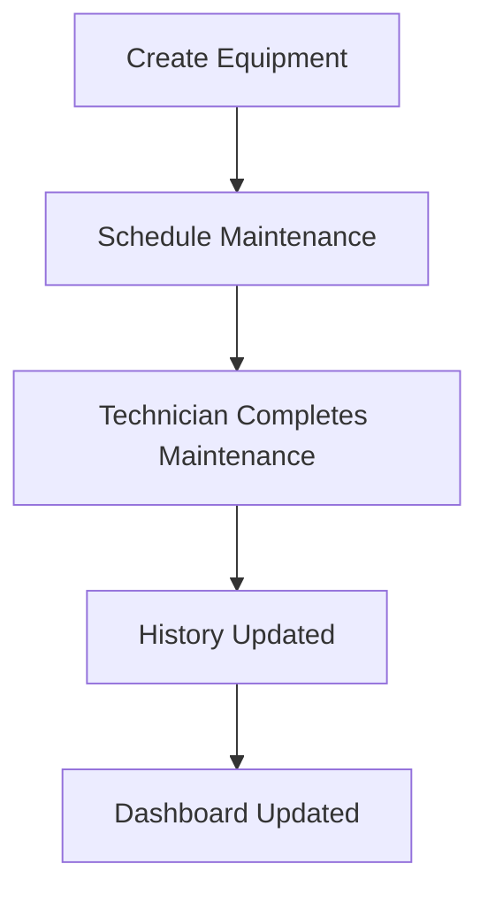
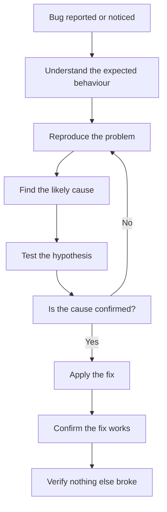

# Testing & Debugging

## Purpose

In Session 12, we built the core features of the EMMS. The application can register equipment, schedule maintenance, track downtime, complete work, and summarize everything on dashboards and reports.

But building software is only **half the job**.

Think about what we have created. This application is meant to be used in a real factory — the kind of place you learned about in Sessions 1 and 2. Operators will log downtime on it. Technicians will record maintenance on it. Managers will make decisions based on its dashboards and reports.

Now imagine that software being wrong. A maintenance task that never appears in a technician's list. A downtime event that records the wrong machine. A dashboard that shows a machine as healthy when it is actually down. In a factory, these are not minor annoyances — they are safety issues, wasted hours, and bad decisions.

That is why factories cannot rely on software that has never been tested.

> [!IMPORTANT]
> The EMMS records real operational information that real people depend on. When a supervisor schedules maintenance or a manager reads a report, they must be able to trust what the system shows. Testing is how we earn that trust.

The journey of every feature is the same:

```
Business Workflow
    ↓
Expected Behaviour
    ↓
Testing
    ↓
Confidence
    ↓
Reliable Software
```

We understand the workflow (Sessions 1–12). We know what should happen. Testing checks that the software actually does it — and that check is what turns a feature into reliable software.

> [!NOTE]
> **Testing** is the process of checking that software behaves the way it should. **Debugging** is the process of finding and fixing problems when it does not. Both are essential before the EMMS can be trusted with real work.

---

## What Does "Testing" Mean?

In simple language, testing means **checking that what you built actually works** — before users depend on it.

Let us be precise about the words we use, because they are often mixed up:

| Term | Meaning |
|---|---|
| **Bug** | A problem in the code that causes something to behave incorrectly |
| **Error** | A mistake a person makes, or a problem that happens when code runs |
| **Failure** | The visible result — the software does the wrong thing |
| **Defect** | A flaw in the software, usually caused by a bug, that may cause a failure |

In everyday conversation people use these words loosely, and that is fine. But for a developer it helps to be clear: a **bug** is the cause, a **failure** is the symptom, and a **defect** is the flaw waiting to cause trouble.

> [!NOTE]
> A **bug** is a problem in the code. An **error** is a mistake or runtime problem. A **failure** is the software doing the wrong thing. A **defect** is the underlying flaw. Testing finds these before they reach users.

### A manufacturing quality-control analogy

Picture a factory that produces metal parts on a production line — the kind of line you learned about in Session 2.

The parts come off the machine, but nobody checks them. Sometimes the machine misaligns and produces a part that is too thin. Nobody notices, so the thin parts get shipped to customers. Later, the parts break, and the customers are unhappy — the factory's reputation suffers.

Now imagine the factory installs a **quality-control** step. Every part is measured as it comes off the line. The moment a part is too thin, the machine is stopped and adjusted. The factory ships only good parts, and customers stay happy.

Testing software works exactly like quality control. The feature is the production line. The test is the measurement at the end of the line. Instead of shipping bugs to users, we catch them before they leave the factory.

> [!TIP]
> A factory would never ship parts it had not checked. Software should not be shipped to users before it has been tested. Testing is quality control for code.

---

## Why EMMS Needs Testing

Every feature in the EMMS, if it fails, has a business consequence. Let us look at what could go wrong with each major feature.

| Feature | Possible Problem | Business Consequence |
|---|---|---|
| Equipment Registry | A machine is registered twice with the same serial number | The inventory becomes unreliable, and maintenance is scheduled on the wrong record |
| Maintenance Scheduling | A task is created with the wrong due date | Maintenance is forgotten or done too late, and a preventable failure happens |
| Downtime Reporting | The downtime event records the wrong machine | The wrong machine looks unreliable, and the real problem machine is ignored |
| Maintenance Completion | The task status never changes to completed | Technicians are asked to redo work, and history is incomplete |
| Dashboard | The dashboard shows outdated or wrong numbers | Managers make decisions based on incorrect information |
| Reports | A report misses records or counts them twice | Leadership sees wrong totals and plans from false data |
| Authentication | A user can access something they should not | Sensitive operational data is exposed, and roles are meaningless (Session 11) |

Look at the pattern. Every single row is a real business problem — not a technical curiosity. When the Equipment Registry fails, the factory's inventory is wrong. When the Dashboard fails, managers decide with bad information.

> [!IMPORTANT]
> In the EMMS, a bug is not just an inconvenience — it can lead to forgotten maintenance, misidentified failures, and decisions based on false data. That is why each feature must be tested against the business outcome it is meant to produce.

> [!NOTE]
> The features above come from Session 12, the permissions from Session 11, and the models from Session 10. Testing verifies that all of it works together the way the business needs.

---

## Types of Testing

There are several kinds of testing, each answering a different question. Think of them as different levels of checking, from the smallest detail to the whole system.

### Unit Testing

A **unit test** checks one small piece of the application in isolation — a single function, rule, or calculation. It answers: *does this one piece do its job correctly?*

For example, a unit test might check that the function which calculates production loss returns the correct number for a given downtime duration and output rate (Session 7).

### Integration Testing

An **integration test** checks that several pieces work together correctly. It answers: *do the parts connect properly?*

For example, an integration test might check that completing a maintenance task correctly updates both the task status and the maintenance history (Session 10's related models).

### End-to-End Testing

An **end-to-end test** checks a complete workflow from start to finish, just as a real user would. It answers: *does the whole journey work?*

For example, an end-to-end test might log in as a supervisor, create equipment, schedule a task, complete it as a technician, and confirm the dashboard reflects the change.

### Manual Testing

**Manual testing** is a person using the application by hand to check it behaves correctly. It answers: *does this feel right to a real user?*

A developer or reviewer clicks through the flows, tries unusual inputs, and looks for anything unexpected.

| Type | What it checks | Scope | Best for |
|---|---|---|---|
| Unit Testing | One small piece in isolation | Small | Verifying calculations and rules |
| Integration Testing | Several pieces working together | Medium | Verifying connections between models and logic |
| End-to-End Testing | A complete user journey | Large | Verifying full workflows |
| Manual Testing | A person using the app by hand | Any | Checking how things feel, and catching what automated tests miss |

> [!NOTE]
> A **unit test** checks one small piece alone. An **integration test** checks pieces working together. An **end-to-end test** checks a whole journey like a real user. **Manual testing** is a person checking by hand.

> [!TIP]
> These types are not competitors — they are layers. Unit tests catch small problems early, integration tests catch connection problems, and end-to-end tests confirm whole workflows. A well-tested application uses all of them.

---

## Example Workflow Test

Let us walk through one complete scenario and see how each step would be verified. This is the core value chain from Session 12: equipment → schedule → complete → history → dashboard.



### Step 1: Create Equipment

**Expected behaviour:** A supervisor registers "Press 01" with a serial number, and the equipment appears in the registry.

**How it is verified:** A unit test confirms the equipment record is created correctly. An integration test confirms the equipment connects to its production line. Manually, a supervisor creates a machine and sees it in the list.

### Step 2: Schedule Maintenance

**Expected behaviour:** A supervisor schedules a preventive maintenance task for Press 01, assigns a technician, and sets a due date.

**How it is verified:** A unit test checks the task is created with the right fields. An integration test confirms the task points to the right equipment and user. Manually, the supervisor sees the task in the schedule.

### Step 3: Technician Completes Maintenance

**Expected behaviour:** The technician opens the assigned task, records notes, and marks it completed.

**How it is verified:** A unit test checks the status change logic. An integration test confirms completing the task also creates the history record. Manually, the technician completes the work and the task leaves their list.

### Step 4: History Updated

**Expected behaviour:** The completed work appears in the equipment's maintenance history.

**How it is verified:** An integration test confirms the history record was created and linked to the equipment. Manually, the technician opens Press 01's history and sees the record.

### Step 5: Dashboard Updated

**Expected behaviour:** The dashboard reflects the new data — the task is no longer open, and the equipment's status is current.

**How it is verified:** An end-to-end test runs the whole journey and checks the final dashboard numbers. Manually, the manager opens the dashboard and sees the change.

> [!NOTE]
> A **scenario** is a complete example of a user journey through the system. Testing a scenario step by step confirms the whole workflow — not just isolated pieces — works correctly.

> [!IMPORTANT]
> Each step is verified at the level that makes sense. Small logic is checked with unit tests, connections with integration tests, and the full journey with end-to-end tests. Together, they cover the workflow from every angle.

---

## Debugging

**Debugging** is the process of finding and fixing problems in software. Even with good testing, bugs will appear — and every developer needs a calm, systematic way to deal with them.

### A mechanic diagnosing a faulty machine

Imagine a mechanic facing a machine that will not start — the kind of machine from Session 2. They do not just start replacing parts at random. They work systematically:

1. Observe the symptoms.
2. Ask questions about what happened.
3. Test likely causes one at a time.
4. Find the actual fault.
5. Fix it, then confirm the machine runs.

Debugging software works the same way. A good developer does not guess and thrash — they follow a process.

### A systematic debugging process



Let us walk through each step:

1. **Understand the expected behaviour.** What *should* happen? If you do not know the expected behaviour, you cannot know what is wrong. Sessions 1 through 12 define it for every feature.
2. **Reproduce the problem.** Make the bug happen again, reliably. If you cannot reproduce it, you cannot investigate it.
3. **Find the likely cause.** Think about what part of the system is responsible. Is it a calculation? A connection? A permission check?
4. **Test the hypothesis.** Change one thing and see if the problem changes. Test one idea at a time.
5. **Apply the fix.** Once the cause is confirmed, fix it.
6. **Confirm the fix works.** Verify the original problem is gone.
7. **Verify nothing else broke.** The fix might have affected another part of the system — that is where the tests from earlier in this chapter prove their worth.

> [!NOTE]
> **Debugging** is the systematic process of finding the cause of a problem and fixing it. It is not random guessing — it is a structured investigation, like a mechanic diagnosing a faulty machine.

> [!TIP]
> The most important debugging skill is patience. Follow the steps in order, test one hypothesis at a time, and resist the urge to change many things at once. A calm, systematic approach finds bugs far faster than frantic guessing.

---

## Common Bugs in EMMS

Here are examples of bugs that commonly appear in an application like the EMMS, and how developers discover and fix them.

### Duplicate equipment

**What happens:** The same machine is registered twice, and the registry shows two records with the same serial number.

**How it is found:** The Equipment Registry search shows duplicates, or a test that checks for unique serial numbers fails (Session 10's normalization).

**How it is fixed:** Enforce uniqueness on the serial number so the system refuses to create a duplicate — and clean up the existing duplicates.

### Incorrect maintenance status

**What happens:** A completed task still shows as "scheduled," or a task jumps to "completed" without the history being created.

**How it is found:** A unit test on the status-change logic fails, or a supervisor sees a task stuck in the wrong state.

**How it is fixed:** Correct the logic that transitions task status, and confirm the transition also creates history (the integration point from Session 12).

### Missing dashboard updates

**What happens:** A new downtime event is recorded, but the dashboard does not reflect it.

**How it is found:** An end-to-end test runs the journey and the dashboard numbers are wrong, or a manager notices stale figures.

**How it is fixed:** Check the caching and recalculation logic from Session 7 — the dashboard may be showing a stale cached result that was not invalidated (the cache invalidation idea from Session 4).

### Incorrect permissions

**What happens:** A technician can access a supervisor-only page, or an operator can delete equipment.

**How it is found:** A test on the permission matrix from Session 11 fails, or a user notices access they should not have.

**How it is fixed:** Fix the role checks so each page and action enforces the correct role — remembering to check on the server, not just in the interface (Session 11).

### Invalid dates

**What happens:** A maintenance task is scheduled with a due date in the past, or a downtime event has an end time before its start time.

**How it is found:** A validation test fails, or a report shows nonsensical dates.

**How it is fixed:** Add validation that rejects impossible dates at the point of entry — a task due date cannot be in the past, and an event end time cannot precede its start time.

### Broken reports

**What happens:** A weekly report counts the same downtime event twice, or misses records from one factory.

**How it is found:** A report test shows wrong totals, or a manager compares a report to the dashboard and notices a mismatch.

**How it is fixed:** Correct the aggregation and filtering logic from Session 7 so records are counted once and from the right scope.

> [!NOTE]
> **Validation** is the process of rejecting incorrect data before it enters the system — the same idea from Session 9. **Aggregation** is combining many records into a summary, from Session 7. Bugs often hide in these areas.

> [!TIP]
> Notice how each bug is found by testing and fixed by returning to the chapter that explains the feature. The handbook is your map: when a bug appears, return to the session that explains that part of the system.

---

## Preventing Bugs

Finding and fixing bugs is important, but the best bugs are the ones that never happen. Here is how developers prevent bugs before they occur.

### Validation

**Validation** rejects bad data at the door. Instead of accepting a maintenance task with a past due date and failing later, the system refuses to create it in the first place. Catching bad input early prevents a whole class of bugs (Session 9 introduced validation).

### Code reviews

A **code review** is when another developer reads your code and looks for problems. A second pair of eyes catches mistakes, misunderstandings, and edge cases the author missed. Reviews are one of the cheapest and most effective bug-prevention tools.

### Logging

**Logging** means recording what the application does — which actions ran, what data was processed, and where errors occurred. When a problem does appear, the logs show what happened. Logs turn "something broke" into "this exact step failed."

### Meaningful error messages

A **meaningful error message** tells the user (or developer) what went wrong and why, in clear language. Instead of "something went wrong," the system says "the due date cannot be in the past." Good messages prevent confusion and guide fixes.

### Incremental development

**Incremental development** means building in small steps and verifying each step before moving on — the "test early" habit from Session 9. When a problem appears, it is easy to find, because the last change was small. Building the whole application and testing at the end makes bugs almost impossible to locate.

### Why prevention is cheaper than fixing production issues

A bug caught in development costs minutes. A bug caught in production costs hours — users are affected, data may be corrupted, and the team must work under pressure.

> [!IMPORTANT]
> Preventing bugs is far cheaper than fixing them after release. Every check added during development — validation, reviews, logs, clear messages, small steps — saves far more time and stress than it costs.

> [!NOTE]
> A **code review** is another developer reading your code to find problems. **Logging** records what the application does so problems can be investigated. **Incremental development** builds and verifies in small steps.

---

## Building Confidence

It is important to be honest about what testing gives us. Testing **increases confidence** — it does not **guarantee perfection**.

No amount of testing can prove that software has no bugs. There are always combinations of inputs, timing, and usage that nobody thought to test. What testing does is build confidence: the more the software is tested, the more we trust that it behaves correctly for the ways people actually use it.

### Regression testing

**Regression testing** is re-running tests after a change to make sure the change did not break something that already worked.

The word "regression" means going backwards — a regression is a feature that was working and then broke. When a developer fixes one bug or adds a new feature, there is a risk that an unrelated feature stops working. Regression tests catch this by re-checking everything.

Imagine fixing a bug in maintenance scheduling, only to discover the dashboard no longer updates. Regression testing would catch that — the dashboard test would fail, and the developer would know the fix broke something.

> [!NOTE]
> **Regression testing** is re-checking that existing features still work after a change. It protects against the risk that fixing one thing breaks another.

> [!TIP]
> Think of testing as building trust, not reaching perfection. Each passing test adds a little more confidence that the EMMS does what the business needs — and regression testing makes sure it stays that way as the software evolves.

> [!IMPORTANT]
> Testing does not make software perfect — it makes software trustworthy. The goal is reliable software that the factory can depend on, not a promise that no bug will ever exist.

---

## Testing Milestone

Before the EMMS is released to real users, the following should be verified. This checklist describes what testing should confirm.

| # | Milestone item | What "verified" looks like |
|---|---|---|
| 1 | Equipment Registry tested | Equipment can be created, viewed, searched, and duplicates are rejected |
| 2 | Maintenance Scheduling tested | Tasks can be scheduled, assigned, and prioritized correctly |
| 3 | Downtime Reporting tested | Downtime events can be reported and resolved, with correct times |
| 4 | Maintenance Completion tested | Completing a task updates its status and creates history |
| 5 | History verified | Completed work appears in the correct equipment's history |
| 6 | Dashboard verified | The dashboard reflects the data being created and updated |
| 7 | Reports verified | Reports count records correctly and filter the right scope |
| 8 | Authentication tested | Logins work, sessions persist, and roles enforce permissions (Session 11) |
| 9 | Regression testing passed | Recent changes did not break existing features |
| 10 | Manual review completed | A person has clicked through the main workflows and they feel correct |

When every box is checked, the EMMS is ready to be trusted with real factory data.

> [!NOTE]
> A **milestone** is a point where a complete, meaningful piece of work is finished. This testing milestone confirms the features from Session 12 behave as the business needs.

> [!IMPORTANT]
> Testing is not the last annoying step before release — it is the step that makes release possible. A feature that has not been tested is not finished; it is unverified.

---

## What's Next?

The EMMS now works correctly. The features from Session 12 have been tested and debugged, and the application can be trusted to handle real workflows.

But working correctly is not the only measure of good software. As the EMMS grows and more users depend on it, other qualities matter too: it must stay fast as data grows, handle more users, remain easy to maintain, and continue to evolve.

**Session 14 — Production Readiness and Future Improvements** introduces how developers think about performance, scalability, maintainability, and long-term evolution. Once the software works, developers focus on making it fast, robust, and ready to grow.

> [!NOTE]
> **Performance** is how quickly the software responds. **Scalability** is how well it handles more users and data. **Maintainability** is how easily it can be changed and understood. These are the qualities Session 14 explores.

---

## Key Takeaways

- Building software is only half the job — testing and debugging are what make it trustworthy.
- Factories cannot rely on software that has never been tested, because real operations depend on it.
- Testing means checking that software behaves the way it should, before users depend on it.
- A bug is the cause, an error is a mistake or runtime problem, a failure is the wrong result, and a defect is the underlying flaw.
- Testing is quality control for code — the same way a factory checks parts before shipping them.
- Every EMMS feature, if it fails, has a business consequence — from wrong inventory to bad decisions.
- The types of testing are unit, integration, end-to-end, and manual — each checks a different level, and together they cover everything.
- A complete workflow test walks equipment → schedule → complete → history → dashboard, verifying each step.
- Debugging is a systematic process, like a mechanic diagnosing a faulty machine — observe, reproduce, find the cause, fix, and confirm.
- Common EMMS bugs include duplicate equipment, incorrect statuses, stale dashboards, wrong permissions, invalid dates, and broken reports.
- Bugs are prevented with validation, code reviews, logging, meaningful error messages, and incremental development.
- Prevention is cheaper than fixing production issues — every early check saves time and stress later.
- Testing increases confidence rather than guaranteeing perfection, and regression testing protects existing features.
- The testing milestone confirms equipment, scheduling, downtime, completion, history, dashboard, reports, authentication, and regressions are all verified.
- Next comes Session 14, where the focus moves from working correctly to performing well and growing sustainably.
