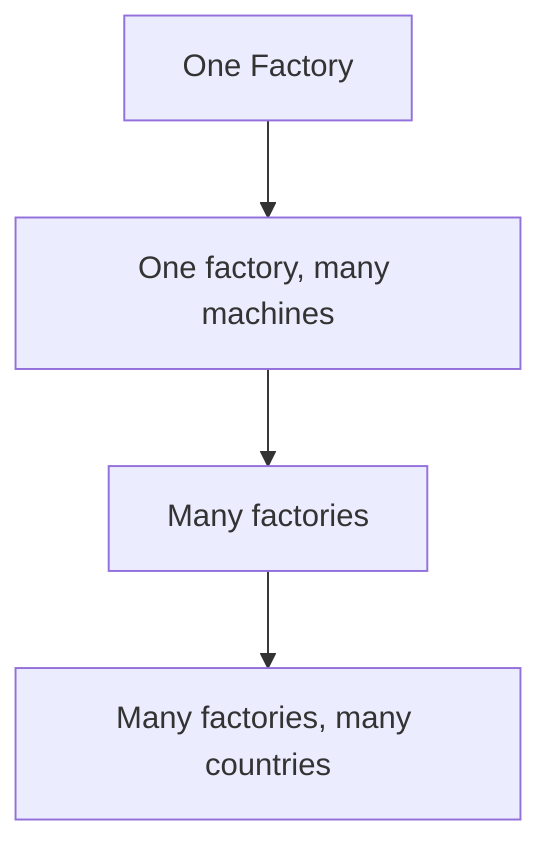
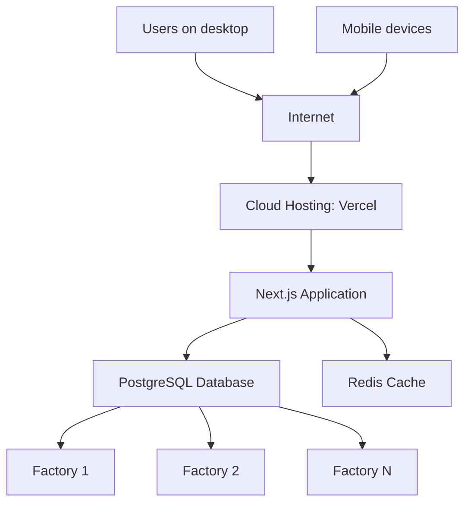

# Performance, Scalability & Maintainability

## Purpose

So far, this handbook has taken you on a complete journey. You understand the business problem (Session 1), the manufacturing fundamentals (Session 2), the database (Sessions 3 and 10), the architecture (Sessions 4 and 5), the project setup (Session 9), authentication (Session 11), the core features (Session 12), and how to test it all (Session 13).

The EMMS now works. Equipment can be registered, maintenance can be scheduled and completed, downtime can be tracked, and dashboards and reports summarize everything — all verified by testing.

But there is one more important lesson: **software that works today may fail tomorrow if it cannot grow.**

Think about what the EMMS might face in the future:

- a factory that starts with 50 machines grows to 5,000
- a team of 10 users grows to a whole organization
- one factory becomes many factories, in many countries
- years of maintenance history accumulate, making reports slower and slower

Software that was never designed to handle growth will start to slow down, break, or become impossible to change. The EMMS must be built not just to work today, but to **keep working as the business grows**.

This chapter is not about low-level optimization tricks. It is about the engineering principles behind **production-quality** software — software that stays fast, reliable, maintainable, and scalable over time.

> [!NOTE]
> **Production-quality** software is software that is not just "working" but is fast, reliable, easy to maintain, and able to grow. These are the qualities this chapter explores.

> [!IMPORTANT]
> The features from Session 12 and the testing from Session 13 prove the EMMS works today. This chapter is about making sure it keeps working tomorrow — and for years after that.

---

## What is Performance?

**Performance** is how quickly and efficiently the software responds. In the EMMS, performance is what makes the difference between a dashboard that appears instantly and one that makes a manager wait.

There are four related ideas to understand.

| Term | Meaning | EMMS Example |
|---|---|---|
| **Response Time** | How long it takes for the system to answer a request | The time between a supervisor clicking "load dashboard" and the page appearing |
| **Latency** | The delay before something happens | The wait for a report to finish calculating |
| **Throughput** | How much work the system can complete in a period | How many downtime events can be logged per minute |
| **Efficiency** | How much work the system does for each unit of result | Whether loading one dashboard does the minimum amount of work possible |

> [!NOTE]
> **Response time** is how long a request takes to be answered. **Latency** is the delay before a response. **Throughput** is how much work happens per unit of time. **Efficiency** is how little work is wasted for each result.

### A conveyor belt analogy

Picture a conveyor belt in the factory from Session 2 — a line of machines moving products from one end to the other.

- **Response time** is how long it takes a product to travel the whole line.
- **Latency** is the moment the product sits at a machine, waiting to move.
- **Throughput** is how many products the line finishes per hour.
- **Efficiency** is whether the line uses every machine well, or whether some machines are idle while others are overloaded.

A good production line moves products quickly, without long waits, producing a steady stream. A good application does the same with requests.

### Why users notice slow software

People notice slowness immediately. In a factory, a technician waiting for a page to load is a technician not doing maintenance. A manager waiting for a dashboard is a manager not making a decision. Slow software wastes the most expensive resource a factory has: **people's time**.

> [!TIP]
> Performance is not about impressive numbers — it is about respecting users' time. Every second of waiting in the EMMS is a second someone is not maintaining equipment or making decisions.

---

## What is Scalability?

**Scalability** is the ability of a system to handle growth — more users, more data, more work — without breaking or slowing down.

The EMMS may need to grow in several directions:

- **Growing users** — from a handful of technicians to hundreds of people across an organization
- **Growing equipment** — from dozens of machines to thousands of assets in the registry
- **Growing factories** — from one plant to several plants in different locations
- **Growing maintenance history** — years of completed work accumulating in the database
- **Growing reports** — more data to summarize, filter, and analyze

The diagram shows the EMMS's possible journey: starting with one factory, growing to handle many machines, then many factories, and eventually operations in many countries. Each step requires the system to handle more of everything.

> [!NOTE]
> **Scalability** is the ability to grow gracefully. A scalable system can handle more users, more data, and more work without redesigning or slowing down. A non-scalable system hits a wall.

> [!IMPORTANT]
> Growth is not hypothetical — it is the normal direction of a successful business. Designing for growth from the start is far cheaper than rebuilding a system that has already become too slow.

---

## What is Maintainability?

**Maintainability** is how easily software can be understood, changed, and fixed over time. A system may work perfectly, but if nobody can change it without breaking something, it will not stay healthy for long.

Maintainability depends on several habits:

| Habit | What it means | EMMS Example |
|---|---|---|
| **Readable code** | Code that is clear and easy to follow | A developer can open a feature and understand what it does quickly |
| **Modular design** | Code divided into focused, independent pieces | Business logic in the server layer, interface in components (Session 6) |
| **Reusable components** | Building blocks used in many places | One button component used across the whole app (Session 6) |
| **Naming** | Names that clearly describe what things are | `Equipment`, `MaintenanceTask`, `downtimeEventId` — not `data`, `info`, `field1` |
| **Documentation** | Written explanations of how the system works | The Learning Handbook itself, and comments where they help |
| **Code reviews** | Another developer reading and checking your code | Catching problems before they are merged (Session 13) |

### Relating this to previous sessions

Maintainability is not a new idea. It is the reason behind the architecture you studied in Sessions 4 and 5:

- **Separation of concerns** (Session 5) means each part has one job, so changes stay small and safe.
- The **folder structure** (Session 6) gives every piece a clear home, so developers know where to look.
- **Normalization** (Session 10) keeps the database from duplicating data, so changes do not multiply.

Every principle from the earlier chapters was, in part, a maintainability principle. A well-architected system is a maintainable system.

> [!NOTE]
> **Maintainability** is how easily software can be understood, changed, and fixed. It is built from readable code, modular design, reusable components, clear naming, documentation, and code reviews.

> [!TIP]
> You have been practicing maintainability all along. The architecture from Session 5 and the folder structure from Session 6 were not just for organizing code — they were for keeping the code maintainable as it grows.

---

## Designing for Growth

As data grows, techniques that were optional become necessary. Here is how the EMMS is designed to keep working as it grows.

### Pagination

**Pagination** means splitting a long list into pages instead of showing everything at once. If the Equipment Registry has 5,000 machines, loading all of them at once would be slow. Pagination shows 25 or 50 at a time, with "next" and "previous" controls.

### Filtering

**Filtering** means narrowing results to what the user wants. Instead of loading all downtime events, a supervisor filters to "this month" or "this machine" (the filtering idea from Session 7). Filtering reduces the amount of data the system must handle.

### Searching

**Searching** lets users find specific records quickly instead of browsing everything — the Equipment Search feature from Session 12. Good search keeps large datasets usable.

### Database indexes

An **index** is a structure the database uses to find records faster, like the index at the back of a book. Instead of reading every page to find "Press 01," the database jumps straight to it. Indexes keep lookups fast as tables grow.

### Caching

**Caching** stores frequently used results so they do not need to be recalculated — the Redis idea from Sessions 7 and 8. A cached dashboard loads instantly instead of recalculating on every visit.

### Background jobs

A **background job** is work done outside the main request, in the background. If a monthly report takes a long time to calculate, the system can prepare it in the background and show the result when ready, instead of making the user wait.

### Lazy loading

**Lazy loading** means loading something only when it is actually needed. If a page has a chart far down the page, the application loads it only when the user scrolls to it — saving time and data.

> [!NOTE]
> **Pagination** splits lists into pages. **Filtering** narrows results. **Indexes** help the database find records faster. **Caching** stores frequent results. **Background jobs** do work off to the side. **Lazy loading** loads things only when needed.

> [!IMPORTANT]
> These techniques are not "nice to have" — they become essential as data grows. A list that is fast with 50 items may be unusable with 5,000. Designing for growth means building these in from the start.

---

## Performance Inside EMMS

Here is how performance concerns apply to specific EMMS features, and how they could be addressed.

| Feature | Performance Concern | Possible Solution |
|---|---|---|
| Dashboard | Recalculating many metrics on every load | Cache the metrics with Redis (Sessions 7 and 8) |
| Equipment Search | Searching thousands of assets slowly | Use indexes on the fields users search by |
| Reports | Aggregating huge amounts of history | Filter first, then aggregate; run long reports as background jobs |
| Maintenance History | Loading years of records for one machine | Paginate the history, showing recent records first |
| Authentication | Checking sessions on every protected page | Keep session checks fast; cache session data where safe |
| Downtime Analytics | Calculating totals across large datasets | Index the fields used for grouping; cache repeated summaries |

Let us explain each one.

### Dashboard

The dashboard calculates many metrics — open tasks, equipment status, downtime, reliability figures (Session 7). If every manager's page load recalculated everything, the database would work hard repeatedly. Caching the results with Redis means the dashboard loads fast.

### Equipment Search

Searching through thousands of assets is fast only if the database can find records quickly. **Indexes** on the fields users search by — name, serial number, status (Session 12) — make search instant.

### Reports

Reports aggregate data from across the system (Session 12). Filtering first — by date range, factory, or machine — reduces the data being aggregated, making the report faster. Very large reports can run as background jobs so users are not left waiting.

### Maintenance History

A machine with years of history could have hundreds of records. Loading them all at once is unnecessary. **Pagination** shows the most recent records first, letting users page through older ones as needed.

### Authentication

Authentication is checked on every protected page (Session 11). If each check is slow, the whole application feels slow. Keeping session checks efficient means every page benefits.

### Downtime Analytics

Analytics group and sum downtime data (Session 7). Indexing the fields used for grouping — machine, date, reason code — keeps these calculations fast even as events accumulate.

> [!TIP]
> Notice the pattern: every feature has a performance concern, and every concern has a solution from this chapter's toolbox — caching, indexing, filtering, pagination, and background jobs. The toolbox applies everywhere.

---

## Keeping the Database Healthy

The database is the heart of the EMMS (Session 10), and it needs care to stay healthy as it grows. Databases slow down over time — and understanding why helps us prevent it.

### Why databases slow down over time

As records accumulate, the database must search through more data to answer each query. A query that was instant with 100 records may be slow with 100,000. Without care, the database becomes the bottleneck of the whole application.

### Indexes

**Indexes** keep lookups fast as tables grow. They are the database's version of a book's index — a shortcut to finding records without reading everything. Indexing the fields the EMMS queries by — equipment names, dates, statuses — keeps the database fast.

### Normalization

**Normalization** (Session 10) keeps the database free of duplicated data. Duplicated data wastes space and makes queries slower. Storing each fact once keeps the database lean.

### Avoiding duplicate data

Beyond normalization, the EMMS prevents duplicates at the source — for example, refusing to register the same equipment serial number twice (Session 12). Fewer duplicates means less data to search through.

### Archiving historical records

**Archiving** means moving old records out of the busy working database into a separate store. Five years of resolved downtime events may not be needed for daily work. Archiving keeps the main database fast while preserving the history for reports.

### Backups

A **backup** is a copy of the data kept safe in case something goes wrong. If the database is lost or corrupted, the backup restores it. Backups protect the EMMS's most valuable asset — its data (Session 8).

> [!NOTE]
> **Archiving** moves old data out of the main database to keep it fast. A **backup** is a safe copy of the data used to recover from loss. **Indexes** help the database find records quickly as data grows.

> [!IMPORTANT]
> The database is the source of truth (Session 5). Keeping it healthy — indexed, normalized, non-duplicated, archived, and backed up — protects the entire application. When the database is slow or unhealthy, everything on top of it suffers.

---

## Caching

Caching is one of the most powerful performance tools, and you met it in Session 7. Here, we look at it from a production perspective — how Redis is used to keep a growing EMMS fast.

### Redis, from a production perspective

Redis is the fast in-memory store (Session 8) that holds temporary copies of expensive results. In production, it sits beside the application so the dashboard and other frequently used views load instantly.

### What should be cached

Caching works best for results that are:

- **expensive to calculate** — like dashboard metrics that aggregate many records (Session 7)
- **frequently requested** — like the summary every manager sees when they open the app
- **not changing every second** — like a weekly report that updates slowly

### What should never be cached

Some things should never be cached:

- **constantly changing data** — a live count of open downtime events would go stale almost immediately
- **user-specific sensitive data** — you must never cache one user's private data and accidentally show it to another user

### Cache expiration

**Cache expiration** is how long a cached result is considered fresh. After that time, the system treats it as outdated and recalculates. Expiration prevents the cache from holding results that are too old to be useful.

### Cache invalidation

**Cache invalidation** is clearing a cached result when the real data changes — the process you learned in Session 4. When a new downtime event is saved, the application tells Redis the cached dashboard numbers are out of date, so the next load recalculates.

### Practical examples

- A **dashboard metric** that aggregates a week of downtime is cached — it is expensive to calculate and requested often.
- A **live "machines currently down" counter** is not cached for long — it changes constantly.
- A **user's private schedule** is never cached in a shared way — it belongs to that user alone.

> [!NOTE]
> **Cache expiration** is when a cached result becomes too old and is recalculated. **Cache invalidation** is actively clearing a cached result when the real data changes. Both keep the cache fast and accurate.

> [!IMPORTANT]
> Caching is powerful but must be managed. Cache the right things (expensive, frequent, stable), never cache the wrong things (sensitive, constantly changing), and always invalidate when data changes. A stale cache can be worse than no cache at all.

---

## Scaling the Application

As the business grows, the EMMS must grow with it. Here is how the system could eventually support a much larger operation.

Let us explain how the EMMS could scale.

### Multiple factories

The database models from Session 10 — `Factory`, `ProductionLine`, `Equipment` — are designed so data can be organized by factory from the start. Supporting many factories means each factory's data is kept distinct while sharing the same system.

### Multiple countries

With data organized by factory and location, the system can report across regions (Session 7's filtering) while keeping each location's records separate. Growth to many countries is mostly a matter of more data, more factories, and more users.

### Thousands of concurrent users

**Concurrent users** are users active at the same time. Handling thousands requires the techniques in this chapter: caching to reduce database load, indexes to keep queries fast, and cloud hosting that can add capacity as needed.

### Mobile devices

As the future vision in the README mentions, a mobile technician application would let technicians work in the field. A well-architected backend from Session 5 can serve both desktop and mobile users.

### Cloud deployments

**Cloud hosting** means running the application on shared, scalable infrastructure — like the Vercel and Railway setup from Session 8. Cloud platforms make it practical to grow capacity up or down as demand changes.

> [!NOTE]
> **Concurrent users** are users using the system at the same time. **Cloud hosting** is running software on scalable internet infrastructure, like Vercel and Railway from Session 8. **Scaling** is the ability to handle more of everything — users, data, factories.

> [!TIP]
> Scaling is not a single switch — it is the accumulated result of good decisions: a clean database, caching, indexes, and a hosted architecture. Each decision from this chapter contributes to a system that can grow.

---

## Technical Debt

**Technical debt** is the cost of taking shortcuts in software. Just like financial debt, it must eventually be repaid — with interest.

### What creates technical debt

| Source | What it is | Why it is costly |
|---|---|---|
| **Quick fixes** | Patching a problem fast instead of fixing it properly | The real cause stays, and the patch causes new problems later |
| **Copy-paste code** | Duplicating logic instead of reusing it | Fixing one copy leaves the others broken (Session 12's warning) |
| **Ignoring documentation** | Not explaining how the system works | Future developers (including you) cannot understand the code |
| **Skipping testing** | Releasing without checking the software works | Bugs reach users and are expensive to fix later (Session 13) |
| **Poor architecture** | Letting code grow without structure | The system becomes hard to change, and every change is risky |

### A factory maintenance analogy

Imagine a factory that keeps fixing its machines with quick patches. A machine leaks, so someone wraps tape around it. It rattles, so someone adds a weight. Each fix works for a moment, but the patches pile up, the machine becomes unreliable, and eventually a proper repair costs far more than a good fix would have cost at the start.

Software technical debt is exactly the same. Each shortcut seems to save time today — but the shortcuts pile up, the system becomes fragile, and the eventual cost of fixing everything is far higher.

> [!NOTE]
> **Technical debt** is the future cost of today's shortcuts. Every quick fix, duplicated block, or skipped test adds to it — and like financial debt, it grows if it is not managed.

> [!IMPORTANT]
> There is no such thing as a shortcut with no cost. The question is not "should I take shortcuts?" but "which debt am I willing to pay off later?" A good developer takes shortcuts deliberately, knows their cost, and repays them before they become crippling.

---

## Maintaining Quality

Software quality is not a one-time achievement — it is a continuing practice. Even good software needs ongoing care.

### Refactoring

**Refactoring** is improving the structure of code without changing what it does. It is like cleaning and reorganizing a workshop: the tools do the same jobs, but they are easier to find and use. Refactoring repays technical debt before it grows.

### Monitoring

**Monitoring** means watching the application in production — tracking speed, errors, and usage. Monitoring tells you when the system is slow, failing, or being used in unexpected ways, so problems are caught early.

### Logging

**Logging** records what the application does (Session 13). When something goes wrong in production, the logs show what happened. Logging turns a mystery into a solvable problem.

### Code reviews

**Code reviews** (Session 13) keep quality high by having another developer check each change. They catch mistakes, spread knowledge across the team, and prevent poor code from entering the codebase.

### Continuous improvement

**Continuous improvement** is the habit of always making things a little better — a feature improved, a process refined, a bug prevented. Small improvements, repeated over time, keep the software healthy and growing.

### Why software is never truly finished

Software is never finished because the world it serves keeps changing. New equipment, new factories, new requirements, new best practices — each change means the software must evolve. A finished system is a system that has stopped serving its users.

> [!NOTE]
> **Refactoring** improves code structure without changing behavior. **Monitoring** watches the running application for problems. **Continuous improvement** is the ongoing habit of making things better over time.

> [!TIP]
> Treat the EMMS like a machine in the factory you learned about in Session 2. A machine that is never inspected, never cleaned, and never improved will break down. Software is the same — it stays healthy only with regular care.

---

## Performance Checklist

Before the EMMS is considered production-ready, run through this checklist. Each item protects the system's speed, reliability, and ability to grow.

| # | Check | Why it matters |
|---|---|---|
| 1 | Database indexes in place | Lookups stay fast as tables grow |
| 2 | Caching configured | Frequently used results load instantly |
| 3 | Cache invalidation working | Cached results stay accurate (Session 4) |
| 4 | Pagination on large lists | Long lists do not slow down the application |
| 5 | Filtering available on large datasets | Users can narrow results (Session 7) |
| 6 | Reports can handle large data | Summaries stay fast as history grows |
| 7 | Database is normalized and non-duplicated | The database stays lean (Session 10) |
| 8 | Backups configured | Data can be recovered if lost (Session 8) |
| 9 | Monitoring and logging in place | Problems are visible and diagnosable (Session 13) |
| 10 | Technical debt reviewed | Shortcuts are known and being repaid |
| 11 | Code reviewed regularly | Quality is protected as the codebase grows |
| 12 | Documentation maintained | The system stays understandable over time |

When every box is checked, the EMMS is not just working — it is built to keep working.

> [!NOTE]
> A **checklist** is a list of items to verify before a release. This performance checklist confirms the EMMS is fast, reliable, maintainable, and ready to grow.

> [!IMPORTANT]
> Production readiness is not a single moment — it is a set of verified habits. This checklist represents the ongoing care the EMMS needs to stay healthy for years.

---

## What's Next?

The EMMS now works correctly (Session 12), is verified by testing (Session 13), and is designed to stay fast, reliable, maintainable, and scalable as the business grows (this chapter).

You have reached the final stage of the learning journey. **Session 15 — Conclusion and Next Steps** will summarize the complete EMMS journey: from the business problem in Session 1, through design, architecture, implementation, testing, and production thinking, to the final picture of a production-ready system.

The final chapter will tie together everything you have learned and point the way forward — what it means to have built the EMMS, and where the journey can go from here.

> [!NOTE]
> The roadmap in the handbook README shows this final stage: after performance and scalability, the journey arrives at **production readiness** — the point where the EMMS is complete and ready for the real world.

---

## Key Takeaways

- Software that works today may fail tomorrow if it cannot grow — production-quality software is built for the long term.
- Performance is response time, latency, throughput, and efficiency — and users notice slow software because it wastes their time.
- Scalability is the ability to handle more users, equipment, factories, history, and reports without breaking down.
- Maintainability is how easily software can be understood, changed, and fixed — built from readable code, modular design, reusable components, naming, documentation, and reviews.
- Designing for growth means using pagination, filtering, searching, indexes, caching, background jobs, and lazy loading.
- Every EMMS feature has a performance concern, and each has a solution — from caching the dashboard to indexing search fields.
- The database needs care — indexes, normalization, avoiding duplicates, archiving, and backups — because it slows down as data grows.
- Caching stores expensive, frequent, stable results — and never caches sensitive or constantly changing data, with expiration and invalidation keeping it accurate.
- Scaling to many factories, countries, users, and devices is the accumulated result of good decisions made along the way.
- Technical debt is the future cost of shortcuts, and it grows with interest if it is not managed.
- Quality is maintained through refactoring, monitoring, logging, code reviews, and continuous improvement — because software is never truly finished.
- The performance checklist confirms the EMMS is fast, reliable, maintainable, and ready to grow.
- Next comes Session 15, the final chapter, which will summarize the complete EMMS journey from business problem to production-ready software.
