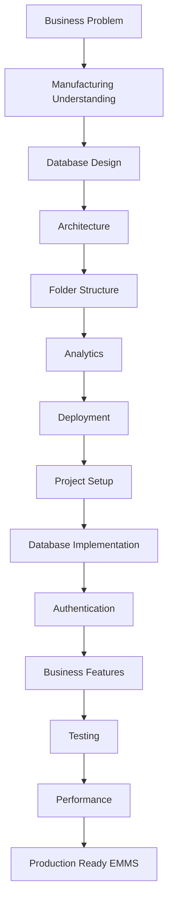
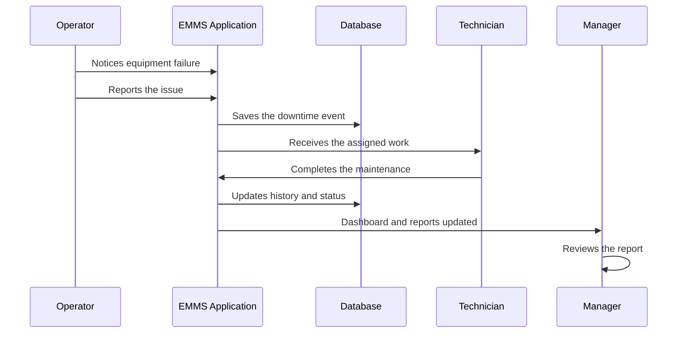

# EMMS Project Journey & Conclusion

## Purpose

You have reached the final chapter of this handbook.

In the last fourteen sessions, you have walked through the complete story of the Equipment Maintenance Management System (EMMS) — from the moment someone asked "why does this software exist?" all the way to the point where the software is production-ready.

This chapter does not introduce anything new. It has no new technologies, no new features, and no new diagrams to master. Its purpose is simpler and more important: **to connect everything you have learned into one complete picture.**

Think of this chapter as the last day of a course. The lectures are done. The projects are finished. Today, we step back, look at the whole journey, and see how every lesson fits together.

> [!NOTE]
> Each session taught you one part of the EMMS: the business (Session 1), the domain (Session 2), the database (Sessions 3 and 10), the architecture (Sessions 4 and 5), the codebase (Session 6), the analytics (Session 7), the deployment (Session 8), the setup (Session 9), the security (Session 11), the features (Session 12), the testing (Session 13), and the production thinking (Session 14). This chapter is where those parts become one story.

> [!IMPORTANT]
> If you can explain the EMMS as a single story — a business problem that became a designed, built, tested, and deployed system — then you have truly learned it. That is the goal of this final chapter.

---

## Looking Back

Before we tell the full story, let us look back at where you have been. Every session contributed something essential.

| Session | What We Learned | Why It Was Important |
|---|---|---|
| 1 | The business problem | Explained why the EMMS exists and the real-world pain it solves |
| 2 | Manufacturing fundamentals | Taught the domain the software models — downtime, maintenance, reliability |
| 3 | Database design | Designed the tables that hold all the system's data |
| 4 | Request flow | Showed how a single action travels through the whole system |
| 5 | System architecture | Explained how all the technologies fit together |
| 6 | Folder structure | Taught how to navigate and organize the codebase |
| 7 | Analytics engine | Turned raw records into the metrics that drive decisions |
| 8 | Deployment and production | Moved the application from a laptop to real users |
| 9 | Project setup | Created the working project and connected its services |
| 10 | Database implementation | Turned the database design into a real, working schema |
| 11 | Authentication and roles | Secured the system so only the right users get access |
| 12 | Core features | Built the business workflows as working software |
| 13 | Testing and debugging | Verified the features behave correctly |
| 14 | Performance and scalability | Designed the system to stay fast and grow |
| 15 | Project journey and conclusion | Connected everything into one complete picture |

Each row of this table is a chapter you completed. Together, they are the full lifecycle of building the EMMS.

> [!TIP]
> You did not memorize a random list of topics. You built a system — and along the way you learned the skills a real software engineer uses every day.

---

## The Complete EMMS Journey

Here is the entire journey as one flow, from the first spark of an idea to a production-ready system.

Let us explain every stage.

### Business Problem

The journey began with a question: why does this software exist? Session 1 explained that factories lose money, time, and information when maintenance is tracked on paper and in scattered messages. The EMMS exists to solve that.

### Manufacturing Understanding

Before designing software, we understood the factory. Session 2 taught us production lines, downtime, MTTR, MTBF, reason codes, and preventive maintenance — the real world the EMMS models.

### Database Design

With the business understood, we designed the data. Session 3 planned the tables — factories, production lines, equipment, events, parts, and users — and how they relate.

### Architecture

Next came the blueprint. Sessions 4 and 5 explained how the pieces fit: the request flow, the frontend and backend, the database, the cache, and the authentication.

### Folder Structure

Before writing code, we learned where code lives. Session 6 taught the folder structure that keeps a growing project organized and navigable.

### Analytics

The system needed to do more than store records — it needed to produce insight. Session 7 explained how raw downtime events become dashboards, metrics, and decisions.

### Deployment

Sessions 8 explained how the finished application would reach real users — hosted on Vercel and Railway, secure and always available.

### Project Setup

Then building began. Session 9 created the project, installed the tools, connected the services, and verified everything with a working homepage.

### Database Implementation

Session 10 turned the Session 3 design into a real schema — migrations created the tables, seed data populated them, and the Prisma Client connected the application to the data.

### Authentication

With data in place, we secured it. Session 11 added authentication and role-based access, so users sign in and act according to their role.

### Business Features

Then the real work was built. Session 12 turned the business workflows — registering equipment, scheduling and completing maintenance, reporting downtime — into working features.

### Testing

Building was not enough. Session 13 tested everything, found and fixed bugs, and confirmed the workflows behave correctly.

### Performance

Working software had to stay working. Session 14 designed the system for growth — performance, scalability, maintainability, and production thinking.

### Production Ready EMMS

The journey ends with a production-ready system: a complete application that solves a real business problem, built on a clean architecture, secured, tested, and designed to grow.

> [!NOTE]
> Notice how the stages flow from understanding to designing to building to verifying. This is the software engineering lifecycle — and you have lived it through the EMMS.

---

## How Everything Connects

The EMMS is not a stack of separate pieces. It is a system of layers, each supporting the ones around it.

| Layer | Purpose | Depends On | Examples |
|---|---|---|---|
| **Business** | Defines what the system must achieve | Nothing — it is the starting point | The problem from Session 1, the workflows from Session 12 |
| **Database** | Stores all the data | The business design | The tables from Sessions 3 and 10 |
| **Backend** | Applies the rules and logic | The database | The server layer and request flow from Session 4 |
| **Frontend** | Shows the interface to users | The backend | The pages and components from Sessions 5 and 6 |
| **Authentication** | Confirms who users are | The database and backend | Auth.js and roles from Session 11 |
| **Analytics** | Turns data into decisions | The database | Dashboards and metrics from Session 7 |
| **Deployment** | Makes the system reachable | All the above | Vercel and Railway from Session 8 |
| **Infrastructure** | Keeps the system fast and growing | Everything | Caching, scaling, and maintenance from Session 14 |

Here is how the layers support each other:

- The **business** layer says *what* matters; the **database** stores it; the **backend** applies the rules; the **frontend** presents it to users.
- **Authentication** protects the whole stack, so only the right people reach the data.
- **Analytics** reads the data the lower layers stored and turns it into decisions.
- **Deployment** puts the entire stack online, and **infrastructure** keeps it fast and scalable.

> [!IMPORTANT]
> Every layer depends on the ones below it, and every layer serves the ones above it. This is what makes the EMMS a coherent system rather than a pile of disconnected code.

---

## Walking Through One Complete Business Scenario

Let us bring the whole system to life with one complete maintenance event. This is the same kind of story from Session 12 — but now we see exactly which sessions contributed to each step.

Now let us explain which sessions contributed to each step.

### Step 1: The operator notices an equipment failure

The **Operator** notices a machine has stopped. Understanding what this means — and why it matters — comes from Session 1 (the business problem) and Session 2 (the manufacturing fundamentals). The operator knows this failure will cost production.

### Step 2: The operator reports the issue

The operator logs the downtime event through the EMMS. The form they use is part of the business features built in Session 12, and the request they make travels through the system the way Session 4 described.

### Step 3: The system saves the downtime event

The application saves the event to the database. The table it lands in was designed in Session 3 and implemented in Session 10. The Prisma Client (Session 10) handles the write.

### Step 4: The technician receives the work

A **Technician** is assigned and sees the task in their work list. Authentication and roles from Session 11 ensure only the right technician sees the right tasks.

### Step 5: The technician completes the maintenance

The technician performs the repair and records the completion through the features from Session 12.

### Step 6: The system updates history and status

The task status changes, and a maintenance history record is created — the connection you learned in Session 12, supported by the related models from Session 10.

### Step 7: The manager reviews the report

The **Manager** opens the dashboard and reports. The metrics they see come from the analytics engine of Session 7, kept fast by the caching and performance thinking of Session 14.

> [!NOTE]
> One single maintenance event used almost every session in this handbook — from the business understanding, through the database and architecture, to the features, security, analytics, and performance. That is the whole system working as one.

> [!TIP]
> When you can trace one event through all these steps and name the session that explains each one, you understand the EMMS completely.

---

## From Student to Software Engineer

Building the EMMS has changed how you think. It is one of the most important transformations in a developer's journey.

Beginners focus on **code** — the syntax, the files, the immediate task in front of them. Experienced engineers think much more broadly.

| What beginners focus on | What experienced engineers think about |
|---|---|
| Writing code that compiles | Solving business problems (Session 1) |
| Making a feature work | Designing the architecture (Session 5) |
| Building what they want | Building what users need (Sessions 1 and 12) |
| Storing data | Designing data well (Sessions 3 and 10) |
| Shipping it | Verifying quality through testing (Session 13) |
| Making it work today | Making it scale for tomorrow (Session 14) |
| Finishing a task | Maintaining the system over time (Session 14) |

The shift is not about knowing more syntax. It is about asking different questions:

- Instead of "how do I write this?" → "what problem is this solving?"
- Instead of "does it work?" → "does it work for the user, at scale, and over time?"
- Instead of "is it done?" → "is it reliable, maintainable, and secure?"

> [!NOTE]
> A **software engineer** is someone who thinks about the whole system — the problem, the users, the data, the quality, and the long-term health of the software — not just the code in front of them. This handbook was designed to build that thinking.

> [!IMPORTANT]
> Code is the tool; thinking is the skill. The EMMS taught you the thinking. That skill transfers to any software you will ever build.

---

## What Makes EMMS a Professional Project?

Many tutorials teach a simple CRUD application — Create, Read, Update, Delete records with minimal structure. The EMMS is a different kind of project. Here is what makes it professional.

| Element | What it means for EMMS |
|---|---|
| **Real business problem** | Solves actual factory pain, not a made-up example (Session 1) |
| **Layered architecture** | Clean separation of concerns (Sessions 4 and 5) |
| **Authentication** | Real user identity and role-based access (Session 11) |
| **Database design** | Normalized, well-related data (Sessions 3 and 10) |
| **Business workflows** | Features built around how people actually work (Session 12) |
| **Analytics** | Turns records into decisions (Session 7) |
| **Testing** | Verifies the software behaves correctly (Session 13) |
| **Scalability** | Designed to grow (Session 14) |
| **Documentation** | A complete handbook explaining every decision (Sessions 1–15) |
| **Deployment** | A real path to production (Session 8) |

A simple CRUD tutorial shows you how to save and display records. The EMMS shows you how to build a system that a business can actually depend on — one with a real problem, a sound design, security, analytics, testing, documentation, and a path to production.

> [!NOTE]
> **CRUD** stands for Create, Read, Update, Delete — the basic operations for managing records. The EMMS does far more: it applies business rules, secures access, analyzes data, and is built to grow.

> [!IMPORTANT]
> The difference between a tutorial and a professional project is not complexity — it is completeness. The EMMS is complete: every layer thought through, every decision explained, every part working with the others.

---

## Lessons Beyond EMMS

Everything you have learned applies far beyond factories. The principles are **transferable** — they work in any software system that serves real people.

| Type of system | How the EMMS lessons apply |
|---|---|
| **Hospital systems** | Track equipment and maintenance the same way — plus patients and staff instead of machines |
| **School systems** | Manage records, roles, and workflows — students, teachers, and courses instead of equipment |
| **Banking** | Handle accounts, transactions, security, and reports with the same care for correctness |
| **Inventory systems** | Track items, quantities, and history — the same data and relationship patterns |
| **Logistics** | Manage shipments and fleets — schedules, statuses, and analytics in a different domain |
| **CRM systems** | Organize customers, sales, and interactions — the same workflows and dashboards |

The pattern is always the same:

- understand the **business problem**
- design the **data** to support it
- build a **layered architecture**
- secure access with **authentication**
- build **workflows** that match real work
- turn data into **analytics**
- **test** it, **deploy** it, and keep it **scalable**

> [!TIP]
> You have not learned "how to build a maintenance app." You have learned how to build software — and the maintenance domain was your practice ground.

> [!NOTE]
> **Transferable skills** are skills that apply to many different situations. The engineering thinking you learned with the EMMS — problems, data, architecture, security, testing, and growth — transfers to any software project.

---

## Future Improvements

The EMMS is production-ready, but a good system is never finished. Here are possible future enhancements and the business value of each.

| Enhancement | What it does | Business value |
|---|---|---|
| **Predictive maintenance** | Uses history to forecast failures before they happen | Prevents breakdowns instead of reacting to them |
| **IoT integration** | Machines report their own data automatically | Live visibility without manual entry |
| **Barcode scanning** | Scan equipment to identify it instantly | Faster, more accurate asset tracking |
| **QR codes** | Quick scanning for equipment details | Convenient access to machine records |
| **Mobile application** | Let technicians work from the field | Maintenance happens where the machines are |
| **Notifications** | Alert users about due or overdue work | Nothing important gets forgotten |
| **AI-assisted planning** | Suggests the best maintenance schedules | Smarter use of maintenance time |
| **Machine learning** | Learns patterns from the data | Insights that humans would miss |
| **Cloud scaling** | Grow capacity as demand grows | The system keeps up with the business |
| **Offline support** | Keep working without internet | Useful where connectivity is unreliable |

Each enhancement builds on the foundation you created. Because the EMMS has a clean database, a layered architecture, and solid analytics, new capabilities can be added without rebuilding anything.

> [!NOTE]
> **IoT** (Internet of Things) means machines connected to the internet that can report data automatically. **Machine learning** is software that learns patterns from data. These are the kind of future directions the EMMS could explore.

> [!IMPORTANT]
> The value of a good foundation is that the future can be built on it. The EMMS's design is ready for these enhancements — they are new features, not a rewrite.

---

## Final Reflection

You have completed the full journey. From a business problem to a production-ready system, you have built the EMMS — and far more importantly, you have learned how to think like a software engineer.

Here is the most valuable lesson of all: **understanding the reasoning behind software is worth more than memorizing code.**

Code changes. Frameworks change. Technologies come and go. But the thinking lasts:

- understanding a business problem before writing code
- designing data to serve the problem
- structuring a system so it can be understood and grown
- securing it, testing it, and keeping it healthy
- explaining your decisions clearly to others

If you memorized every piece of code in this handbook, it would be outdated in a few years. But if you understand *why* the EMMS was built the way it was, that understanding will serve you for your whole career.

The other lesson is to keep learning. Software engineering is a field where there is always something new — a new problem, a new tool, a new way of thinking. The habit of continuous learning, and of always asking "why," is what separates engineers who grow from engineers who stall.

> [!NOTE]
> You started this handbook as someone learning about software. You are finishing it as someone who has built a complete system and can explain every decision behind it. That is a transformation worth being proud of.

> [!TIP]
> Keep building. Keep asking why. Keep improving. The EMMS was your first full journey — may it be the first of many.

> [!IMPORTANT]
> The value is not in the code you wrote. It is in the thinking behind it. Carry that thinking with you, and it will serve you in every project that follows.

---

## Final Key Takeaways

- The EMMS journey connects everything from a business problem to a production-ready system.
- Each of the fifteen sessions taught one essential part: business, domain, database, architecture, codebase, analytics, deployment, setup, implementation, security, features, testing, performance, and conclusion.
- The complete journey flows from understanding, through design and building, to verification and production thinking.
- Every layer of the EMMS — business, database, backend, frontend, authentication, analytics, deployment, infrastructure — supports the others.
- One complete maintenance event uses almost every session in the handbook, showing how the whole system works as one.
- Building the EMMS transformed your thinking from focusing on code to thinking about problems, users, data, quality, scalability, and maintenance.
- The EMMS is a professional project because it is complete: real problem, sound architecture, security, analytics, testing, documentation, and deployment.
- The principles you learned transfer to hospitals, schools, banking, inventory, logistics, and CRM systems — anywhere software serves real people.
- Future improvements like predictive maintenance, IoT, mobile, and AI are possible because the foundation is designed to grow.
- Understanding the reasoning behind software is more valuable than memorizing code — and it lasts a lifetime.
- Keep learning, keep asking why, and keep improving. The EMMS was your first full journey — now go build the next one.
